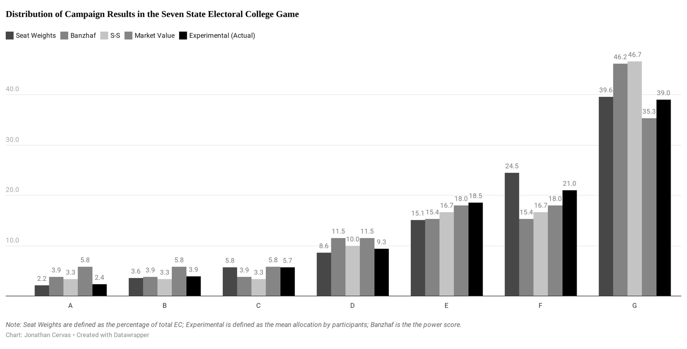

An Experiment on Optimal Campaigning

Using a Simplified Seven-State Electoral College\*

Bernard Grofman

University of California, Irvine

Jonathan Cervas

Carnegie Mellon University

Scott L. Feld

Purdue University

<s>May 31, 2020</s>

September 24, 2020

\*Grofman is Distinguished Professor of Political Science and Jack W.
Peltason Endowed Chair of Democracy Studies at the University of
California, Irvine. Cervas was a graduate student in the Political
Science program at UCI when his work on this project began. He is now a
Postdoctoral Fellow at Carnegie Mellon University. The participation of
these two authors in this project was supported by the Peltason Chair.
Feld is a Professor of Sociology at Purdue University.

ABSTRACT

Using experimental data on a seven-state simplified electoral college
game, we examine how participants judge a state’s importance for
generating an electoral college victory, distinguishing between a
state’s share of electoral college seats, on the one hand, and the
likelihood that the state will be pivotal in the electoral college game,
on the other. To measure the latter, we calculate the state’s *Banzhaf
power score* and the state’s *Shapley-Shubik* *value*. The weights in
our game have been carefully chosen to generate clear differences among
weights, *Banzhaf scores*, and *Shapley-Shubik* values, and yet
different values for another game theory measure, *market value*,
a.k.a., *bribeworthiness* (Owen et al., 2006). We find that, on average,
respondents use weights rather than any of the three theoretically
grounded measures from game theory to make allocation decisions.
Analogous to the *fiscal illusion* in Public Choice theory, we may label
this as the *weightiness illusion*. Despite the absence of a dominant
strategy in this Colonel Blotto-type game, we show that there are,
nonetheless, dominated strategies. We also consider the degree to which
respondents focus allocations on a single potential *minimum winning
coalition* (*mwc*) versus spreading allocations among two or more
potential *mwc*s. And we compare our findings to those of a similar
experiment on four-state electoral college games (Deck, Sarangi, and
Wiser, 2017); and to theoretical results on optimal resource allocation
vectors in probabilistic EC games (Duffy and Matros, 2015).

# **Introduction and Hypotheses**

Americans do not directly elect the president of the United States, the
electors that make up the Electoral College (EC) do. Each state has
electoral votes equal to the state's number of U.S. senators and
representatives -- Montana has 3, New York has 29, Texas has 38, and the
largest state in population, California, has 55. Washington, DC, is the
only non-state with electoral votes; it gets three.[1] There are 538
electoral votes total, and you need 270 to win. When a presidential
candidate wins the popular vote in a state, he or she gets all of that
state's electoral votes -- except in Maine and Nebraska, where
allocations are by congressional districts with a two EC bonus for the
candidate winning the plurality of the state’s votes.

There is a huge literature about the Electoral College. Some of it
models the likelihood of divergence between the Electoral College
outcome and the popular vote (Merrill, 1978; Grofman, Brunell, Campagna,
1997; Miller, 2012), including work on whether there is a systematic
partisan bias in the EC (Grofman and Campagna, 1997; Zingher, 2016);
some of it looks at candidate incentives for campaigning in different
states as function of the state’s Electoral College seat share and as a
function of the state’s level of competitiveness, including work that
uses game theory measures of power as a means to calculate such
incentives (Shaw 1999a,b; 2006; Abramowitz 2001; Grofman and Feld, 2005;
Stromberg, 2008; Owen, Lindner and Grofman, 2008; Fair 2009; Cervas and
Grofman, 2017; Shaw, Dun and Althaus, 2020; see also Gimpel, Kaufmann,
and Pearson-Merkowitz. 2007). But much of the literature focuses on the
argument’s pro and con about the need to eliminate the Electoral College
and debates the desirability of various presidential election mechanisms
that have been proposed to replace it, including the option of a
directly elected president (see e.g., Edwards, 2011; Ross, 2012).[2]

The work we present here is intended as a contribution to the second of
these topics. We have created a two-candidate campaign game with a
mini-electoral college -- one with seven states rather than fifty.
States have different seat weights ranging from 3 to 55, with 70 seats
needed for a majority. We have run in-class experiments where students
take the role of the candidate of one of the parties. In the game,
candidates must <u>simultaneously</u> choose allocations of their full
campaign resources across the states, with each having 100 million
dollars (to be allocated in units of one million) across the seven
states in what they view as an optimal manner.[3] Each state is assumed
to be competitive, i.e., a battleground state, such that whichever
participant spends more in the state will win all of the state’s
electoral college votes. We can distinguish two different utility
functions. In one the candidates seek to maximize their EC seat share;
in the other they seek to maximize the probability that they will
capture a majority of the EC seats. We assigned the second utility
function to the players in our EC experimental game.[4] We ran the
experiment as a one-shot game. While students were paired, since their
choices were simultaneous and we only ran the game as a one-shot game,
we are not interested in the pairing as such. Instead we later create a
hypothetical tournament pairing each allocation vector against every
other allocation vector. We provide in the Appendix the protocol we used
for this game.

The Electoral College can be regarded as an instance of the more general
class of what mathematicians refer to as *weighted voting games*
(Felsenthal and Machover, 1998; Owen, 2013). We can characterize such a
game by a set of weights together with is called a *quota*, a threshold
such that a proposal that wins that much or more support carries and one
that falls below *quota* , fails to pass.[5] The EC game we use for our
experiment is one in which is a simple majority of the weights. We can
write it as (70; 3, 5, 8, 13, 21, 34, 55), where the value before the
semicolon is thevalue and the values after the semi-colon are the
weights of the various states. We label the seven states from A to G,
ordered from lowest EC weight to highest EC weight.

In our game, as in the real-world Electoral College, there are multiple
combinations of states that generate a winning coalition. We show below
the set of ten minimum winning coalitions in the game and the sum of the
weights in that coalition.

> G + F = 89
>
> G + E = 76
>
> G + D + C = 76
>
> G + D + B = 73
>
> G + D + A = 71
>
> G +C + B + A = 71
>
> F + E + D + C = 76
>
> F + E + D + B = 73
>
> F + E + D + A = 71
>
> F + E + C + B + A = 71

The representation of the game as (70; 3, 5, 8, 13, 21, 34, 55) is not
unique. In general, any two weighted voting games that have the same set
of minimal winning coalitions are regarded as equivalent.[6] A weighted
voting game is said to be *homothetic* if there exists a representation
of the game such that all the minimum winning coalitions in that
representation have the same weight (See Owen et al., 2006 and
references cited therein). As the game is represented in our protocol it
does not appear to be *homothetic*, however we can also represent this
game as (9; 1, 1, 1, 2, 3, 3, 6). The reader can verify for themselves
that the two games are equivalent in terms of having the same set of
minimum winning coalitions. We make use of the homothetic representation
of the game when we consider possible candidate strategies.[7]

We have collected 80 allocation n-tuples from our in-class
experiments.[8] Our goal is to use this experimental data to learn how
ordinary citizens make strategic judgments about their level of
investment of campaign funds in the state. If we think about a campaign
game where the units of contention are of unequal value and the winner
is the one who captures units that sum to a majority of the contested
resources, a very important set of questions has to do with the
strategic incentives in such a game.

The seven voter game we use in our experiment is a *Colonel Blotto* game
(Friedman, 1958; Lake, 1979; Golman and Page, 2009; Kovenock and
Roberson, 2012) in which, for any resource allocation vector that one
candidate can submit, as long as the candidates have equal (or near
equal) resources there is at least one resource allocation vector that
the other candidate can submit that will lead to a victory by that
candidate. In other words, in our EC game there is no *majority rule
equilibrium*. However, we can still ask whether there are identifiable
features of game participant’s preferred strategies. In particular, we
can look at the structure of the mean allocation n-tuple in the game and
seek to identify a factor or factors that determine the proportion of
resources a given state will be allocated <u>on average</u>; and we can
also look at the set of *minimum winning coalitions* in the game and
see, for example, if all are chosen with roughly equal probability or if
there are features of *mwc*s, such as how many states are in them, that
affect candidate resource allocation predilections. And, we will show
that, although there is no dominant strategy, there are dominated
strategies in our game.

Even though the only information players have to shape campaign resource
allocation decision in our game is the EC seat share in the state, we
can distinguish between a state’s share of electoral college seats, on
the one hand, and the likelihood that the state will be *pivotal* in the
electoral college game, on the other. To measure the latter, we can
calculate the state’s *Banzhaf* power score or the state’s
*Shapley-Shubik* value (*Shapley and Shubik*, 1954). We also look at
another important but much less well-known concept of value derived from
game theory, *market value* a.k.a. *bribeworthiness* (Owen et al.,
2006).

*Banzhaf scores* are calculated by creating the set of possible
coalitions (Banzhaf, 1967; Felsenthal and Machover, 1998; Owen, 2013)
under the assumption that all combinations (of states) are equally
likely. We then look to see when the removal of a state from a winning
coalition changes that coalition from winning to losing (or at the other
side of the coin, when the addition of a state to a losing coalition
changes that coalition from losing to winning). When the addition (or
subtraction) of a single state changes the outcome that state is said to
be *pivotal*. [9] The proportion of times a given state is pivotal (as a
fraction of all the instances of pivotality) is the (normalized)
*Banzhaf score* of the state.[10] The game we had our students play is a
deterministic one, i.e., if we know which candidate allocated more
resources to a state, we know with certainty that this is the player who
won the state.[11] When, instead, victory is a probabilistic function,
e. g., the *contest function* is one in which a probability of a
candidate’s victory in a state is the ratio of the allocation of that
candidate in the state to the sum of the allocations of both candidates
in the state, then, for small numbers of states, n ≤ 4, Duffy and Matros
(2015) show that an equilibrium allocation is guaranteed. Moreover, they
are able to characterize such equilibria as ones in which each
candidate’s resource allocations are identical and each candidate
assigns a portion of his or her resources to the state that is equal to
the normalized *Banzhaf score* of the state. But they also find a
five-state counterexample to the proposition that there always exists a
*Banzhaf*-based equilibrium vector. [12]

In our seven-state deterministic EC game there is no equilibrium mean
allocation outcome based on *Banzhaf* *scores*. Still, we can look to
see if *Banzhaf scores* predict the mean allocation vector across our
set of participants.

**HYPOTHESIS 1A. In an EC game, the resource allocations across all
participants will be well predicted by the** **states' (normalized)
*Banzhaf power score*, and this prediction will be as good or better as
a prediction based on the state’s actual EC share.**

While the *Banzhaf index* is built around combinations, the
*Shapley-Shubik* *value* is based on permutations (Straffin, 1978). To
calculate the *Shapley-Shubik* *value* we imagine the states are listed
in order and then, moving from the bottom to the top of that listing we
continue adding the weights of the states we include until we reach the
value needed in our game. Now we look at all possible orderings, i.e.,
the set of permutations of the states. For each permutation in which a
state is pivotal we score the state a one and then sum the total number
of times each state has been pivotal, normalizing by the total number of
permutations, here =7! **=**5,040. Now we can look to see if
*Shapley-Shubik values* predict the average resource allocations to each
state.

**HYPOTHESIS 1B. In an EC game, the resource allocations across all
participants will be well predicted by the** **states' (normalized)
*Shapley-Shubik values*, and this prediction will be as good or better
as a prediction based on the state’s actual seat EC share.**

There is also another way to think about the level of resources that
should be devoted to each state. Rather than looking to sum the
pivotality of a state in the set of possible coalitions we can ask if
there is a value we can assign to a state such that every minimum
winning coalition will have an identical sum when we sum these assigned
values of the states in each minimum winning coalition. This value, if
it exists, is called the *market value* or *bribeworthiness value* of
the state (Owen et al., 2006). The intuition behind this concept is
that, when we have established a state’s *market value*, we can take
that to be the state’s contribution to winning in <u>any</u> *mwc* in
which it is found. Thus, *market value* seems a plausible surrogate for
the share of resources a candidate would want to invest in the state in
any *mwc* to which the candidate allocated resources.

For any EC game we can always calculate the normalized *market value*
for each of the states either exactly or approximately. When a game is
*homothetic, market value* is equal to the weights in the homothetic
version of the game, as is apparent from the definitions of *homothetic*
and of *market value*. When a game is not *homothetic*, and we hold the
quota in the game representation used to be fixed and the sum of the
weights in the game to be fixed, we can find the least-square minimizing
values we get when we seek to equate the sum of the values of the states
in each minimum coalition to some common value, x. If we require integer
allocations, as we do here, then the least square minimization can
depend upon the representation we choose.[13]

In our current game, the market value of the seven states is as follows:

**A=B=C=1**

**D=2**

**E=F=3**

**G=6**

**The sum of the market value in this game is 17, and a majority is 9.
We can see how this works by looking at all the *mwc*:**

**G+F=9**

**G+E=9**

**G+D+C=9**

**G+D+B=9**

**G+D+A=9**

**C+C+B+A=9**

**F+E+D+C=9**

**F+E+D+B=9**

**F+E+D+A=9**

**F+E+C+B+A=9**

**HYPOTHESIS 1C. In an EC game, the resource allocations across all
participants will be well predicted by the** **states' (normalized)
*market value*, and this prediction will be as good or better as a
prediction based on the state’s actual EC seat share.**

Whether we are looking at *Banzhaf scores* or *Shapley-Shubik* values,
weights and power can differ. For example, consider a three state EC
game where the weights are (3, 4, 6). In terms of weights, state C has
twice the weight of state A, and yet in terms of both the power the two
states are identical both in terms of *Banzhaf scores* and
*Shapley-Shubik* values, since 7 votes are needed to win
(\[3+4+6\]/2=6.5), and any two states are a minimum winning coalition.
It also is often the case that the *Shapley-Shubik* values and the
*Banzhaf* scores do not coincide, and that is true for our seven-voter
EC game (see Table 1 later in the text). Similarly, the *market value*s
for the states in an EC game can be distinct from *Shapley-Shubik*
values and from *Banzhaf scores* and from the weights of the game, both
in the form that the game has been presented to the participants in the
experiment, and that also is true for our seven-voter EC game (see
Figure 1 later in the text).

Before we turn to analyze our own data on mean resource allocations by
state to test the hypotheses above, we wish to briefly discuss results
in the experimental paper that is closest to our own, Deck, Sarangi, and
Wiser (2017). These authors run experiments on four-state EC games. They
consider the three possible four-state games for fixed at 4 and the
weights summing to 7, which can be represented in canonical form as

(4; 1, 2, 2, 2), (4; 1, 1, 1, 4), and (4; 1, 1, 2, 3).

In the first game, (4; 1, 2, 2,2), state A is, in game theory parlance,
a *dummy*, i.e., a state that will never be pivotal, and thus has a
*normalized* *Banzhaf score* or *Shapley-Shubik value* of zero.
Moreover, state A in this game is in no minimal winning coalitions and
thus also has a *market value* of zero. In this game, if we neglect the
dummy, then there is no difference in the predictions of any of our four
models {weights, *Banzhaf*, *S-S*, *market value*}. State A should
receive nothing, and the other three states should have roughly equal
resource allocations. For this game, the *dummy* state gets few
resources allocated to it by the players (about 10% of total resources
allocated) in the Deck, Sarangi, Wiser (2017) experiment but, even so,
that level of resource allocation is still statistically distinguishable
from zero.

The second game, (4; 1, 1, 1, 4), also has a very simple form. There is
only one state that is in a minimal winning coalition, and the three
others are *dummies*, so resources should only go to the non-dummy state
under all models except an allocation equal to seat share. Here, too,
Deck, Sarangi, and Wiser (2017) find that the *dummy states* get very
few resources, but looking at their experimental data again we can
clearly reject the hypothesis that each is getting zero resources, since
each received about 6% of the total resource allocation, with 18.6% in
toto going to the three.

The third four-state game, (4; 1, 1, 2, 3), is the most interesting. The
minimal winning coalitions are A+ B + C = 4; A + D = 4; B + D = 4; C+ D
= 5. This game, however, is *homothetic* when we represent it as (3; 1,
1, 1, 2) even though the weights now sum to an even number. Seat shares
in the original representation of the game are (0.14, 0.14, 0.29, 0.43),
*Banzhaf scores* are

(0.17, 0.17, 0.17, 0.50), with *Shapley-Shubik* values and *market
values* the same. The implication of all models except for the seat
share allocation in the original game representation is that states A,
B, and C should each receive identical resource allocations. Looking at
the Deck, Sarangi, and Wiser (2017) experimental data, we cannot reject
that null hypothesis at the .05 level. But it is also the case that
state C receives a resource allocation considerably larger than that of
state A or state B, and the difference in each case is near statistical
significance. Moreover, state D receives a resource allocation nearly
one and half times that of state C. In their experimental results for
this game we cannot reject the hypothesis that the resource allocations
were roughly equal to the seat shares in the original game
representation.[14]

While we do not have a game which allows us to test for zero or near
zero allocation to a state which is a dummy, our seven-voter game allows
for more complex assessments of candidate strategies vis-à-vis mean
resources allocations than is possible in the canonic four-state games
studied by Deck, Sarangi, and Wiser (2017). The weights in our larger
seven-state game have been carefully chosen to allow a comparison
between potential measures of a state’s importance in that three states
have different weights but the same *Banzhaf score* of 0.038, the same
*Shapley-Shubik value* of 0.033, and the same market value of 0.058 ;
while two of the other four states have different weights but also the
same *Banzhaf score* of 0.154, the same *Shapley-Shubik value* of 0.167,
and the same market value of 0.18.

Also, while there are no states that are *dummies* in this seven-state
game and so, unlike in Deck, Serangi and Wiser (2017), we cannot check
to see if game participants have been smart enough to figures out the
inefficacy of investing in dummies, we can do a check for *minimum
rationality*. *Minimum rationality* is the requirement that the set of
states to which resources are devoted is, in fact, a set that contains a
majority of seats in the EC.

**HYPOTHESIS 2. In the EC game, all individual resource allocations will
satisfy the requirement of *minimum rationality.***

But also, before we turn to our own data, we want to introduce analyses
of strategic behavior that look at a different question than the nature
of the mean resource allocation vector. We wish to focus on *minimum
winning coalitions* and the structure of the resource allocations chosen
by participants in terms of characteristics such as the “tightness” of
the allocation vectors, i.e., the extent to which participants choose a
strategy in which all resources are concentrated on a single winning
coalition versus one which respondents seek to “hedge their bets” by
allocations that might permit victory in multiple ways.[15]

**HYPOTHESIS 3A. In the EC game, individual resource allocations will be
tightly clustered around one specific *minimum winning coalition.***

The set of ten minimum winning coalitions for our seven-state EC game we
have previously provided identifies the different sets of states we
would expect a candidate to concentrate resources on if the candidate
were seeking to pursue only <u>one</u> route to electoral victory. There
are a total of 127 different potential sets of state combinations
(27-1). Of these, only 64 sum high enough to win the EC.[16]
Notice also that every minimum winning coalition includes either F or G;
indeed, by definition then every <u>winning</u> coalition includes one
of the two states, though of course there are also losing coalitions
that include only one of these two states.

But if participants do choose to spread their resources beyond a single
*mwc*, do they still seek to limit the number of states in which they
invest? This question leads us to the hypothesis below.

**HYPOTHESIS 3B. In the EC game, allocations will be limited to a set of
states that encompasses no more than two minimum winning coalitions*.***

If candidates were to simultaneously pursue exactly two *mwcs*, the set
of states they chose would be in the list of six below.

G + F + E = 110

G + F + D + C = 110

G + F + D + B = 107

G + F + D + A = 104

F + E + D + C + B = 81

F + E + D + C + A = 79

Note that some combinations of states, such as G + F + E + D + C are
ruled out of this list because they contain <u>more than</u> two *mwcs*,
here G + F, and G + E, and F + E + D + C. Indeed, the list of states
that contain <u>exactly</u> two *mwc*s, with six sets of states, is
actually a shorter list than the list of states that contains
<u>exactly</u> one *mwc*, with ten sets of states.

We know that our game has no dominant strategy but that does not it does
not have dominated strategies. Define an *inefficient allocation* as
either (a) an allocation that includes states in more than a single
*minimum winning coalition* but not a set of states that contains two
*mwc*s, since placing resources on this extra state (these extra states)
does nothing to increase the likelihood of EC victory but takes away
resources that the candidate might have been spending on the winning the
states in the *mwc*; or (b) an allocation that includes states in two
*minimum winning coalitions* but not a set of states that has three or
more *mwc*s, since the state or states that is not in the two *mwc*s
should not have had resources allocated to it since placing resources on
such a state (such states) does nothing to increase the likelihood of EC
victory but takes away resources that the candidate might have been
spending on one of the two *mwc*s to which s/he is already allocating
resources.

**HYPOTHESIS 3C. In the EC game, *inefficient allocations* will not be
chosen*.***

Hypothesis 3C is considerably stronger than our earlier *minimum
rationality* hypothesis.

**However, though we have called these strategies “inefficient”,**
**because** **outcomes are** **deterministic** **and not**
**probabilistic,** **players might allocate small amounts to states not
in their *mwc* in order to <u>prevent</u> their opponent from winning**
**in coalitions the player themself is not focusing on.** **We might
expect that players who are playing two strategies are more likely to
employ a blocking strategy, since they have already spread their
resources in ways that make their first coalition less likely to win on
its own, which means that each state in their coalition is more
vulnerable than it would be if they indeed focused on a minimum
coalition exclusively.**

We can identify another factor affecting choice of minimum winning
coalitions, a more psychological one, namely that we might expect that
participants would seek smaller winning coalitions since that allows
them to concentrate resources more and arguably makes their decision
process simpler. The hypothesis of *fewest actor minimal winning
coalitions* is found in the early literature on cabinet coalition
processes in multi-party European democracies (Leiserson, 1970).

> **HYPOTHESIS 4A. In the EC game, individual resource allocations will
> be focused primarily on *mwc*s with a few states** **– more**
> **specifically, two state coalitions,** **G + F and G + E;** **and
> three state coalitions, G + D + C, G + D + B, and G + D + A.**
>
> **HYPOTHESIS 4B. In the EC game, if resources are devoted only to a
> single *minimum winning coalition*, a high proportion of those will be
> *mwc*s with a few states –** **more specifically, two state
> coalitions, G + F and G + E; and three state coalitions, G + D + C,
> G + D + B, and G + D + A.**
>
> Another way to think about fewest actor coalitions is in terms of
> states not of *mwc*s.
>
> **HYPOTHESIS 4C. In the EC game, positive** **resource allocations
> will be to no more than** **five states.**

The next hypotheses have to do with the strategic value of the choices
made. While there is no dominant strategy in the game there are some
allocations, *inefficient* ones, that are worse than others and, if
there are systematic biases in how strategies are chosen, there may be
some types of allocations that do better than others in the tournament
pitting proposed allocations against each other in pairwise fashion.

> **HYPOTHESIS 5A. In the EC game, the number of minimal winning
> coalitions to which resources are allocated will affect the likelihood
> of electoral victory.**
>
> **HYPOTHESIS 5B. In the EC game, the number of states to which
> resources are allocated will affect the likelihood of electoral
> victory.**

For example, we might think that investments in small *mwc*s would be
more likely to yield success, or we might expect the opposite since,
under the rules of our EC game, participants might choose to allocate
some minimal amount to all or nearly all states in order to “steal”
victory in any state where the opponent failed to invest any resources.
Similarly, we can imagine there might be a link between the number of
*mwc*s over which resources are spread and chances of victory in our
tournament. There is an obvious tradeoff in that investing in more
states increases the potential paths to victory while decreasing the
likelihood of winning any particular *mwc*.

**  
Data Analysis**

In our seven-voter EC game there is no optimal allocation to look for,
so we cannot check to see how closely voters are to the equilibrium
strategy; instead, as suggested above, we can seek to predict the
<u>average</u> allocation of resources While *Banzhaf* allocations are
not optimal in our seven-voter deterministic voting game, it is
nonetheless of interest to see whether voters allocate resources more in
terms of simple weights or more in terms of *Banzhaf power*, or
*Shapley-Shubik value,* or *market share value*. And we can check for
allocations will encompass a set of states that jointly equal or exceed
a majority of the EC seats, i.e., check for *minimum rationality*. But
we can also look at resource allocations in strategic terms, in accord
with Hypotheses 3-5 above.

Figure 1 shows the allocation vectors we would obtain based on
expectation derived from weights, *Banzhaf* *power, Shapley-Shubik
value,* and *market share value*, as well as the *average* actual
resource allocation data we obtained from the 80 participants in our
experiment.

**&lt;&lt; Figure 1 about here &gt;&gt;**

We now present results for each of the five hypotheses identified in the
previous section.

With respect to Hypothesis 1, about the relative predictive power of
seat shares under the original announced seat distribution, and the
three other measures of power/value we identified in the previous
section, we find seat share to be a clear winner. We cannot reject the
null hypothesis that the allocation based on seat share and the observed
allocation come from the same distribution (p = 0.73; chi-square df =
1147); but we can reject the null hypothesis that the allocation based
on *Banzhaf scores* or *Shapley-Shubik values* or *market values* match
the actual distribution. In each case a chi-square test gives us a p
value of no more than 0.02 (df = 1147).[17] In other words, candidates
are paying attention to weights not to the relative ability of states to
determine outcomes in the EC by being part of a (minimum) winning
coalitions. We may think of this a fallacy, a kind of *weightiness
illusion*.[18] We view this result as our most important finding.

With respect to Hypothesis 2, about the expectation of *minimum
rationality*, we found that all 80 players allocated resources to states
that jointly controlled at least enough EC seats to lead to victory.
**So, this hypothesis can clearly be confirmed.**

**Table 1 shows actual results and theoretical expectations based on
equiprobability** (**each state chosen with probability .5 JONATHAN IS
THIS HOW YOU DERIVED YOUR THEORETICAL EXPECTATIONS??** ) **about the
number of minimum winning coalitions in each resource allocation
vector.** With respect to Hypothesis 3A, about the tightness of
allocations around one minimal winning coalition, only **15**
**JONATHAN, IN THE TABLE YOU SAY 16!?** of the 80 (18.75%) participants
allocated resources to just one *mwc*. **While this is slightly higher
than the theoretical expectation of no strategic considerations, the
difference is small and not statistically significant, so we would
regard this hypothesis as having been rejected. JONATHAN PLEASE
DOUBLECHECK. On the other hand, we also see from Table 1 that** that 27
out of 80 (33.8%) participants allocated some resources to *all* seven
states, i.e., implicitly to all 10 ***mwc***s. **This is clearly a far
higher proportion of all-state allocations than would be expected by
chance alone.**

**&lt;&lt; Table 1 about here&gt;&gt;**

<table>
<colgroup>
<col style="width: 100%" />
</colgroup>
<thead>
<tr class="header">
<th><h2
id="table-1.-number-of-minimum-winning-coalitions-to-which-resources-are-being-allocated"><strong>Table
1. Number of Minimum Winning Coalitions to Which Resources are Being
Allocated</strong></h2></th>
</tr>
</thead>
<tbody>
<tr class="odd">
<td><table>
<colgroup>
<col style="width: 24%" />
<col style="width: 25%" />
<col style="width: 25%" />
<col style="width: 25%" />
</colgroup>
<thead>
<tr class="header">
<th><strong>Strategy</strong></th>
<th><strong>N vectors (empirical)</strong></th>
<th>
<strong>Proportion of Wins</strong>

<strong>(empirical)</strong>
</th>
<th><strong>Proportion of all Winning Coalitions (theoretical) JONATHAN
DOUBLECHECK-I CHANGED TO WINNING COALTIONS</strong></th>
</tr>
</thead>
<tbody>
<tr class="odd">
<td><strong>One MWC</strong></td>
<td><strong>16 (20%)</strong></td>
<td><strong>51.6%</strong></td>
<td><strong>15.8%</strong></td>
</tr>
<tr class="even">
<td><strong>Two MWCs</strong></td>
<td><strong>4 (5%)</strong></td>
<td><strong>50.3%</strong></td>
<td><strong>7.8%</strong></td>
</tr>
<tr class="odd">
<td><strong>Three MWCs JONATHAN, CAN YOU PLEASE DOUBLECHECK THIS, BASED
ON WHAT YOUWROTE I AM NOT SURE YOU ARE CALCULATING THIS CATEGORY
CORRECTLY?</strong></td>
<td><strong>2 (2.5%)</strong></td>
<td><strong>43.8%</strong></td>
<td><strong>7.0%</strong></td>
</tr>
<tr class="even">
<td><strong>Inefficient Allocation JONATHAN, CAN YOU PLEASE DOUBLECHECK
THIS, BASED ON WHAT YOUWROTE I AM NOT SURE YOU ARE CALCULATING THIS
CATEGORY CORRECTLY?</strong></td>
<td><strong>0 (0%)</strong></td>
<td><strong>0%</strong></td>
<td><strong>12.6%</strong></td>
</tr>
<tr class="odd">
<td><strong>Four to Nine MWCs</strong></td>
<td><strong>32 (40%)</strong></td>
<td><strong>47.2%</strong></td>
<td><strong>56.6%</strong></td>
</tr>
<tr class="even">
<td><strong>Ten MWCs (Allocation to All States)</strong></td>
<td><strong>26 (32.5%) JONATHAN, IN THE TEXT YOU SAY 27?!</strong></td>
<td><strong>47.7%</strong></td>
<td><strong>0.8%</strong></td>
</tr>
</tbody>
</table></td>
</tr>
</tbody>
</table>

With respect to Hypothesis 3B, about the number of minimal winning
coalitions included in the resource allocation being two or fewer,

**We find just a few participants allocated resources to exactly two
*mwcs*. While 14 JONATHAN, ABOVE YOU SAY 15? ! IN THE TABLE YOU SAY 16!
allocated to only one *mwc*, only 4?? 3?? allocated to exactly two
*mwc*s. So would reject this hypothesis as well.**

We also note that two participants allocated to either (G + D + C + A)
or (G + D + C + B)**; these strategies have three *mwc*s. <s>and what
amounts to one dummy state each</s>.**

**JONATHAN ARE THESE THE ONLY ALLOCATIONS WITH EXACTLY THREE MWCS?**

**But how many have exactly 4 mwcs?**

**And how many 5 mwcs?**

**Etc.**

**WHEN I ASKED FOR A HISTOGRAM I WANTED TO KNOW FOR EACH K HOW MANY
ALLOCATIONS HAD EXACTLY K WINNING MWCS. YOU TOLD ME EARLIER THAT 37 OUT
OF 80 HAD ALL STATES IN THEM. THOSE THEN HAVE 10 MWCS. That info now
more or less found in Table 1.**

**Table 1 also provides us information about inefficient allocations.
Hypothesis 3C was that we should find no *inefficient allocations*, and
Table 1 shows that expectation to be confirmed.**

With respect to Hypothesis 4A, **we already know that most resource
allocation vectors will include allocations to more than a single *mwc*,
so we would not expect that there would be that many single *mwc*s of
the five types identified in the hypothesis. So, instead we focus on
Hypothesis 4B, i.e., of the 16 singleton *mwc* allocations, are a high
proportion of those the ones predicted by Hypothesis 4? Of those 16, we
find that XX JONATHAN FILL IN satisfy Hypothesis 4.**

**Hypothesis 4C is in terms of the number of states to which resources
are being allocated. Table 2 shows resource allocations by number of
states with a positive allocation.**

**&lt;&lt; Table 2 about here&gt;&gt;**

<table>
<colgroup>
<col style="width: 33%" />
<col style="width: 33%" />
<col style="width: 33%" />
</colgroup>
<thead>
<tr class="header">
<th colspan="3"><h2
id="table-2.-number-of-states-to-which-resources-are-being-allocated-jonathan-theres-something-really-wrong-with-this-tablea-everything-has-to-average-to-50-b-the-success-probabilities-here-dont-match-the-success-probability-is-table-1.-7-states-10-mwcs"><strong>Table
2. Number of States to Which Resources are Being Allocated JONATHAN
THERE’S SOMETHING REALLY WRONG WITH THIS TABLE(A) EVERYTHING HAS TO
AVERAGE TO 50%, (B) THE SUCCESS PROBABILITIES HERE DON’T MATCH THE
SUCCESS PROBABILITY IS TABLE 1. 7 STATES = 10 MWCS</strong></h2></th>
</tr>
</thead>
<tbody>
<tr class="odd">
<td><strong>Number of States in Resource Allocation</strong></td>
<td><strong>Probability of Success</strong></td>
<td><strong>N participants</strong></td>
</tr>
<tr class="even">
<td><strong>2</strong></td>
<td><strong>43.6%</strong></td>
<td><strong>8 (10%)</strong></td>
</tr>
<tr class="odd">
<td><strong>3</strong></td>
<td><strong>44%</strong></td>
<td><strong>4 (5%)</strong></td>
</tr>
<tr class="even">
<td><strong>4</strong></td>
<td><strong>36.1%</strong></td>
<td><strong>14 (18%)</strong></td>
</tr>
<tr class="odd">
<td><strong>5</strong></td>
<td><strong>39.9%</strong></td>
<td><strong>15 (19%)</strong></td>
</tr>
<tr class="even">
<td><strong>6</strong></td>
<td><strong>36.8%</strong></td>
<td><strong>12 (15%)</strong></td>
</tr>
<tr class="odd">
<td><strong>7</strong></td>
<td><strong>38%</strong></td>
<td><strong>27 (34%)</strong></td>
</tr>
<tr class="even">
<td colspan="3"><em><strong>Note:</strong></em></td>
</tr>
</tbody>
</table>

**Resource allocations with five or fewer states are marginally less
likely than resource allocations with six or seven states. The average
participant placed resources in 5.25 states (the median was 5).
Hypothesis 4C can also be rejected.**

**Now we look to see if participant allocations have any impact on
likelihood of success. Our expectation is that the answer should be no,
since there is winning strategy. There is a tradeoff between focusing on
a single mwc or at most two, and trying to spread resources too thinly.
Each type can win under some circumstances and lose under others.
JONATHAN PLEASE THINK ABOUT By definition, any allocation to one state
simultaneously increases the probability of winning that state and
lowers the probability of losing the state that in which that allocation
might have otherwise been useful.**[19] **But because there are some
strategies (inefficient ones) that are clearly inferior, we might still
expect that some other strategies would have a better than 50% chance of
success. JONATHAN PLEASE THINK ABOUT**

**With respect to Hypothesis 5A, about the number of *minimum winning
coalitions* to which resources are being allocated being linked to
likelihood of success in the EC competition coalitions, when we play
each resource allocation vector against each other resource allocation
vector, Table 1 above also reports the likelihood of tournament success
of resource vectors allocating to exactly k *mwc*s. While vectors
allocating to exactly 1 or exactly 2 *mwc*s seem to do marginally better
than attempts to create more potential paths to victory, the difference
do not appear to be statistically significant.**

With respect to Hypothesis 5B, about the number of states to which
resources are being allocated being linked to likelihood of success in
the EC competition coalitions when we play **each resource allocation
vector** against each other resource allocation vector, **Table 2 also
reports the likelihood of tournament success of a resource allocation to
exactly r states. We find JONATHAN THERE’S SOMETHING REALLY WRONG WITH
THIS TABLE(A) EVERYTHING HAS TO AVERAGE TO 50%, (B) THE SUCCESS
PROBABILITIES HERE DON’T MATCH THE SUCCESS PROBABILITY IS TABLE 1. Since
7 STATES = 10 MWCS.**

**Allocating to only one *mwc* resulted in the highest proportion of
wins among our participants, and those who allocated to all states did
the worst, winning less than 50% of the time.**[20] **But, given the
relatively low differences in average success across categories of
resource allocations and given the limits of our sample size we do not
wish to draw conclusions about the optimal allocation strategies.**[21]
**JONATHAN PLEASE THINK ABOUT**

**  
Discussion**

Our experiment is one of a number that have been run on variants of
Colonel Blotto games (see e.g., Chowdhury, Kovenock and Sherematia 2013)
and there are even previous papers running an experiment on a game
explicitly modeled on the Electoral College (Deck, Sarangi, Wiser, 2017;
Duffy and Matros, 2017). However, the seven-state EC game we study has a
more complex strategic structure than the four-state games studied in
those papers.

Our main finding is we think quite interesting. We find that simple seat
share predicts better than wither of the two best known power scores and
better than market values. Arguably, what we have found is in some ways
analogous to the famous *fiscal illusion* in Public Choice theory, i.e.,
the failure of taxpayers to grasp the true structure of the tax system.
Here what we have is an illusion about the importance of a state’s
apparent weight rather than the state’s actual influence in shaping
election outcomes. We might call this the *weightiness illusion*. We
also found that resource allocations that we called *inefficient*, i.e.,
ones that are dominated, were not chosen. **Unfortunately, however, our
other hypotheses about the relative frequency of type of *mwc*s or
number of states being allocated resources were not confirmed by the
data. JONATHAN IS THIS CORRECT?** **The one clear finding is that
seven-state allocations were much more likely than would have been
expected by chance. Similarly, we did not find differences in tournament
success rates across different types of resource allocation types,
though there our expectation was that such differences were unlikely to
be found, even though we specified hypotheses in a directional form.
JONATHAN PLEASE THINK ABOUT**

**We view the experiment reported here as the first in what we hope will
be a series of increasingly more realistic experimental games.** **For
example**, we recognize the desirability of adding to the realism of the
experimental simulation of the Electoral College game[22] by replacing
the assumption that all states were *tabula rasa*, i.e., with an equal
pre-campaign likelihood of voting for either party, with a more
realistic version with built-in asymmetries. [23] In particular, we
could assign each state an *a priori* expected vote share for party A
and identify a contest function that linked relative spending levels in
the state to the likelihood that a given candidate would win the state,
**perhaps in a probabilistic fashion.** In such experimental games we
may imagine a two dimensional structure of political competition such
that each state can be characterized by its EC weight, on the one hand,
and its (positive or negative) vote margin on the other (Grofman and
Feld, 2005; Shaw, 2006; Stromberg 2008; cf. McDonald and Rabinowitz,
2008; Wright, 2009). Similarly, it would be very useful to see how
strategies change when we have asymmetry in the resource levels of each
party (cf. Chowdhury, Kovenock, Sherematia, 2013). Another important
variation has to do with the level of *a priori* bias in the Electoral
College we posit. In our game we have focused only on the competitive
states, and implicitly assumed that they were the only ones that matter.
But that assumption is unrealistic. Stromberg (2008) offers a model in
which such asymmetries in *a priori* victory odds would, lead to
differences in the allocation strategies of candidates who must come
from behind versus those who are trying to hold on to a lead. Similarly,
Brams and Kilgour (2017) and Cervas and Grofman (2017) strongly
emphasize the importance of the noncompetitive states. And, relatedly,
**it would be interesting to see what happens if we allow the structure
of the game to evolve.** In particular, Grofman and Feld (2005) look at
the situation where states have already gone out of play because they
are safe for one side or the other and emphasize the importance of
understanding how that can change over time. **In such a situation, the
two candidates have different paths to victory and their optimum
strategies should change accordingly**.

APPENDIX

Instruction for In-class Game for Seven State Electoral College

Imagine that there are seven states in the Notusistan Electoral College
used for its presidential elections. Each is designated with a capital
letter below. Notusistan’s Electoral College operates under the same
“winner take all” weighted voting rules as in the U.S. Electoral
College. The weight of a state is the number of seats allocated to it in
the Notusistan Electoral College. The seven states have weights as
follows:

A 3

B 5

C 8

D 13

E 21

F 34

G 55

There is a two-candidate contest for the presidency of Notusistan, and
you are one of the candidates. You have $100 million Notusistan dollars
in campaign resources to be distributed across the seven states in the
country. Any state in which you spend more than your opponent you will
win. You may only spend money in one million-dollar amounts. If there is
a spending tie, that state’s electoral college votes will be divided
equally between the two of you. YOU WANT TO WIN!! To win, since there
are 139 seats in the Notusistan electoral college, you will need to win
states totaling at least 70 Electoral College seats.

Report your proposed spending in each state as a percentage of your
total spending to the right of the state’s electoral college votes above
<u>as a number between 1 and 100</u>. Remember, your total spending is
capped at 100 million dollars (in units of one million dollars) and so
the allocations to the states should sum to 100%, i.e., <u>the numbers
you report for each state should sum to 100.</u> (You may assume that
your campaign opponent has the same amount of money to spend that you
do.)

In class you will pair up and play the game. You may play multiple games
against different opponents to determine who can spend his or her money
most effectively.

## Figure 1

**Table 1. Weights, *Banzhaf Scores*, *Shapley-Shubik Values* and
*Market Value* in the Seven State Electoral College Game**

<table>
<colgroup>
<col style="width: 13%" />
<col style="width: 13%" />
<col style="width: 15%" />
<col style="width: 15%" />
<col style="width: 14%" />
<col style="width: 14%" />
<col style="width: 13%" />
</colgroup>
<thead>
<tr class="header">
<th><strong>State</strong></th>
<th><strong>EC Seats</strong></th>
<th><strong>EC Seat share</strong></th>
<th><em><strong>Banzhaf Score</strong></em></th>
<th><em><strong>Shapley-Shubik</strong></em></th>
<th><em><strong>Market Value</strong></em></th>
<th><strong>Actual</strong></th>
</tr>
</thead>
<tbody>
<tr class="odd">
<td><strong>A</strong></td>
<td>3</td>
<td>0.022</td>
<td>0.038</td>
<td>0.033</td>
<td>0.058</td>
<td>0.024</td>
</tr>
<tr class="even">
<td><strong>B</strong></td>
<td>5</td>
<td>0.036</td>
<td>0.038</td>
<td>0.033</td>
<td>0.058</td>
<td>0.039</td>
</tr>
<tr class="odd">
<td><strong>C</strong></td>
<td>8</td>
<td>0.058</td>
<td>0.038</td>
<td>0.033</td>
<td>0.058</td>
<td>0.057</td>
</tr>
<tr class="even">
<td><strong>D</strong></td>
<td>13</td>
<td>0.094</td>
<td>0.115</td>
<td>0.100</td>
<td>0.115</td>
<td>0.094</td>
</tr>
<tr class="odd">
<td><strong>E</strong></td>
<td>21</td>
<td>0.151</td>
<td>0.154</td>
<td>0.167</td>
<td>0.18</td>
<td>0.185</td>
</tr>
<tr class="even">
<td><strong>F</strong></td>
<td>34</td>
<td>0.245</td>
<td>0.154</td>
<td>0.167</td>
<td>0.18</td>
<td>0.210</td>
</tr>
<tr class="odd">
<td><strong>G</strong></td>
<td>55</td>
<td>0.396</td>
<td>0.462</td>
<td>0.467</td>
<td>0.353</td>
<td>0.390</td>
</tr>
<tr class="even">
<td><strong>TOTAL</strong></td>
<td><strong>139</strong></td>
<td><strong>1</strong></td>
<td><strong>1</strong></td>
<td><strong>1</strong></td>
<td><strong>1</strong></td>
<td><strong>1</strong></td>
</tr>
</tbody>
</table>

**  
**

**REFERENCES** NEED TO BE COMPLETED and cleaned up

Brams Steven J. and Morton D. Davis. 1974. The 3/2's Rule in
Presidential Campaigning. <u>American Political Science Review</u>
68(1):113-134.

Brams Steven J. and Mark Kilgour 2017 Public Choice TBA

Cervas, Jonathan and Bernard Grofman. 2017. Why noncompetitive states
are so important for understanding the outcomes of competitive
elections: The Electoral College 1868-2016. <u>Public Choice</u>. 173
(3-4): 251-265.** .  **

Chowdhury, Kovenock and Sherematia. 2013 An experimental investigation
of Colonel Blotto games. <u>Economic Theory</u> 52:833–861.

Colantoni, Ordeshook and Levesque 1975 **TBA**

Deck, Cary, Sudipta Serengi and Matt Wiser. 2017. Electoral College: A
Multi-battle Contest with Complementarities. <u>Upublished
manuscript.</u>

Duffy, John, and Margit Tavits. 2008. Beliefs and Voting Decisions: A
Test of the Pivotal Voter Model. <u>American Journal of Political
Science</u> 52 (3):603–18.

Duffy, John and Alexander Matros. 2015. Stochastic Asymmetric Blotto
games: Some New Results<u>. Economics Letters</u> 134: 4–8.

Duffy, John and Alexander Matros. 2017 Stochastic Asymmetric Blotto
Games: An Experimental Study. <u>Journal of Economic Behavior and
Organization</u> **TBA**

Edwards, George C. III. 2011. <u>Why the Electoral College Is Bad for
America</u>, 2nd Edition. Yale University Press.

[Felsenthal](https://scholar.google.com/citations?user=0Y0CkhcAAAAJ&hl=en&oi=sra),
Daniel M, and Moshe Machover. 1998. [The Measurement of Voting
Power](https://ideas.repec.org/b/elg/eebook/1489.html). New York:
Springer.

Friedman, L., 1958. Game-theory models in the allocation of advertising
expenditures. <u>Operations Research</u> 6(5): 699–709.

Gimpel, James G., Karen M. Kaufmann, and Shanna Pearson-Merkowitz. 2007.
"Battleground States Versus Blackout States: The Behavioral Implications
of Modern Presidential Campaigns." <u>Journal of Politics</u> 69(3):
786-97.

Golman, R .and S.E. Page. 2009. General Blotto: Games of Strategic
Allocative mismatch. <u>Public Choice</u> 138: 279–299

Grofman, Bernard, Thomas Brunell, Janet Campagna. 1997. Distinguishing
between the effects of swing ratio and bias on outcomes in the U.S.
electoral college, 1900-1992. <u>Electoral Studies</u>, 16(4):471-487.

Grofman, Bernard and Scott L. Feld. 2005. Thinking About the Political
Impacts of the Electoral College. <u>Public Choice</u>, 123: 1-18.

Kovenock, D. and B. Roberson. 2012. Conflicts with Multiple
Battlefields. In Garfinkel, Michelle R. and Stergios Skaperdas (Eds.),
<u>Oxford Handbook of the Economics of</u> <u>Peace and Conflict</u>.
Oxford University Press, Oxford, 503–530.

Lake, M., 1979. A new campaign resource allocation model. In: Brams,
S.J., A. Schotter, and G. Schwodiauer, (Eds.), <u>Applied Game
Theory</u>. Physica-Verlag, Wurzburg, West Germany, 118–132.

Leiserson, Michael. 1970a. “Game Theory and the Study of Coalition
Behavior.” In Groennings, M., E. W. Kelly and M. Leiserson (eds.) <u>The
Study of Coalition Behavior</u> TBA

Merrill, Samuel. 1978. TBA

Miller, Nicholas. 2012. TBA

Owen, Guillermo. 2013. <u>Game Theory</u>. **TBA**

Owen, Guillermo and Bernard Grofman. 1988. Optimal partisan
gerrymandering. <u>Political Geography Quarterly</u> 7(1):5‑22.

Owen, Guillermo, Ines Lindner and Bernard Grofman. 2008. Modified Power
Indices for Indirect Voting. In Braham, Matthew and Frank Steffen (Eds.)
[Power, Freedom, and
Voting](http://www.amazon.com/Power-Freedom-Voting-Matthew-Braham/dp/3540733817/ref=sr_1_2?ie=UTF8&s=books&qid=1203702424&sr=8-2)<u>.</u>
Berlin: SpringerVerlag, 119-138.

Owen, Guillermo, Ines Lindner, Scott L. Feld, Bernard Grofman and
Leonard Ray. 2006. A Simple ‘Market Value’ Bargaining Model for Weighted
Voting Games: Characterization and Limit Theorems. <u>International
Journal of Game Theory</u>, 35:111-126.

Rabinowitz and McDonald 2008. **TBA**

Ross, Tara. 2012. <u>Enlightened Democracy: The Case for the Electoral
College</u>, 2nd Edition. World Ahead Publishing.

Schofield, Norman, Bernard Grofman and Scott L. Feld. 1988. The Core and
the Stability of Group Choice in Spatial Voting Games. <u>American
Political Science Review</u>, 82)(1):195‑211.

Shapley Lloyd S and Martin Shubik. 1954. A method for evaluating the
distribution of power in a committee system. <u>American Political
Science Review</u> 48:787–792.

Shaw, Daron R. 1999a. The Effect of TV Ads and Candidate Appearances on
Statewide Presidential Votes, 1988-96. <u>American Political Science
Review</u> 93 (2): 345-361

Shaw, Daron R. 1999b. The Methods behind the Madness: Presidential
Electoral College Strategies, 1988-1996. <u>Journal of Politics</u> 61
(4): 893-913.

Shaw, Daron R. 2006. <u>The Race to 270</u>. Chicago: University of
Chicago Press.

Shaw, Daron, Scott Dun and Scott Althaus. 2020. Electoral College
Strategies of American Presidential Campaigns from 1952 to 2012.
Unpublished manuscript.

Snyder, James. 1989. Election Goals and the Allocation of Campaign
Resources. <u>Econometrica</u> 57(3): 637-660.

Straffin, Phillip. 1978. **BG FILL IN** <u>Public Choice</u>**.**

Strömberg, David. 2008. “How the Electoral College Influences Campaigns
and Policy: The Probability of Being Florida.” <u>American Economic
Review</u> 2008, 98 (3), 769–807.

Wright, John R. 2009. “Pivotal States in the Electoral College,
1880-2004.” <u>Public Choice</u> 139 (1): 21-37.

Zingher, Joshua. 2016 **TBA**

[1] D.C. can receive no more electors than the smallest state.
Therefore, D.C. could receive more than three if the smallest state
receives at least as many and the population is sufficient in D.C. to
warrant the additional electors.

[2] Often opponents of the Electoral College also review the historical
record to make the points that (1) the reasons why the EC was created no
longer seem relevant, and that (2) in any case, the institution now
operates in a fashion undreamt of by the founding fathers.

[3] The choice of $100 million is arbitrary, as long as the budget given
is expressed as a percentage of a whole. Some experiments were performed
with a budget of $100, and still others $1 billion, but always with
integer allocations that summed to 100. The magnitude of the dollar
amount did not appear to matter in terms of statistically significant
differences in the mean resource allocation n-tuples in the different
treatment conditions, so we have combined the data across these
different protocol formats.

[4] The two utility functions need not lead to identical strategies
(Friedman, 1958; Snyder, 1989; Duffy and Matros, 2017; *cf*. Owen and
Grofman, 1988).

[5] There has been a great deal of work by mathematicians on the
properties of weighted voting games. For a useful overview see
Felsenthal and Machover (1998). As Schofield, Grofman and Feld (1988:
202, with internal cites omitted) observe: “Weighted voting games are a
much more general concept than they might first appear. Almost all
multitiered representation systems with veto power or veto power with
override that are in common use can be re-expressed as weighted voting
games. For example, in the UN Security Council, the Big Five (U.S.,
USSR, Great Britain, France, China) have only one vote apiece but they
also have veto power (a negative vote cast by any of them defeats any
motion); the 10 other members of the Security Council have 1vote, and,
absent a veto, 9 of 15 votes are needed for passage. This voting
situation can be re-expressed in weighted-voting terms as
(39;7,7,7,7,7,1,1,1,1,1,1,l,l,1,1). Note that we now have a
39/45ths q.”

[6] A general definition of a *minimum winning coalition* (*mwc*) in a
weighted voting game is a set of voters or units such that the sum of
their weight is greater than or equal to *quota*, but the elimination of
any member of the set brings the sum of the weight of the remaining
members below *quota*. In other words, a *minimum winning coalition* is
one such the loss of any single member will turn the coalition from
winning to losing.

[7] The designer of the game, the first-named author, had not initially
realized the *homothetic* nature of this game until this fact was called
to our attention by the third-named author.

[8]

[9] *Pivotality* is also a central concept in the Downsian literature on
party competition (see e.g., Duffy and Tavits, 2008).

[10] To better understand how such calculations are done represent a win
for Party I in any given state as a one and a win for Party II as a
zero, so that there will be 27 feasible coalitions, which we
can write in binary order. Then we can identify which of the coalitions
in this set that are winning for Party I (II); these will be losing for
Party II (I), and vice versa. Then we can look separately at each of the
states that are contributing to the winning coalition. By symmetry we
only need to look at the winning coalitions for one of the parties, say
Party I. Now we ask for each winning coalition whether a switch in a
state that went for Party I in that winning coalition for Party I will
change the outcome for Party I from winning to losing if we change the
outcome in that single state. If so, we tally a one for that state. We
do the same for all the states in that winning coalition and then repeat
for all the winning coalitions. Then we count up the total times each
state has been pivotal, and the sum of those pivotality totals across
the seven states. Then we normalize each state’s pivotality score by the
total to obtain the *normalized Banzhaf score*.

[11] If both players allocate the same amount of resources to a state,
the winner of the state is determined by a coin toss.

[12] See also the theoretical results in Deck, Sarangi, and Wiser (
2017), a paper whose experimental results we discuss in some detail
below.

[13] A simple *non-homothetic* weighted voting game is the six-state
game (10; 7, 6, 2, 2, 1, 1).

[14] The participants in the games studied by Deck, Sarangi, Wiser
(2017) do not operate with an explicit budget constraint. Accordingly,
except in games with *dummies*, it is difficult to compare the exact
values in the solution concepts we review, such as *the Banzhaf score*,
with the equilibrium strategies they solve for (see Remark 1, p. 9 in
their essay for a discussion of solution concepts vis-a-vis the (4; 1,
1, 2, 3) game). Also, because they allow for variable investments rather
having a fixed amount that is intended to be fully spent, a portion of
their analyses of experimental results looks at variation in total
campaign spending.

[15] Deck, Serangi and Wiser (2017) look at similar issues in terms of
ternary diagrams in their third four-state EC game (see e.g., Figure 7
and also Table 4).

[16] A participate wins a state if they allocate a great absolute amount
of their allocation to a state. A participant is assumed to lose the
states she or he fails to allocate any resources.

[17] We can also reject the null hypothesis at the 0.001 level
(chi-square df = 1147), the hypotheses that the allocation based on
seats and the allocations based on *Banzhaf scores,* or *Shapley-Shubik*
values, or *market values,* respectively, come from the same
distribution.

[18] However, we do need to be careful in that the students in our
courses involved in the experiment did not have the opportunity to play
the game repeatedly, and were not given a monetary award or extra course
credit for having a winning resource allocation. Thus, their incentives
to explore carefully the structure of the game was limited.

[19] This kind of strategic choice issue has real world parallels.
Presidential candidates have limited resources and must decide where
their money is best allocated. In 2016, Democratic candidate Hillary
Clinton choose to spend some money in Arizona, when her chances of
winning there were significantly lower than in PA, MI, or WI. In
retrospect, money spend on AZ might better have been spent in three
states in which she lost narrowly, in that her combined losses in those
states arguably cost her the election. It is not clear, however, if
there was a *mwc* her campaign was focusing on that included AZ as a
potential replacement for **other states with similar EC seat share.**

[20] **However, the best strategy allocated to all seven states; it won
54 out of 80 times (67.5%). Whilethis rate of success is not within the
parameters of random success with 80 trials, with a p value of .002 on a
two-tailed test, its high score must be seen in the context of low
scores for allocation vectors of a similar sort. JONATHAN PLEASE
DOUBLECHECK This allocation vector was (1, 6, 1, 20, 1, 1, 70). Knowing
exactly what other strategies were played we can improve still further
on this vector, finding one that will win 58 out of 80 times, but this
is “cheating.” JONATHAN THINK ABOUT**

[21] **We might, however, be missing some feature that would distinguish
among allocations vis-à-vis likely success**. For example, **a single
mwc** strategy that includes <u>either</u> F or G, but not both, should
have an expected win probability of 50% , but tinkering with that
strategy by a**dding in a second winning coalition, e.g., adding B to**

F + E + D + C **might do better,**. **JONATHAN THINK ABOUT**

[22] **There are some kinds of real world strategic aspects, however,
that we would not expect to replicate experimentally. For example,** our
game differs with the real world Electoral College competition in that
there are not competitive US Senate races, or other contested elections
in which having the top ticket presidential contender spend resources in
the state might help push other same party candidates over the top.

[23] Brams and Davis (1974) are sharply critiqued by Colantoni,
Ordeshook and Levesque (1975) for only looking at EC weights and not
also at the competitiveness level of the state, making the obvious point
that it makes no sense not to take into account the likelihood that
one’s resource investments might actually change the outcome in the
state.
