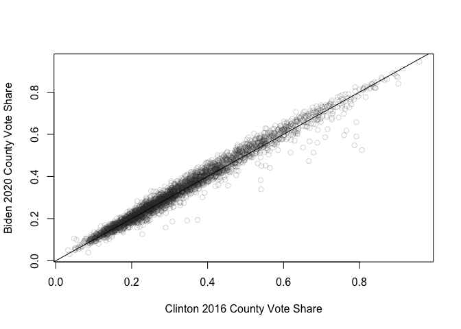

# Replication Code for Massive Election Fraud?: A Compendium of Statistically Fallacies in Claims about the 2020 Presidential Election

By: Bernard Grofman & Jonathan Cervas

Conditionally Accepted, Minor Revisions, Statistics and Public Policy

------------------------------------------------------------------------

Remove all objects just to be safe.

``` r
rm(list=ls(all=TRUE))
#library(tidyverse)
options(scipen=999)
```

Set directories where data will be read from or written to

``` r
dir.download <- "/Users/cervas/Downloads"
dir.git <- "/Users/cervas/My Drive/GitHub/Data Files"
dir.paper <- "/Users/cervas/My Drive/GitHub/jcervas.github.io/2023/SPP/Statistical-Fallacies"
dir.data <- paste0(dir.paper, "/data")
dir.figures <- paste0(dir.paper,"/figures")
dir.gis <- paste0(dir.paper,"/writeOGR")
```

Read in Functions used in other projects

``` r
source("https://raw.githubusercontent.com/jcervas/R-Functions/main/GERRYfunctions.R")
```

    ## 
    ## 
    ## •••••••••••••••••••••••••••••••••••••••••••••••••••••••••••••••••
    ##     LOADING FUNCTIONS. . . . . . . . . . . . . . . . . . . . . . 
    ## •••••••••••••••••••••••••••••••••••••••••••••••••••••••••••••••••

``` r
source("https://raw.githubusercontent.com/jcervas/R-Functions/main/seatsvotes.R")
```

    ## Seats-Votes Function - v1.0

# Load Data

``` r
# source("https://raw.githubusercontent.com/jcervas/2020-Elections/main/NYT_json.R")
## FIPS Codes
fips <- read.csv("https://raw.githubusercontent.com/jcervas/Data/master/fips.csv")

## US House Delegation Aggregate
house.del <- read.csv("https://raw.githubusercontent.com/jcervas/Data/master/Elections/House/housedelegations1868-2020.csv")
house <- read.csv("https://raw.githubusercontent.com/jcervas/Data/master/Elections/House/house_elections_1968_2020.csv")
     house$district[house$district > 54] <- 1

## State-level Presidential Election Results
pres <- read.csv("https://raw.githubusercontent.com/jcervas/Data/master/Elections/Presidential/Pres%20by%20State/president_state.csv")

## Congressional District level Presidential Election Results
presCD <- read.csv("https://raw.githubusercontent.com/jcervas/Data/master/Elections/Presidential/Pres%20by%20CD/pres_cd_1952_2020.csv")

## County-level Presidential Election Results
pres.cnty.2016 <- read.csv("https://raw.githubusercontent.com/tonmcg/US_County_Level_Election_Results_08-20/master/2016_US_County_Level_Presidential_Results.csv")
pres.cnty.2020 <- read.csv("https://raw.githubusercontent.com/tonmcg/US_County_Level_Election_Results_08-20/master/2020_US_County_Level_Presidential_Results.csv")
```

Read 2020 Presidential election data by county, via:
<https://observablehq.com/@charliesmart/dorling-cartogram>

``` r
county.2020 <- read.csv("/Users/cervas/My Drive/GitHub/Data Files/GIS/NYT/2020/2020_county_results.csv")
     county.2020$GEOID <- leadingZeroes(county.2020$GEOID, d=5)
     county.2020 <- county.2020[!is.na(county.2020$total_votes),]
write.csv(county.2020, "/Users/cervas/Downloads/county_2020.csv", row.names=F)
```

## Read Shapefiles

US Census Bureau’s County Shapefile

``` r
counties.tiger <- rgdal::readOGR(paste0(dir.git, "/GIS/Tigerline/TIGER2020PL/counties/tl_2020pl_counties_simplified/tl_2020pl_counties_simplified.shp"))
```

    ## OGR data source with driver: ESRI Shapefile 
    ## Source: "/Users/cervas/My Drive/GitHub/Data Files/GIS/Tigerline/TIGER2020PL/counties/tl_2020pl_counties_simplified/tl_2020pl_counties_simplified.shp", layer: "tl_2020pl_counties_simplified"
    ## with 3142 features
    ## It has 17 fields
    ## Integer64 fields read as strings:  ALAND20 AWATER20

``` r
tiger.cart <- rgdal::readOGR(paste0(dir.git, "/GIS/Tigerline/TIGER2020PL/counties-cartographic/cb_2020_us_county_500k_simlified_projected.json"))
```

    ## OGR data source with driver: GeoJSON 
    ## Source: "/Users/cervas/My Drive/GitHub/Data Files/GIS/Tigerline/TIGER2020PL/counties-cartographic/cb_2020_us_county_500k_simlified_projected.json", layer: "cb_2020_us_county_500k_simlified_projected"
    ## with 3234 features
    ## It has 12 fields
    ## Integer64 fields read as strings:  ALAND AWATER

    ## Warning in rgdal::readOGR(paste0(dir.git,
    ## "/GIS/Tigerline/TIGER2020PL/counties-cartographic/cb_2020_us_county_500k_simlified_projected.json")):
    ## Dropping null geometries: 265, 266, 267, 268, 325, 326, 660, 661, 662, 663, 664,
    ## 665, 912, 943, 1139, 1140, 1141, 1184, 1235, 1278, 1397, 1432, 1489, 1583, 1584,
    ## 1593, 1594, 1602, 1610, 1734, 1735, 1746, 1747, 2003, 2004, 2025, 2026, 2268,
    ## 2269, 2277, 2278, 2288, 2318, 2319, 2361, 2408, 2417, 2418, 2431, 2432, 2453,
    ## 2454, 2463, 2464, 2474, 2475, 2483, 2484, 2491, 2492, 2588, 2589, 2590, 2598,
    ## 2607, 2608, 2620, 2751, 2752, 2758, 2760, 2761, 2763, 2771, 2772, 2783, 2784,
    ## 2787, 2905, 2958, 2967, 2968, 3028, 3099, 3119, 3129, 3132, 3133, 3144, 3198,
    ## 3234

NYTs County Shapefile

``` r
counties.shp <- rgdal::readOGR(paste0(dir.git, "/GIS/NYT/2020/counties-albers-med/counties.shp"))
```

    ## OGR data source with driver: ESRI Shapefile 
    ## Source: "/Users/cervas/My Drive/GitHub/Data Files/GIS/NYT/2020/counties-albers-med/counties.shp", layer: "counties"
    ## with 3153 features
    ## It has 7 fields

``` r
state_labels <- rgdal::readOGR(paste0(dir.git, "/GIS/NYT/2020/counties-albers-med/state_labels.shp"))
```

    ## OGR data source with driver: ESRI Shapefile 
    ## Source: "/Users/cervas/My Drive/GitHub/Data Files/GIS/NYT/2020/counties-albers-med/state_labels.shp", layer: "state_labels"
    ## with 51 features
    ## It has 13 fields

``` r
states <- rgdal::readOGR(paste0(dir.git, "/GIS/NYT/2020/counties-albers-med/states.shp"))
```

    ## OGR data source with driver: ESRI Shapefile 
    ## Source: "/Users/cervas/My Drive/GitHub/Data Files/GIS/NYT/2020/counties-albers-med/states.shp", layer: "states"
    ## with 51 features
    ## It has 7 fields

``` r
state_lines <- rgdal::readOGR(paste0(dir.git, "/GIS/NYT/2020/counties-albers-med/statelines.shp"))
```

    ## OGR data source with driver: ESRI Shapefile 
    ## Source: "/Users/cervas/My Drive/GitHub/Data Files/GIS/NYT/2020/counties-albers-med/statelines.shp", layer: "statelines"
    ## with 107 features
    ## It has 2 fields

Set years examined

``` r
years <- seq(1868,2020,4)
```

Clean data

``` r
## Presidential results by Congressional District
     presCD$ed[presCD$ed > 54] <- 1 # At large districts are `98` in dataset
     presCD <- data.frame(year=presCD$year, state=presCD$state, district=presCD$ed, demPres=two_party(presCD$dem,presCD$rep))
     head(presCD)
```

    ##   year   state district   demPres
    ## 1 1952 Alabama        1 0.5775672
    ## 2 1952 Alabama        2 0.6319325
    ## 3 1952 Alabama        3 0.7223116
    ## 4 1952 Alabama        4 0.6414271
    ## 5 1952 Alabama        5 0.7269408
    ## 6 1952 Alabama        6 0.6127380

``` r
     presCD <- presCD[presCD$year %in% seq(1968,2020,2),]

## US House of Represenatives
houseCD <- data.frame(year=house$year, state=house$state, district=house$district, demCD=two_party(house$dem,house$gop))
cd.elections <- dplyr::inner_join(houseCD,presCD)
```

    ## Joining, by = c("year", "state", "district")

``` r
     head(cd.elections)
```

    ##   year   state district     demCD   demPres
    ## 1 1968 Alabama        1 0.4022654 0.6861826
    ## 2 1968 Alabama        2 0.3819142 0.6433229
    ## 3 1968 Alabama        3 1.0000000 0.7068266
    ## 4 1968 Alabama        4 0.8840256 0.6013500
    ## 5 1968 Alabama        5 0.8257659 0.7308212
    ## 6 1968 Alabama        6 0.3325997 0.5488313

Compare 2016 and 2018 elections

``` r
presCD.2016 <- presCD[presCD$year %in% "2016",]
houseCD.2016 <- houseCD[houseCD$year %in% "2016",]
houseCD.2018 <- houseCD[houseCD$year %in% "2018",]
     elec.2016.2018 <- dplyr::full_join(presCD.2016,houseCD.2018, by=c("state", "district"))
     elec.2016.2016 <- dplyr::full_join(presCD.2016,houseCD.2016, by=c("state", "district"))
head(elec.2016.2018)
```

    ##   year.x   state district   demPres year.y     demCD
    ## 1   2016  Alaska        1 0.4161435   2018 0.4669369
    ## 2   2016 Alabama        1 0.3492051   2018 0.3680121
    ## 3   2016 Alabama        2 0.3370181   2018 0.3849741
    ## 4   2016 Alabama        3 0.3311129   2018 0.3624173
    ## 5   2016 Alabama        4 0.1783581   2018 0.2014847
    ## 6   2016 Alabama        5 0.3263326   2018 0.3892786

``` r
sum(1 * (elec.2016.2018$demCD > 0.5 & elec.2016.2018$demPres < 0.5), na.rm=T) # Trump win, Dem wins in 2018
```

    ## [1] 35

``` r
sum(1 * (elec.2016.2018$demCD < 0.5 & elec.2016.2018$demPres > 0.5), na.rm=T) # Clinton win, gop wins in 2018
```

    ## [1] 5

``` r
sum(1 * (elec.2016.2016$demCD > 0.5 & elec.2016.2016$demPres < 0.5), na.rm=T) # Trump win, Dem wins in 2018
```

    ## [1] 13

``` r
sum(1 * (elec.2016.2016$demCD < 0.5 & elec.2016.2016$demPres > 0.5), na.rm=T) # Clinton win, gop wins in 2018
```

    ## [1] 24

Bias in the 2020 US House of Representatives

``` r
seatsvotes(DEMvotes=house$dem, REPvotes=house$gop, year="2020", vBar.range = c(0.45, 0.55))
```

    ##   year intercept intercept_se intercept_Pr swing_ratio swing_ratio_se
    ## 1 2020    -0.064            0            0       1.387          0.003
    ##   swing_ratio_Pr Log_Odds_SEATS Linear_Regression_SEATS Bias_low Bias_point
    ## 1              0         48.411                 48.421%   -0.016     -0.016
    ##   Bias_high ActualSEATS ActualVotes   vote_bias   seat_bias
    ## 1    -0.016       0.543        0.54 -0.01145617 -0.01588856

Alternative Pres without NY and CA

``` r
pres.alt <- pres[!pres$state %in% c("New York", "California"),]
  head(pres.alt)
```

    ##   year       state    pop       dem  total ecvotes dlag dlag2 house
    ## 1 1868     Alabama 964201 0.4874789 149588       8   NA    NA     6
    ## 2 1868      Alaska     NA        NA     NA      NA   NA    NA    NA
    ## 3 1868     Arizona     NA        NA     NA      NA   NA    NA    NA
    ## 4 1868    Arkansas 435450 0.4631707  41190       5   NA    NA     3
    ## 6 1868    Colorado     NA        NA     NA      NA   NA    NA    NA
    ## 7 1868 Connecticut 460147 0.4850758  98632       6   NA    NA     4

Coattails

``` r
house.del$coattails <- as.numeric(ifelse(house.del$pres_party==1, house.del$DemChange, house.del$RepChange))

pres.del <- house.del[(house.del$Congress %% 2) %in% 1,]
midterm.del <- house.del[(house.del$Congress %% 2) %in% 0,]
```

Plot Coattails over time

``` r
plot(pres.del$Congress, pres.del$coattails/pres.del$seats, axes=F, xlab="", ylab="Presidential Coattails", col="#33333333")
axis(side=2, las=1, at=seq(-0.2,0.2, 0.05), labels=paste0(seq(-0.2,0.2, 0.05) * 100, "%"), cex.axis=0.5)
axis(side=1, las=2, at=pres.del$Congress, labels=pres.del[,1], cex.axis=0.5)
lines(lowess(pres.del$coattails/pres.del$seats ~ pres.del$Congress))
abline(h=0, lty=3)
```

<!-- -->

2016 Presidential elections by county

``` r
pres.cnty.2016 <- data.frame(fips=leadingZeroes(pres.cnty.2016$combined_fips,5), dem2016=pres.cnty.2016$votes_dem, gop2016=pres.cnty.2016$votes_gop)
     pres.cnty.2016$total <- pres.cnty.2016$dem2016+pres.cnty.2016$gop2016
     head(pres.cnty.2016)
```

    ##    fips dem2016 gop2016  total
    ## 1 02013   93003  130413 223416
    ## 2 02016   93003  130413 223416
    ## 3 02020   93003  130413 223416
    ## 4 02050   93003  130413 223416
    ## 5 02060   93003  130413 223416
    ## 6 02068   93003  130413 223416

2020 Presidential elections by county

``` r
pres.cnty.2020 <- data.frame(fips=leadingZeroes(pres.cnty.2020$county_fips,5), dem2020=pres.cnty.2020$votes_dem, gop2020=pres.cnty.2020$votes_gop)
     pres.cnty.2020$total <- pres.cnty.2020$dem2020+pres.cnty.2020$gop2020

## Order from largest to smallest county (votes)
pres.cnty.2020.decrease <- pres.cnty.2020[order(pres.cnty.2020$total, decreasing=T),]

## Order from smallest to largest county (votes)
pres.cnty.2020.increase <- pres.cnty.2020[order(pres.cnty.2020$total, decreasing=F),]

## Half the Population in X Counties
pres.top.cnty <- pres.cnty.2020.decrease[cumsum(pres.cnty.2020.decrease$total)<sum(pres.cnty.2020.decrease$total)/2,]
     dim(pres.top.cnty)[1] # 150 counties have half the votes
```

    ## [1] 150

``` r
## Reverse
pres.top.cnty.rev <- pres.cnty.2020.increase[cumsum(pres.cnty.2020.increase$total)<sum(pres.cnty.2020.increase$total)/2,]
     dim(pres.top.cnty.rev)[1] # 3001 have the other half
```

    ## [1] 3001

Population of top 150 counties and bottom 3001 counties

``` r
     sum(pres.cnty.2020.increase$total[1:3001])
```

    ## [1] 77708312

``` r
     sum(pres.cnty.2020.decrease$total[1:150])
```

    ## [1] 77537909

Compare 2016 and 2020 by county

``` r
a <- dplyr::full_join(pres.cnty.2016, pres.cnty.2020, by="fips")
     tail(a)
```

    ##       fips dem2016 gop2016 total.x dem2020 gop2020 total.y
    ## 3177 02936      NA      NA      NA    3796    5114    8910
    ## 3178 02937      NA      NA      NA    2560    2358    4918
    ## 3179 02938      NA      NA      NA    3202    1737    4939
    ## 3180 02939      NA      NA      NA    3580    1939    5519
    ## 3181 02940      NA      NA      NA    2318    1994    4312
    ## 3182 46102      NA      NA      NA    2829     297    3126

``` r
counties.16.20 <- a[complete.cases(a),] # Problems with Alaska

plot(
     two_party(counties.16.20$dem2016,counties.16.20$gop2016), 
     two_party(counties.16.20$dem2020,counties.16.20$gop2020), 
     xlab="Clinton 2016 County Vote Share", 
     ylab="Biden 2020 County Vote Share", 
     col="#33333333")
abline(0,1)
```

<!-- -->

``` r
summary(lm(two_party(counties.16.20$dem2020,counties.16.20$gop2020) ~ two_party(counties.16.20$dem2016,counties.16.20$gop2016)))
```

    ## 
    ## Call:
    ## lm(formula = two_party(counties.16.20$dem2020, counties.16.20$gop2020) ~ 
    ##     two_party(counties.16.20$dem2016, counties.16.20$gop2016))
    ## 
    ## Residuals:
    ##       Min        1Q    Median        3Q       Max 
    ## -0.286544 -0.013487  0.000423  0.015364  0.075518 
    ## 
    ## Coefficients:
    ##                                                           Estimate Std. Error
    ## (Intercept)                                               0.006408   0.001098
    ## two_party(counties.16.20$dem2016, counties.16.20$gop2016) 0.998546   0.002971
    ##                                                           t value
    ## (Intercept)                                                 5.835
    ## two_party(counties.16.20$dem2016, counties.16.20$gop2016) 336.105
    ##                                                                       Pr(>|t|)
    ## (Intercept)                                                      0.00000000592
    ## two_party(counties.16.20$dem2016, counties.16.20$gop2016) < 0.0000000000000002
    ##                                                              
    ## (Intercept)                                               ***
    ## two_party(counties.16.20$dem2016, counties.16.20$gop2016) ***
    ## ---
    ## Signif. codes:  0 '***' 0.001 '**' 0.01 '*' 0.05 '.' 0.1 ' ' 1
    ## 
    ## Residual standard error: 0.02665 on 3109 degrees of freedom
    ## Multiple R-squared:  0.9732, Adjusted R-squared:  0.9732 
    ## F-statistic: 1.13e+05 on 1 and 3109 DF,  p-value: < 0.00000000000000022

This time with raw votes

``` r
plot(
     counties.16.20$dem2016-counties.16.20$gop2016, 
     counties.16.20$dem2020-counties.16.20$gop2020, 
     xlab="Clinton Advantage 2016 County Vote", 
     ylab="Biden Advantage 2020 County Vote", 
     col="#33333333")
abline(0,1)
```

<!-- -->

Figure 1 - 2020 Presidential Election Results, by county

``` r
svglite::svglite(paste0(dir.figures,"/2020county.svg"), width=8, height=5)
     par(mfrow=c(2,1),
          mar = c(1, 0.1, 1, 0.1))
          hist(county.2020$per_dem, 
               xlim=c(0,1), 
               breaks=101, 
               col="white", 
               border="#000000", 
               main="Unweighted", 
               axes=F, 
               xlab="", 
               ylab="")
               abline(v=0.5, lty=1, lwd=2)
     par(mar = c(2, 0.1, 1, 0.1))
          hist(rep(county.2020$per_dem, county.2020$total_votes), 
               xlim=c(0,1), 
               breaks=101, 
               col="white", 
               border="#000000",
               main="Weighted", 
               axes=F, 
               xlab="", 
               ylab="")
               abline(v=0.5, lty=1, lwd=2)
               axis(side=1, at=c(0,0.5,1), labels=c("0%", "50%", "100%"))
               mtext("More Democratic          ", side=1, line=0, adj=1)
dev.off()
```

    ## quartz_off_screen 
    ##                 2

Biden Counties vs. Trump Counties

``` r
## Biden Counties
county.2020.biden <- county.2020[county.2020$votes_dem > county.2020$votes_gop,]
     sum(county.2020.biden$votes_dem) # Biden Votes
```

    ## [1] 59019426

``` r
     sum(county.2020.biden$votes_gop) # Trump Votes
```

    ## [1] 33564182

``` r
     sum(county.2020.biden$diff) # Difference
```

    ## [1] -25455244

``` r
## Trump Counties
county.2020.trump <- county.2020[county.2020$votes_dem < county.2020$votes_gop,]
     sum(county.2020.trump$votes_dem) # Biden Votes
```

    ## [1] 22245568

``` r
     sum(county.2020.trump$votes_gop) # Trump Votes
```

    ## [1] 40644014

``` r
     sum(county.2020.trump$diff) # Difference
```

    ## [1] 18398446

``` r
## Trump most votes, county
     county.2020[order(county.2020$votes_gop, decreasing=T),][1:10,]
```

    ##      ST GEOID        NAME STATEFP state_name        county_name votes_gop
    ## 49   CA 06037 Los Angeles       6 California Los Angeles County   1145530
    ## 31   AZ 04013    Maricopa       4    Arizona    Maricopa County    995665
    ## 1003 TX 48201      Harris      48      Texas      Harris County    700630
    ## 878  CA 06059      Orange       6 California      Orange County    676498
    ## 2993 CA 06073   San Diego       6 California   San Diego County    600094
    ## 364  IL 17031        Cook      17   Illinois        Cook County    558269
    ## 1681 FL 12086  Miami-Dade      12    Florida  Miami-Dade County    532833
    ## 1046 CA 06065   Riverside       6 California   Riverside County    448702
    ## 1207 NV 32003       Clark      32     Nevada       Clark County    430930
    ## 1908 TX 48439     Tarrant      48      Texas     Tarrant County    409741
    ##      votes_dem total_votes     diff   per_gop   per_dem per_point_diff
    ## 49     3028885     4263443 -1883355 0.2686866 0.7104317    -0.44174509
    ## 31     1040774     2069475   -45109 0.4811196 0.5029169    -0.02179732
    ## 1003    918193     1640818  -217563 0.4270004 0.5595947    -0.13259423
    ## 878     814009     1521725  -137511 0.4445600 0.5349252    -0.09036521
    ## 2993    964650     1601722  -364556 0.3746555 0.6022581    -0.22760254
    ## 364    1725973     2321399 -1167704 0.2404882 0.7435055    -0.50301736
    ## 1681    617864     1156816   -85031 0.4606031 0.5341074    -0.07350434
    ## 1046    527945      996156   -79243 0.4504335 0.5299823    -0.07954879
    ## 1207    521852      972510   -90922 0.4431111 0.5366032    -0.09349210
    ## 1908    411567      834697    -1826 0.4908859 0.4930735    -0.00218762

Statewide Vote

``` r
state.2020 <- aggregate(
     data.frame(
          votes_gop=county.2020$votes_gop,
          votes_dem=county.2020$votes_dem,
          total_votes=county.2020$total_votes,
          diff=county.2020$diff), 
     by=
     list(
          state_name=county.2020$state_name), 
     FUN=sum)

sum((4263443 > state.2020$total_votes) * 1)
```

    ## [1] 39

Combine 2020 data with Shapefiles

``` r
counties.shp@data <- dplyr::left_join(counties.shp@data, county.2020, by=c("GEOID"))
counties.tiger@data <- dplyr::left_join(counties.tiger@data, county.2020, by=c("GEOID20"="GEOID"))

     head(counties.shp@data)
```

    ##   ST.x GEOID    NAME.x STATEFP.x         X         Y   SQKM ST.y    NAME.y
    ## 1   IA 19107    Keokuk        19  317271.6 436242.12 1502.0   IA    Keokuk
    ## 2   IA 19189 Winnebago        19  182712.9 660252.81 1039.4   IA Winnebago
    ## 3   KS 20093    Kearny        20 -462758.4  69021.18 2255.4   KS    Kearny
    ## 4   KS 20123  Mitchell        20 -188533.0 214400.46 1862.8   KS  Mitchell
    ## 5   KS 20187   Stanton        20 -505788.4  22474.11 1761.8   KS   Stanton
    ## 6   KY 21005  Anderson        21  956494.6 114212.54  529.1   KY  Anderson
    ##   STATEFP.y state_name      county_name votes_gop votes_dem total_votes diff
    ## 1        19       Iowa    Keokuk County      3797      1414        5303 2383
    ## 2        19       Iowa Winnebago County      3707      2135        5970 1572
    ## 3        20     Kansas    Kearny County      1134       255        1413  879
    ## 4        20     Kansas  Mitchell County      2454       547        3039 1907
    ## 5        20     Kansas   Stanton County       607       147         767  460
    ## 6        21   Kentucky  Anderson County      9661      3348       13254 6313
    ##     per_gop   per_dem per_point_diff
    ## 1 0.7160098 0.2666415      0.4493683
    ## 2 0.6209380 0.3576214      0.2633166
    ## 3 0.8025478 0.1804671      0.6220807
    ## 4 0.8075025 0.1799934      0.6275090
    ## 5 0.7913950 0.1916558      0.5997392
    ## 6 0.7289120 0.2526030      0.4763090

``` r
     # counties.shp <- counties.shp[!counties.shp@data$ST %in% c("AK","HI"),]
rgdal::writeOGR(counties.shp, dir.gis, "us2020", driver="ESRI Shapefile", overwrite_layer=TRUE)
```

    ## Warning in rgdal::writeOGR(counties.shp, dir.gis, "us2020", driver = "ESRI
    ## Shapefile", : Field names abbreviated for ESRI Shapefile driver

``` r
nation.shp <- rmapshaper::ms_dissolve(states)
```

    ## Registered S3 method overwritten by 'geojsonlint':
    ##   method         from 
    ##   print.location dplyr

Set Colors

``` r
# dodgerblue.t <- rgb(30, 144, 255, 127.5, max =255)
# dodgerblue <- rgb(30, 144, 255, max =255)
# indianred.t <- rgb(205, 92, 92, 127.5, max =255)
# indianred <- rgb(205, 92, 92, max =255)
# indianred.75 <- rgb(205, 92, 92, 191, max =255)
# colors.map <- c(indianred.t, dodgerblue.t)
# colors.map.borders <- c(indianred, dodgerblue)
colors.map <- c("#c93135","#1375b7")
```

Create Choropleth inputs

``` r
     pop.brks <- seq(0,1,0.5)
     counties.shp@data$col <- colors.map[findInterval(counties.shp@data$per_dem, vec = pop.brks)]

     # brks <- c(0, 10000, 25000, 50000, 100000, 200000, 400000, 800000, 1600000, 3200000)
     # size.brks <- c(0.25, 0.5, seq(1,25,4))
     # pop.blocks <- size.brks[findInterval(counties.shp@data$total_votes, vec = brks)]
     absmargin <- abs(counties.shp@data$votes_dem-counties.shp@data$votes_gop)

# Function to calculate the rScale
scaleSqrt <- function(value, maxRadius=20, maxDomain=NA) {
if (is.na(maxDomain)) {stop("Need max Domain")}
# Input domain values
     domain <- c(0, maxDomain)  # Example domain values
# Output range values
     range <- c(0, maxRadius)  # Example range values

  # Calculate the square root of the value
  sqrt_value <- sqrt(value)
  
  # Map the square root value to the output range
  scaled_value <- (sqrt_value - sqrt(domain[1])) / (sqrt(domain[2]) - sqrt(domain[1]))
  scaled_value <- scaled_value * (range[2] - range[1]) + range[1]
  
  return(scaled_value)
}

# Function to calculate the oScale
scaleOpacitySqrt <- function(value, minOpacity=0, maxOpacity=20, maxDomain=NA) {
if (is.na(maxDomain)) {stop("Need max Domain")}
# Input domain values
     domain <- c(0, maxDomain)  # Example domain values
# Output range values
     range <- c(minOpacity, maxOpacity)  # Example range values

  # Calculate the square root of the value
  sqrt_value <- sqrt(value)
  
  # Map the square root value to the output range
  scaled_value <- (sqrt_value - sqrt(domain[1])) / (sqrt(domain[2]) - sqrt(domain[1]))
  scaled_value <- scaled_value * (range[2] - range[1]) + range[1]
  
  alpha_hex <- sprintf("%02X", round(scaled_value * 255))
  return(alpha_hex)
}

pop.sizes <- 
scaleSqrt(
     county.2020$total_votes,
     maxRadius= 5, 
     maxDomain= max(county.2020$total_votes))

pop.opacity <- 
scaleOpacitySqrt(
     abs(county.2020$per_point_diff),
     minOpacity=0.25,
     maxOpacity= 0.75, 
     maxDomain= max(abs(county.2020$per_point_diff)))

# pop.sizes <- sqrt(absmargin) * 0.005
```

Create Maps

``` r
## If we wanted to make a .png file
# png(paste0("us2020.png"), 
#    height = 4000, width = 6000, 
#    units = "px", pointsize = 24)

## To make a *.svg file

## Choropleth Map
svglite::svglite(paste0(dir.figures,"/us2020.svg"))
par(mfrow=c(1,1),
          mar = c(0.1, 0.1, 0.1, 0.1))
     sp::plot(counties.shp, col=counties.shp@data$col, border="#ffffff", lwd=0.15)
     sp::plot(states, border="#ffffff", add=T, lwd=1)
     sp::plot(nation.shp, col=NA, border="#777777", add=T, lwd=1)
     text(state_labels@data$X, state_labels@data$Y, labels=state_labels@data$label_text, cex=0.8)
dev.off()
```

    ## quartz_off_screen 
    ##                 2

``` r
## Bubble Map
svglite::svglite(paste0(dir.figures,"/us2020_bubble.svg"))
par(mfrow=c(1,1),
          mar = c(0.1, 0.1, 0.1, 0.1))
     sp::plot(counties.shp, border="#ffffff", col="#ffffff", lwd=0.15)
counties.shp@data$col_trans <- ifelse(is.na(counties.shp@data$col), counties.shp@data$col, paste0(counties.shp@data$col, pop.opacity)) # Add transparency
     sp::plot(states, border="#999999", add=T, lwd=1)
     points(counties.shp@data$X, counties.shp@data$Y, 
          cex=pop.sizes, 
          col="#00000033", 
          bg=counties.shp@data$col_trans, 
          pch=21, 
          lwd=1)
     sp::plot(nation.shp, col=NA, border="#777777", add=T, lwd=1)
     text(state_labels@data$X, state_labels@data$Y, labels=state_labels@data$label_text, cex=0.8)
dev.off()
```

    ## quartz_off_screen 
    ##                 2

Make Choropleth Plot in mapshaper.org

    ## FIGURE 2A and 2B - Choropleth Plot, 2020 Presidential Election by county; Bubble Plot, 2020 Presidential Election by county (RUN IN TERMINAL)
    mapshaper -i "/Users/cervas/My Drive/GitHub/Data Files/GIS/NYT/counties-albers-med.json"
    -i "/Users/cervas/Downloads/county_2020.csv" string-fields=GEOID name=data
    -join target=counties data keys=GEOID,GEOID
    -each target=counties 'marginper = per_dem-0.5'
    -each target=counties 'absmargin = Math.abs(per_point_diff)'
    -each 'absmargin = Math.abs(per_point_diff)'
    -style target=counties r='Math.sqrt(total_votes) * 0.008'
    -sort absmargin descending
    -style target=counties opacity=1 fill='per_point_diff > 0 ? "#cc0000" : "#0061aa"'
    -innerlines + name=counties_style
    -style target=counties_style stroke="#ddd" stroke-width=0.15
    -style target=states stroke="#000" fill=none
    -o "/Users/cervas/Downloads/us_chor.svg" target=counties,states,state_labels
    -points target=counties inner + name=points
    -style opacity=0.5 fill='per_point_diff > 0 ? "#cc0000" : "#0061aa"'
    -o "/Users/cervas/Downloads/us_bubble.svg" target=points,states,state_labels

Create Cartograms

``` r
counties.shp.cart.tmp <- counties.shp
counties.shp.cart <- counties.shp.cart.tmp[!is.na(counties.shp.cart.tmp@data$total),]
counties.shp.cart@data$margin <- abs(counties.shp.cart@data$votes_dem-counties.shp.cart@data$votes_gop)
counties.shp.cart1 <- cartogram::cartogram_ncont(counties.shp.cart, "margin")
counties.shp.cart2 <- cartogram::cartogram_cont(counties.shp.cart, "margin", itermax=3)
     # rgdal::writeOGR(counties.shp, dir.gis, "counties_shp_cart2", driver="ESRI Shapefile", overwrite_layer=TRUE)

counties.shp.dorling <- cartogram::cartogram_dorling(x=counties.shp, weight="margin")
```

Plot Cartograms

``` r
svglite::svglite(paste0(dir.figures,"/us2020_cart.svg"))
     sp::plot(counties.shp.cart1, border="#dddddd", col=counties.shp.cart1@data$col, lwd=0.15)
dev.off()

svglite::svglite(paste0(dir.figures,"us2020_cart2.svg"))
     sp::plot(counties.shp.cart2, border=counties.shp.cart2@data$gs.pop.blocks, col=counties.shp.cart2@data$col, lwd=0.15)
dev.off()

svglite::svglite(paste0(dir.figures,"us2020_dorling.svg"))
     sp::plot(counties.shp.dorling, id=counties.shp.dorling@data$NAME, border=NA, col=counties.shp.dorling@data$col, lwd=0.15)
dev.off()

rgdal::writeOGR(counties.shp.cart1, dir.gis, "counties.shp.cart1", driver="ESRI Shapefile", overwrite_layer=TRUE)
rgdal::writeOGR(counties.shp.cart2, dir.gis, "counties.shp.cart2", driver="ESRI Shapefile", overwrite_layer=TRUE)
```

Figure X: County Size and Number of Voters

``` r
cnty <- county.2020[order(county.2020$total_votes),]
cnty$pop_cumsum <- cumsum(cnty$total_votes)
cnty$dem_cumsum <- cumsum(cnty$votes_dem)
cnty$gop_cumsum <- cumsum(cnty$votes_gop)

svglite::svglite(paste0(dir.figures,"/county-vote.svg"), width = 8,height = 3)
par(mfrow=c(1,1),
          mar = c(0.5, 4, 0.1, 0.1))
barplot(
     cnty$total_votes, 
     names.arg = cnty$NAME,
     col = ifelse(cnty$votes_dem > cnty$votes_gop, "#1375b7","#c93135"),
     border=NA,
     xlab = "", 
     ylab = "Total Votes",
  main = "",
  axes=F,
     xaxt="n")
x_ticks <- barplot(cnty$total_votes, plot = FALSE)
## Calculate the center of the plot
     plot_center <- mean(par("usr")[3:4])

axis(side=2, las=2, at=seq(0,4000000, 1000000), paste0(seq(0,4,1),"mil"))
abline(v = x_ticks[3153-150], lty = "dashed", col = "black")
text(x = x_ticks[3153-150], y = plot_center, labels = "Half of voters live in counties\n on either side of line", srt = 90)
dev.off()
```

    ## quartz_off_screen 
    ##                 2

``` r
# Cumulative Sum of Voters
# barplot(
#   cnty$pop_cumsum, 
#   col = ifelse(cnty$dem_cumsum > cnty$gop_cumsum, "blue", "red"), 
#   border=NA,
#   ylab="",
#   axes=F)
# # axis(side=2, las=2, at=seq(0,150000000, 50000000), paste0(seq(0,150, 50),"mil"))

# sum(cnty$votes_dem[cnty$votes_dem > cnty$votes_gop])
# sum(cnty$votes_gop[cnty$votes_dem < cnty$votes_gop])


## Alternative bar plot 

# Create example data
dem <- cnty$votes_dem
gop <- cnty$votes_gop

# Calculate the total population
totalvotes <- dem + gop

# Create the stacked bar plot
svglite::svglite(paste0(dir.figures,"/county-vote.svg"), width = 8,height = 3)
par(mfrow=c(1,1),
          mar = c(0.5, 4, 0.1, 0.1))
barplot(
     rbind(dem, gop), 
     beside = FALSE, 
  col = c("#1375b7","#c93135"),
     border=NA,
     xlab = "", 
     ylab = "Total Votes",
  main = "",
  axes=F,
     xaxt="n")
x_ticks <- barplot(cnty$total_votes, plot = FALSE)
## Calculate the center of the plot
     plot_center <- mean(par("usr")[3:4])

axis(side=2, las=2, at=seq(0,4000000, 1000000), paste0(seq(0,4,1),"mil"))
abline(v = x_ticks[3153-150], lty = "dashed", col = "black")
text(x = x_ticks[3153-150], y = plot_center, labels = "Half of voters live in counties\n on either side of line", srt = 90)
# Add a legend
legend(
     "topleft", 
     legend = c("Democratic", "Republican"), 
     fill = c("#1375b7","#c93135"),
     bty="n")
dev.off()
```

    ## quartz_off_screen 
    ##                 2

Exit Poll Data

``` r
groups <- c(
     "White",
     "Black",
     "Hispanic",
     "Asian",
     "Other")
type.exit <- c(
     "proportion_vote",
     "Democratic",
     "Republican"
)
exit.2016 <- 
     matrix(
          c(0.70,0.12,0.11,0.04,0.03,
               0.37,0.89,0.66,0.65,0.56,
               0.57,0.08,0.28,0.27,0.36),
          ncol=5, byrow = TRUE)
exit.2020 <-
     matrix(
          c(0.67,  0.13,  0.13,  0.04,  0.04,
               0.41,  0.87,  0.65,  0.61,  0.55,
               0.58,  0.12,  0.32,  0.34,  0.41),
          ncol=5, byrow = TRUE)

colnames(exit.2016) <- colnames(exit.2020) <- groups
rownames(exit.2016) <- rownames(exit.2020) <- type.exit

exit.2016
```

    ##                 White Black Hispanic Asian Other
    ## proportion_vote  0.70  0.12     0.11  0.04  0.03
    ## Democratic       0.37  0.89     0.66  0.65  0.56
    ## Republican       0.57  0.08     0.28  0.27  0.36

``` r
exit.2020
```

    ##                 White Black Hispanic Asian Other
    ## proportion_vote  0.67  0.13     0.13  0.04  0.04
    ## Democratic       0.41  0.87     0.65  0.61  0.55
    ## Republican       0.58  0.12     0.32  0.34  0.41

Ignore this, for now

``` r
# Read in 2000-2020 Presidential election results, by county 
# (MIT Election Data and Science Lab, 2018, 
# "County Presidential Election Returns 2000-2020", 
# https://doi.org/10.7910/DVN/VOQCHQ, 
# Harvard Dataverse, V10, UNF:6:pVAMya52q7VM1Pl7EZMW0Q== [fileUNF])

# county.pres <- read.csv("https://raw.githubusercontent.com/jcervas/Data/master/Elections/Presidential/Pres%20By%20County/County%20Presidential%20Election%20Returns%202000-2020/countypres_2000-2020.csv")
#    head(county.pres)
#    county.pres$fips <- leadingZeroes(county.pres$county_fips, d=5)
# county.pres.2020 <- county.pres[county.pres$year == 2020,]

# county.pres.2020.dem <- county.pres.2020[county.pres.2020$party == "DEMOCRAT",]
#    county.2020.dem <- aggregate(list(dem=county.pres.2020.dem$candidatevotes), by=list(state=county.pres.2020.dem$state, county=county.pres.2020.dem$county_name, fips=county.pres.2020.dem$fips), FUN=sum)
# county.pres.2020.gop <- county.pres.2020[county.pres.2020$party == "REPUBLICAN",]
#    county.2020.gop <- aggregate(list(gop=county.pres.2020.gop$candidatevotes), by=list(state=county.pres.2020.gop$state, county=county.pres.2020.gop$county_name, fips=county.pres.2020.gop$fips), FUN=sum)


# county.2020 <- (dplyr::full_join(county.2020.dem, county.2020.gop, by=c("state", "county", "fips")))
# county.2020 <- county.2020[!county.2020$fips %in% "   NA",]
# county.2020$total <- county.2020$dem + county.2020$gop
#    head(county.2020)
# county.2020$DEM <- two_party(county.2020$dem, county.2020$gop)
```
