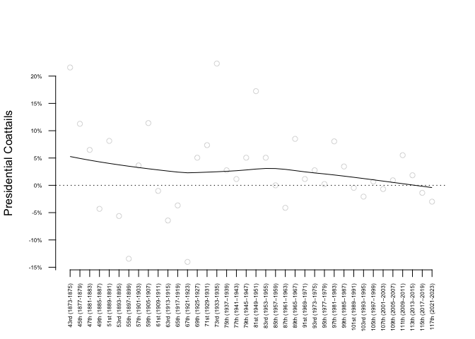
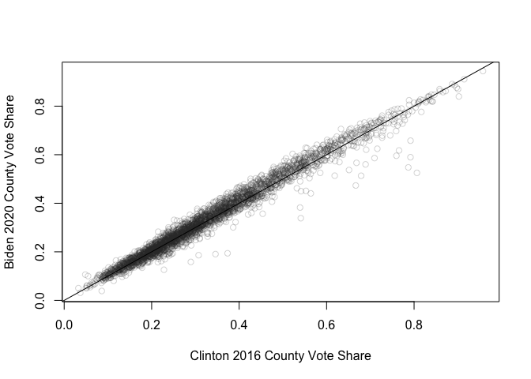
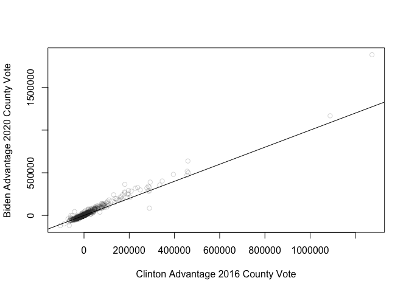
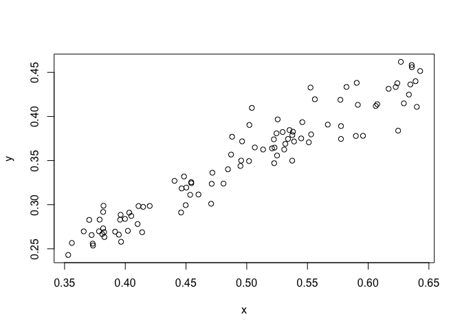
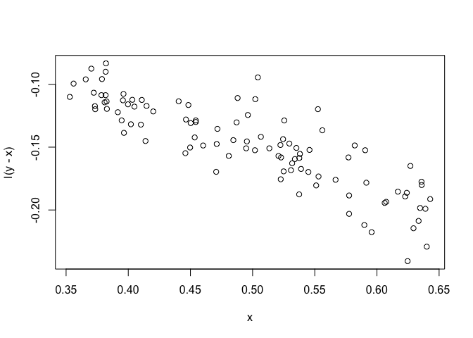
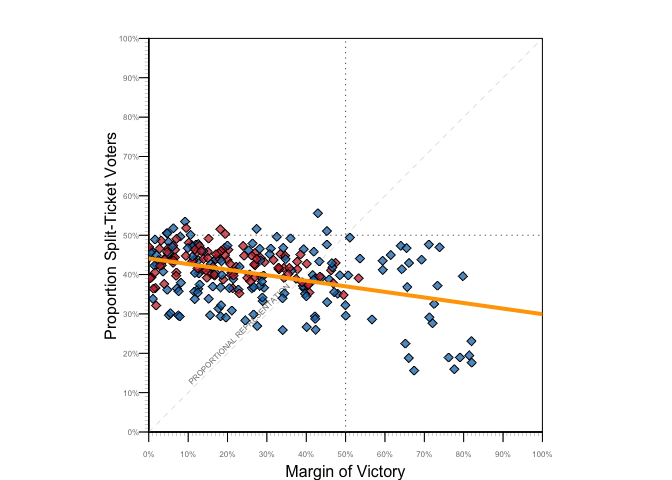
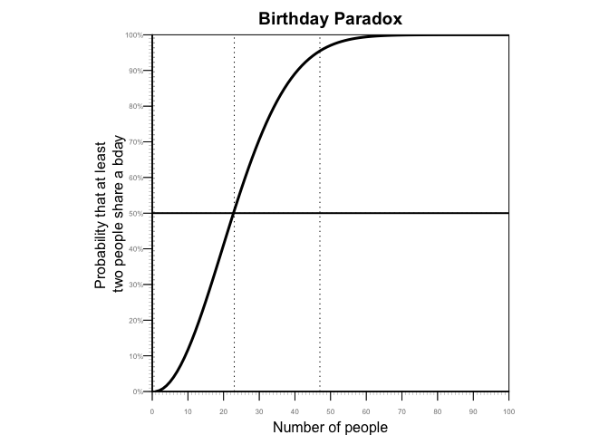

# Replication Code for Massive Election Fraud?: A Compendium of Statistically Fallacies in Claims about the 2020 Presidential Election

By: Bernard Grofman & Jonathan Cervas

Conditionally Accepted, Minor Revisions, Statistics and Public Policy

------------------------------------------------------------------------

Remove all objects just to be safe.

``` r
rm(list=ls(all=TRUE))
#library(tidyverse)
options(scipen=999)
```

Set directories where data will be read from or written to

``` r
dir.download <- "/Users/cervas/Downloads"
dir.git <- "/Users/cervas/My Drive/GitHub/Data Files"
dir.online.git <- "https://raw.githubusercontent.com/jcervas/Data"
dir.paper <- "/Users/cervas/My Drive/GitHub/jcervas.github.io/2023/SPP"
dir.data <- paste0(dir.paper, "/data")
dir.figures <- paste0(dir.paper,"/figures")
dir.gis <- paste0(dir.paper,"/GIS")
```

Read in Functions used in other projects

    ## 
    ## 
    ## •••••••••••••••••••••••••••••••••••••••••••••••••••••••••••••••••
    ##     LOADING FUNCTIONS. . . . . . . . . . . . . . . . . . . . . . 
    ## •••••••••••••••••••••••••••••••••••••••••••••••••••••••••••••••••

    ## Seats-Votes Function - v1.0

Set years examined

``` r
years <- seq(1868,2020,4)
```

# Load Data

``` r
# source("https://raw.githubusercontent.com/jcervas/2020-Elections/main/NYT_json.R")
## FIPS Codes
fips <- read.csv("https://raw.githubusercontent.com/jcervas/Data/master/fips.csv")

## US House Delegation Aggregate
house.del <- read.csv("https://raw.githubusercontent.com/jcervas/Data/master/Elections/House/housedelegations1868-2020.csv")
house <- read.csv("https://raw.githubusercontent.com/jcervas/Data/master/Elections/House/house_elections_1968_2020.csv")
  house$district[house$district > 54] <- 1

## State-level Presidential Election Results
pres <- read.csv("https://raw.githubusercontent.com/jcervas/Data/master/Elections/Presidential/Pres%20by%20State/president_state.csv")

## Congressional District level Presidential Election Results
presCD <- read.csv("https://raw.githubusercontent.com/jcervas/Data/master/Elections/Presidential/Pres%20by%20CD/pres_cd_1952_2020.csv")

## County-level Presidential Election Results
pres.county.2016 <- read.csv("https://raw.githubusercontent.com/tonmcg/US_County_Level_Election_Results_08-20/master/2016_US_County_Level_Presidential_Results.csv")
pres.county.2020 <- read.csv("https://raw.githubusercontent.com/tonmcg/US_County_Level_Election_Results_08-20/master/2020_US_County_Level_Presidential_Results.csv")
```

Read 2020 Presidential election data by county, via:
<https://observablehq.com/@charliesmart/dorling-cartogram>

``` r
county.2020 <- read.csv("/Users/cervas/My Drive/GitHub/Data Files/GIS/NYT/2020/2020_county_results.csv")
  county.2020$GEOID <- leadingZeroes(county.2020$GEOID, d=5)
  county.2020 <- county.2020[!is.na(county.2020$total_votes),]
write.csv(county.2020, "/Users/cervas/Downloads/county_2020.csv", row.names=F)
```

## Read Shapefiles

US Census Bureau’s County Shapefile

``` r
counties.tiger <- rgdal::readOGR(paste0(dir.git, "/GIS/Tigerline/TIGER2020PL/counties/tl_2020pl_counties_simplified/tl_2020pl_counties_simplified.shp"))
```

    ## OGR data source with driver: ESRI Shapefile 
    ## Source: "/Users/cervas/My Drive/GitHub/Data Files/GIS/Tigerline/TIGER2020PL/counties/tl_2020pl_counties_simplified/tl_2020pl_counties_simplified.shp", layer: "tl_2020pl_counties_simplified"
    ## with 3142 features
    ## It has 17 fields
    ## Integer64 fields read as strings:  ALAND20 AWATER20

``` r
tiger.cart <- rgdal::readOGR(paste0(dir.git, "/GIS/Tigerline/TIGER2020PL/counties-cartographic/cb_2020_us_county_500k_simlified_projected.json"))
```

    ## OGR data source with driver: GeoJSON 
    ## Source: "/Users/cervas/My Drive/GitHub/Data Files/GIS/Tigerline/TIGER2020PL/counties-cartographic/cb_2020_us_county_500k_simlified_projected.json", layer: "cb_2020_us_county_500k_simlified_projected"
    ## with 3234 features
    ## It has 12 fields
    ## Integer64 fields read as strings:  ALAND AWATER

    ## Warning in rgdal::readOGR(paste0(dir.git,
    ## "/GIS/Tigerline/TIGER2020PL/counties-cartographic/cb_2020_us_county_500k_simlified_projected.json")):
    ## Dropping null geometries: 265, 266, 267, 268, 325, 326, 660, 661, 662, 663, 664,
    ## 665, 912, 943, 1139, 1140, 1141, 1184, 1235, 1278, 1397, 1432, 1489, 1583, 1584,
    ## 1593, 1594, 1602, 1610, 1734, 1735, 1746, 1747, 2003, 2004, 2025, 2026, 2268,
    ## 2269, 2277, 2278, 2288, 2318, 2319, 2361, 2408, 2417, 2418, 2431, 2432, 2453,
    ## 2454, 2463, 2464, 2474, 2475, 2483, 2484, 2491, 2492, 2588, 2589, 2590, 2598,
    ## 2607, 2608, 2620, 2751, 2752, 2758, 2760, 2761, 2763, 2771, 2772, 2783, 2784,
    ## 2787, 2905, 2958, 2967, 2968, 3028, 3099, 3119, 3129, 3132, 3133, 3144, 3198,
    ## 3234

NYTs County Shapefile

``` r
counties.shp <- rgdal::readOGR(paste0(dir.git, "/GIS/NYT/2020/counties-albers-med/counties.shp"))
```

    ## OGR data source with driver: ESRI Shapefile 
    ## Source: "/Users/cervas/My Drive/GitHub/Data Files/GIS/NYT/2020/counties-albers-med/counties.shp", layer: "counties"
    ## with 3153 features
    ## It has 7 fields

``` r
state_labels <- rgdal::readOGR(paste0(dir.git, "/GIS/NYT/2020/counties-albers-med/state_labels.shp"))
```

    ## OGR data source with driver: ESRI Shapefile 
    ## Source: "/Users/cervas/My Drive/GitHub/Data Files/GIS/NYT/2020/counties-albers-med/state_labels.shp", layer: "state_labels"
    ## with 51 features
    ## It has 13 fields

``` r
states <- rgdal::readOGR(paste0(dir.git, "/GIS/NYT/2020/counties-albers-med/states.shp"))
```

    ## OGR data source with driver: ESRI Shapefile 
    ## Source: "/Users/cervas/My Drive/GitHub/Data Files/GIS/NYT/2020/counties-albers-med/states.shp", layer: "states"
    ## with 51 features
    ## It has 7 fields

``` r
state_lines <- rgdal::readOGR(paste0(dir.git, "/GIS/NYT/2020/counties-albers-med/statelines.shp"))
```

    ## OGR data source with driver: ESRI Shapefile 
    ## Source: "/Users/cervas/My Drive/GitHub/Data Files/GIS/NYT/2020/counties-albers-med/statelines.shp", layer: "statelines"
    ## with 107 features
    ## It has 2 fields

Clean data

``` r
## Presidential results by Congressional District
  presCD$ed[presCD$ed > 54] <- 1 # At large districts are `98` in dataset
  presCD <- data.frame(year=presCD$year, state=presCD$state, district=presCD$ed, demPres=two_party(presCD$dem,presCD$rep))
  head(presCD)
```

    ##   year   state district   demPres
    ## 1 1952 Alabama        1 0.5775672
    ## 2 1952 Alabama        2 0.6319325
    ## 3 1952 Alabama        3 0.7223116
    ## 4 1952 Alabama        4 0.6414271
    ## 5 1952 Alabama        5 0.7269408
    ## 6 1952 Alabama        6 0.6127380

``` r
  presCD <- presCD[presCD$year %in% seq(1968,2020,2),]

## US House of Represenatives
houseCD <- data.frame(year=house$year, state=house$state, district=house$district, demCD=two_party(house$dem,house$gop))
cd.elections <- dplyr::inner_join(houseCD,presCD)
```

    ## Joining, by = c("year", "state", "district")

``` r
  head(cd.elections)
```

    ##   year   state district     demCD   demPres
    ## 1 1968 Alabama        1 0.4022654 0.6861826
    ## 2 1968 Alabama        2 0.3819142 0.6433229
    ## 3 1968 Alabama        3 1.0000000 0.7068266
    ## 4 1968 Alabama        4 0.8840256 0.6013500
    ## 5 1968 Alabama        5 0.8257659 0.7308212
    ## 6 1968 Alabama        6 0.3325997 0.5488313

Compare 2016 and 2018 elections

``` r
presCD.2016 <- presCD[presCD$year %in% "2016",]
houseCD.2016 <- houseCD[houseCD$year %in% "2016",]
houseCD.2018 <- houseCD[houseCD$year %in% "2018",]
  elec.2016.2018 <- dplyr::full_join(presCD.2016,houseCD.2018, by=c("state", "district"))
  elec.2016.2016 <- dplyr::full_join(presCD.2016,houseCD.2016, by=c("state", "district"))
head(elec.2016.2018)
```

    ##   year.x   state district   demPres year.y     demCD
    ## 1   2016  Alaska        1 0.4161435   2018 0.4669369
    ## 2   2016 Alabama        1 0.3492051   2018 0.3680121
    ## 3   2016 Alabama        2 0.3370181   2018 0.3849741
    ## 4   2016 Alabama        3 0.3311129   2018 0.3624173
    ## 5   2016 Alabama        4 0.1783581   2018 0.2014847
    ## 6   2016 Alabama        5 0.3263326   2018 0.3892786

``` r
sum(1 * (elec.2016.2018$demCD > 0.5 & elec.2016.2018$demPres < 0.5), na.rm=T) # Trump win, Dem wins in 2018
```

    ## [1] 35

``` r
sum(1 * (elec.2016.2018$demCD < 0.5 & elec.2016.2018$demPres > 0.5), na.rm=T) # Clinton win, gop wins in 2018
```

    ## [1] 5

``` r
sum(1 * (elec.2016.2016$demCD > 0.5 & elec.2016.2016$demPres < 0.5), na.rm=T) # Trump win, Dem wins in 2018
```

    ## [1] 13

``` r
sum(1 * (elec.2016.2016$demCD < 0.5 & elec.2016.2016$demPres > 0.5), na.rm=T) # Clinton win, gop wins in 2018
```

    ## [1] 24

Bias in the 2020 US House of Representatives

``` r
seatsvotes(DEMvotes=house$dem, REPvotes=house$gop, year="2020", vBar.range = c(0.45, 0.55))
```

    ##   year intercept intercept_se intercept_Pr swing_ratio swing_ratio_se
    ## 1 2020    -0.064            0            0       1.387          0.003
    ##   swing_ratio_Pr Log_Odds_SEATS Linear_Regression_SEATS Bias_low Bias_point
    ## 1              0         48.411                 48.421%   -0.016     -0.016
    ##   Bias_high ActualSEATS ActualVotes   vote_bias   seat_bias
    ## 1    -0.016       0.543        0.54 -0.01145617 -0.01588856

Alternative Pres without NY and CA

``` r
pres.alt <- pres[!pres$state %in% c("New York", "California"),]
  head(pres.alt)
```

    ##   year       state    pop       dem  total ecvotes dlag dlag2 house
    ## 1 1868     Alabama 964201 0.4874789 149588       8   NA    NA     6
    ## 2 1868      Alaska     NA        NA     NA      NA   NA    NA    NA
    ## 3 1868     Arizona     NA        NA     NA      NA   NA    NA    NA
    ## 4 1868    Arkansas 435450 0.4631707  41190       5   NA    NA     3
    ## 6 1868    Colorado     NA        NA     NA      NA   NA    NA    NA
    ## 7 1868 Connecticut 460147 0.4850758  98632       6   NA    NA     4

Coattails

``` r
house.del$coattails <- as.numeric(ifelse(house.del$pres_party==1, house.del$DemChange, house.del$RepChange))

pres.del <- house.del[(house.del$Congress %% 2) %in% 1,]
midterm.del <- house.del[(house.del$Congress %% 2) %in% 0,]
```

Plot Coattails over time

``` r
plot(pres.del$Congress, pres.del$coattails/pres.del$seats, axes=F, xlab="", ylab="Presidential Coattails", col="#33333333")
axis(side=2, las=1, at=seq(-0.2,0.2, 0.05), labels=paste0(seq(-0.2,0.2, 0.05) * 100, "%"), cex.axis=0.5)
axis(side=1, las=2, at=pres.del$Congress, labels=pres.del[,1], cex.axis=0.5)
lines(lowess(pres.del$coattails/pres.del$seats ~ pres.del$Congress))
abline(h=0, lty=3)
```

<!-- -->

2016 Presidential elections by county

``` r
pres.county.2016 <- data.frame(fips=leadingZeroes(pres.county.2016$combined_fips,5), dem2016=pres.county.2016$votes_dem, gop2016=pres.county.2016$votes_gop)
  pres.county.2016$total <- pres.county.2016$dem2016pres.county.2016$gop2016
  tail(pres.county.2016)
```

    ##       fips dem2016 gop2016
    ## 3136 56035     644    3409
    ## 3137 56037    3233   12153
    ## 3138 56039    7313    3920
    ## 3139 56041    1202    6154
    ## 3140 56043     532    2911
    ## 3141 56045     294    2898

2020 Presidential elections by county

``` r
pres.cnty.2020 <- data.frame(fips=leadingZeroes(pres.county.2020$county_fips,5), dem2020=pres.county.2020$votes_dem, gop2020=pres.county.2020$votes_gop)
  pres.county.2020$total <- pres.county.2020$dem2020pres.county.2020$gop2020

## Order from largest to smallest county (votes)
pres.cnty.2020.decrease <- pres.county.2020[order(pres.county.2020$total, decreasing=T),]

## Order from smallest to largest county (votes)
pres.cnty.2020.increase <- pres.county.2020[order(pres.county.2020$total, decreasing=F),]

## Half the Population in X Counties
pres.top.cnty <- pres.cnty.2020.decrease[cumsum(pres.cnty.2020.decrease$total)<sum(pres.cnty.2020.decrease$total)/2,]
  dim(pres.top.cnty)[1] # 150 counties have half the votes
```

    ## [1] 151

``` r
## Reverse
pres.top.cnty.rev <- pres.cnty.2020.increase[cumsum(pres.cnty.2020.increase$total)<sum(pres.cnty.2020.increase$total)/2,]
  dim(pres.top.cnty.rev)[1] # 3001 have the other half
```

    ## [1] 3000

Population of top 150 counties and bottom 3001 counties

``` r
  sum(pres.cnty.2020.increase$total[1:3001])
```

    ## [1] 79227659

``` r
  sum(pres.cnty.2020.decrease$total[1:150])
```

    ## [1] 78974022

Compare 2016 and 2020 by county

``` r
a <- dplyr::full_join(pres.county.2016, pres.cnty.2020, by="fips")
  tail(a)
```

    ##       fips dem2016 gop2016 dem2020 gop2020
    ## 3177 02936      NA      NA    3796    5114
    ## 3178 02937      NA      NA    2560    2358
    ## 3179 02938      NA      NA    3202    1737
    ## 3180 02939      NA      NA    3580    1939
    ## 3181 02940      NA      NA    2318    1994
    ## 3182 46102      NA      NA    2829     297

``` r
counties.16.20 <- a[complete.cases(a),] # Problems with Alaska

plot(
  two_party(counties.16.20$dem2016,counties.16.20$gop2016), 
  two_party(counties.16.20$dem2020,counties.16.20$gop2020), 
  xlab="Clinton 2016 County Vote Share", 
  ylab="Biden 2020 County Vote Share", 
  col="#33333333")
abline(0,1)
```

<!-- -->

``` r
summary(lm(two_party(counties.16.20$dem2020,counties.16.20$gop2020) ~ two_party(counties.16.20$dem2016,counties.16.20$gop2016)))
```

    ## 
    ## Call:
    ## lm(formula = two_party(counties.16.20$dem2020, counties.16.20$gop2020) ~ 
    ##     two_party(counties.16.20$dem2016, counties.16.20$gop2016))
    ## 
    ## Residuals:
    ##       Min        1Q    Median        3Q       Max 
    ## -0.286544 -0.013487  0.000423  0.015364  0.075518 
    ## 
    ## Coefficients:
    ##                                                           Estimate Std. Error
    ## (Intercept)                                               0.006408   0.001098
    ## two_party(counties.16.20$dem2016, counties.16.20$gop2016) 0.998546   0.002971
    ##                                                           t value
    ## (Intercept)                                                 5.835
    ## two_party(counties.16.20$dem2016, counties.16.20$gop2016) 336.105
    ##                                                                       Pr(>|t|)
    ## (Intercept)                                                      0.00000000592
    ## two_party(counties.16.20$dem2016, counties.16.20$gop2016) < 0.0000000000000002
    ##                                                              
    ## (Intercept)                                               ***
    ## two_party(counties.16.20$dem2016, counties.16.20$gop2016) ***
    ## ---
    ## Signif. codes:  0 '***' 0.001 '**' 0.01 '*' 0.05 '.' 0.1 ' ' 1
    ## 
    ## Residual standard error: 0.02665 on 3109 degrees of freedom
    ## Multiple R-squared:  0.9732, Adjusted R-squared:  0.9732 
    ## F-statistic: 1.13e+05 on 1 and 3109 DF,  p-value: < 0.00000000000000022

This time with raw votes

``` r
plot(
  counties.16.20$dem2016-counties.16.20$gop2016, 
  counties.16.20$dem2020-counties.16.20$gop2020, 
  xlab="Clinton Advantage 2016 County Vote", 
  ylab="Biden Advantage 2020 County Vote", 
  col="#33333333")
abline(0,1)
```

<!-- -->

## Figure 3 - Histogram of the 2020 Presidential Election Results, by county

``` r
svglite::svglite(paste0(dir.figures,"/fig3.svg"), width=8, height=5)
  par(mfrow=c(2,1),
    mar = c(1, 0.1, 1, 0.1))
    hist_data <- hist(county.2020$per_dem, 
      xlim=c(0,1), 
      breaks=101, 
      col="#d5d5d5", 
      border="#FFFFFF", 
      main="Unweighted", 
      axes=F, 
      xlab="", 
      ylab="")
    segments(x0=0.5, y0=0, x1=0.5, y1=95, lty=1, lwd=2)
# Add labels to each bar
mids <- hist_data$mids # The midpoints of each bin
counts <- hist_data$counts # The count of observations in each bin
    text(mids, -5, labels = counts, pos = 3, cex = 0.2)
  par(mar = c(2, 0.1, 1, 0.1))
    hist(rep(county.2020$per_dem, county.2020$total_votes), 
      xlim=c(0,1), 
      breaks=101, 
      col="#d5d5d5", 
      border="#FFFFFF", 
      main="Weighted", 
      axes=F, 
      xlab="", 
      ylab="")
      segments(x0=0.5, y0=0, x1=0.5, y1=6000000, lty=1, lwd=2)
      axis(side=1, at=c(0,0.5,1), labels=c("0%", "50%", "100%"))
      mtext("More Democratic", side=1, line=0, adj=0.95)
      mtext("More Republican", side=1, line=0, adj=0.05)
dev.off()
```

    ## quartz_off_screen 
    ##                 2

Biden Counties vs. Trump Counties

``` r
## Biden Counties
county.2020.biden <- county.2020[county.2020$votes_dem > county.2020$votes_gop,]
  sum(county.2020.biden$votes_dem) # Biden Votes
```

    ## [1] 59019426

``` r
  sum(county.2020.biden$votes_gop) # Trump Votes
```

    ## [1] 33564182

``` r
  sum(county.2020.biden$diff) # Difference
```

    ## [1] -25455244

``` r
## Trump Counties
county.2020.trump <- county.2020[county.2020$votes_dem < county.2020$votes_gop,]
  sum(county.2020.trump$votes_dem) # Biden Votes
```

    ## [1] 22245568

``` r
  sum(county.2020.trump$votes_gop) # Trump Votes
```

    ## [1] 40644014

``` r
  sum(county.2020.trump$diff) # Difference
```

    ## [1] 18398446

``` r
## Trump most votes, county
  county.2020[order(county.2020$votes_gop, decreasing=T),][1:10,]
```

    ##      ST GEOID        NAME STATEFP state_name        county_name votes_gop
    ## 49   CA 06037 Los Angeles       6 California Los Angeles County   1145530
    ## 31   AZ 04013    Maricopa       4    Arizona    Maricopa County    995665
    ## 1003 TX 48201      Harris      48      Texas      Harris County    700630
    ## 878  CA 06059      Orange       6 California      Orange County    676498
    ## 2993 CA 06073   San Diego       6 California   San Diego County    600094
    ## 364  IL 17031        Cook      17   Illinois        Cook County    558269
    ## 1681 FL 12086  Miami-Dade      12    Florida  Miami-Dade County    532833
    ## 1046 CA 06065   Riverside       6 California   Riverside County    448702
    ## 1207 NV 32003       Clark      32     Nevada       Clark County    430930
    ## 1908 TX 48439     Tarrant      48      Texas     Tarrant County    409741
    ##      votes_dem total_votes     diff   per_gop   per_dem per_point_diff
    ## 49     3028885     4263443 -1883355 0.2686866 0.7104317    -0.44174509
    ## 31     1040774     2069475   -45109 0.4811196 0.5029169    -0.02179732
    ## 1003    918193     1640818  -217563 0.4270004 0.5595947    -0.13259423
    ## 878     814009     1521725  -137511 0.4445600 0.5349252    -0.09036521
    ## 2993    964650     1601722  -364556 0.3746555 0.6022581    -0.22760254
    ## 364    1725973     2321399 -1167704 0.2404882 0.7435055    -0.50301736
    ## 1681    617864     1156816   -85031 0.4606031 0.5341074    -0.07350434
    ## 1046    527945      996156   -79243 0.4504335 0.5299823    -0.07954879
    ## 1207    521852      972510   -90922 0.4431111 0.5366032    -0.09349210
    ## 1908    411567      834697    -1826 0.4908859 0.4930735    -0.00218762

Statewide Vote

``` r
state.2020 <- aggregate(
  data.frame(
    votes_gop=county.2020$votes_gop,
    votes_dem=county.2020$votes_dem,
    total_votes=county.2020$total_votes,
    diff=county.2020$diff), 
  by=
  list(
    state_name=county.2020$state_name), 
  FUN=sum)

sum((4263443 > state.2020$total_votes) * 1)
```

    ## [1] 39

Combine 2020 data with Shapefiles

``` r
counties.shp@data <- dplyr::left_join(counties.shp@data, county.2020, by=c("GEOID"))
counties.tiger@data <- dplyr::left_join(counties.tiger@data, county.2020, by=c("GEOID20"="GEOID"))

  head(counties.shp@data)
```

    ##   ST.x GEOID    NAME.x STATEFP.x         X         Y   SQKM ST.y    NAME.y
    ## 1   IA 19107    Keokuk        19  317271.6 436242.12 1502.0   IA    Keokuk
    ## 2   IA 19189 Winnebago        19  182712.9 660252.81 1039.4   IA Winnebago
    ## 3   KS 20093    Kearny        20 -462758.4  69021.18 2255.4   KS    Kearny
    ## 4   KS 20123  Mitchell        20 -188533.0 214400.46 1862.8   KS  Mitchell
    ## 5   KS 20187   Stanton        20 -505788.4  22474.11 1761.8   KS   Stanton
    ## 6   KY 21005  Anderson        21  956494.6 114212.54  529.1   KY  Anderson
    ##   STATEFP.y state_name      county_name votes_gop votes_dem total_votes diff
    ## 1        19       Iowa    Keokuk County      3797      1414        5303 2383
    ## 2        19       Iowa Winnebago County      3707      2135        5970 1572
    ## 3        20     Kansas    Kearny County      1134       255        1413  879
    ## 4        20     Kansas  Mitchell County      2454       547        3039 1907
    ## 5        20     Kansas   Stanton County       607       147         767  460
    ## 6        21   Kentucky  Anderson County      9661      3348       13254 6313
    ##     per_gop   per_dem per_point_diff
    ## 1 0.7160098 0.2666415      0.4493683
    ## 2 0.6209380 0.3576214      0.2633166
    ## 3 0.8025478 0.1804671      0.6220807
    ## 4 0.8075025 0.1799934      0.6275090
    ## 5 0.7913950 0.1916558      0.5997392
    ## 6 0.7289120 0.2526030      0.4763090

``` r
  # counties.shp <- counties.shp[!counties.shp@data$ST %in% c("AK","HI"),]
rgdal::writeOGR(counties.shp, dir.gis, "us2020", driver="ESRI Shapefile", overwrite_layer=TRUE)
```

    ## Warning in rgdal::writeOGR(counties.shp, dir.gis, "us2020", driver = "ESRI
    ## Shapefile", : Field names abbreviated for ESRI Shapefile driver

``` r
nation.shp <- rmapshaper::ms_dissolve(states)
```

    ## Registered S3 method overwritten by 'geojsonlint':
    ##   method         from 
    ##   print.location dplyr

Exit Poll Data

``` r
groups <- c(
  "White",
  "Black",
  "Hispanic",
  "Asian",
  "Other")
type.exit <- c(
  "proportion_vote",
  "Democratic",
  "Republican"
)
exit.2016 <- 
  matrix(
    c(0.70,0.12,0.11,0.04,0.03,
      0.37,0.89,0.66,0.65,0.56,
      0.57,0.08,0.28,0.27,0.36),
    ncol=5, byrow = TRUE)
exit.2020 <-
  matrix(
    c(0.67,  0.13,  0.13,  0.04,  0.04,
      0.41,  0.87,  0.65,  0.61,  0.55,
      0.58,  0.12,  0.32,  0.34,  0.41),
    ncol=5, byrow = TRUE)

colnames(exit.2016) <- colnames(exit.2020) <- groups
rownames(exit.2016) <- rownames(exit.2020) <- type.exit
```

## Table 3

``` r
exit.2016
```

    ##                 White Black Hispanic Asian Other
    ## proportion_vote  0.70  0.12     0.11  0.04  0.03
    ## Democratic       0.37  0.89     0.66  0.65  0.56
    ## Republican       0.57  0.08     0.28  0.27  0.36

``` r
exit.2020
```

    ##                 White Black Hispanic Asian Other
    ## proportion_vote  0.67  0.13     0.13  0.04  0.04
    ## Democratic       0.41  0.87     0.65  0.61  0.55
    ## Republican       0.58  0.12     0.32  0.34  0.41

Demographic and Election Results

``` r
## https://en.wikipedia.org/wiki/2016_United_States_presidential_election
trump_votes_16 <- 62984828
clinton_votes_16 <- 65853514
other_votes_16 <- 7830895
all_votes_16 <- 136669237

all_2016 <- all_votes_16 * exit.2016[1,]
trump_2016 <- all_votes_16 * exit.2016[1,] * exit.2016[3,] # Trump
clinton_2016 <- all_votes_16 * exit.2016[1,] * exit.2016[2,] # Clinton

all_2016 - trump_2016 - clinton_2016 # Other
```

    ##     White     Black  Hispanic     Asian     Other 
    ## 5740108.0  492009.3  902017.0  437341.6  328006.2

``` r
## https://en.wikipedia.org/wiki/2020_United_States_presidential_election
trump_votes_20 <- 74223975
biden_votes_20 <- 81283501
other_votes_20 <- 2922155
all_votes_20 <- 158429631

all_2020 <- all_votes_20 * exit.2020[1,]
trump_2020 <- all_votes_20 * exit.2020[1,] * exit.2020[3,] # Trump
biden_2020 <- all_votes_20 * exit.2020[1,] * exit.2020[2,] # Clinton

all_2020 - all_2020 - trump_2020 - biden_2020 # Other
```

    ##      White      Black   Hispanic      Asian      Other 
    ## -105086374  -20389894  -19977976   -6020326   -6083698

``` r
# Non-Hispanic White Voters
white_voters16 <- all_votes_16 * exit.2016[1,1]
white_voters20 <- all_votes_20 * exit.2020[1,1]

# 2016 v 2020
all_2020 - all_2016
```

    ##      White      Black   Hispanic      Asian      Other 
    ## 10479386.9  4195543.6  5562236.0   870415.8  2237108.1

``` r
trump_2020 - trump_2016
```

    ##     White     Black  Hispanic     Asian     Other 
    ## 7034729.0 1159477.6 2381260.1  678615.2 1122218.2

``` r
biden_2020 - clinton_2016
```

    ##     White     Black  Hispanic     Asian     Other 
    ## 8123287.3 3322116.8 3465117.2  312282.8 1189408.7

``` r
totalwhite16 <- rbind(
  white_voters16, 
  all_votes_16-white_voters16,
  all_votes_16)

totalwhite20 <- rbind(
  white_voters20, 
  all_votes_20-white_voters20,
  all_votes_20)
```

### Table 4 - Change in Non-Hispanic White Votes between 2016 and 2020

``` r
tab4 <- rbind(
  cbind(
  y2016=
    rbind(
      trump_2016[1],
      clinton_2016[1],
      all_2016[1]-trump_2016[1]-clinton_2016[1]),
  y2020=
    rbind(
      trump_2020[1],
      biden_2020[1],
      all_2020[1]-trump_2020[1]-biden_2020[1]),
  difference=
    rbind(
      (trump_2020 - trump_2016)[1],
      (biden_2020 - clinton_2016)[1],
      (all_2020[1]-trump_2020[1]-biden_2020[1])-(all_2016[1]-trump_2016[1]-clinton_2016[1]))
  ),
cbind(
  totalwhite16,
  totalwhite20,
  totalwhite20-totalwhite16
))

colnames(tab4) <- c("2016", "2020", "Difference")
rownames(tab4) <- c("Trump", "Clinton/Biden", "Other", "Non-Hispanic White Votes", "Minority Votes", "All Votes")

tab4
```

    ##                               2016      2020 Difference
    ## Trump                     54531026  61565755    7034729
    ## Clinton/Biden             35397332  43520620    8123287
    ## Other                      5740108   1061479   -4678629
    ## Non-Hispanic White Votes  95668466 106147853   10479387
    ## Minority Votes            41000771  52281778   11281007
    ## All Votes                136669237 158429631   21760394

# Maps

Set Colors

``` r
# dodgerblue.t <- rgb(30, 144, 255, 127.5, max =255)
# dodgerblue <- rgb(30, 144, 255, max =255)
# indianred.t <- rgb(205, 92, 92, 127.5, max =255)
# indianred <- rgb(205, 92, 92, max =255)
# indianred.75 <- rgb(205, 92, 92, 191, max =255)
# colors.map <- c(indianred.t, dodgerblue.t)
# colors.map.borders <- c(indianred, dodgerblue)
colors.map <- c("#c93135","#1375b7")
```

Create Choropleth inputs

``` r
  pop.brks <- seq(0,1,0.5)
  counties.shp@data$col <- colors.map[findInterval(counties.shp@data$per_dem, vec = pop.brks)]

  # brks <- c(0, 10000, 25000, 50000, 100000, 200000, 400000, 800000, 1600000, 3200000)
  # size.brks <- c(0.25, 0.5, seq(1,25,4))
  # pop.blocks <- size.brks[findInterval(counties.shp@data$total_votes, vec = brks)]
  absmargin <- abs(counties.shp@data$votes_dem-counties.shp@data$votes_gop)

# Function to calculate the rScale
scaleSqrt <- function(value, maxRadius = 20, maxDomain = NA) {
  if (is.na(maxDomain)) {
    stop("Need max Domain")
  }
  # Input domain values
  domain <- c(0, maxDomain)  # Example domain values
  # Output range values
  range <- c(0, maxRadius)  # Example range values
  
  # Calculate the square root of the value
  sqrt_value <- sqrt(value)
  
  # Map the square root value to the output range
  scaled_value <- (sqrt_value - sqrt(domain[1])) / (sqrt(domain[2]) - sqrt(domain[1]))
  scaled_value <- scaled_value * (range[2] - range[1]) + range[1]  # Fix the typo here
  
  return(scaled_value)
}


# Function to calculate the oScale
scaleOpacitySqrt <- function(value, minOpacity = 0, maxOpacity = 20, maxDomain = NA) {
  if (is.na(maxDomain)) {
    stop("Need max Domain")
  }
  # Input domain values
  domain <- c(0, maxDomain)  # Example domain values
  # Output range values
  range <- c(minOpacity, maxOpacity)  # Example range values
  
  # Calculate the square root of the value
  sqrt_value <- sqrt(value)
  
  # Map the square root value to the output range
  scaled_value <- (sqrt_value - sqrt(domain[1])) / (sqrt(domain[2]) - sqrt(domain[1]))
  scaled_value <- scaled_value * (range[2] - range[1]) + range[1]  # Fix the typo here
  
  alpha_hex <- sprintf("%02X", round(scaled_value * 255))
  return(alpha_hex)
}


pop.sizes <- 
scaleSqrt(
  county.2020$total_votes,
  maxRadius= 5, 
  maxDomain= max(county.2020$total_votes))

pop.opacity <- 
scaleOpacitySqrt(
  abs(county.2020$per_point_diff),
  minOpacity=0.25,
  maxOpacity= 0.75, 
  maxDomain= max(abs(county.2020$per_point_diff)))

# pop.sizes <- sqrt(absmargin) * 0.005
```

Create Maps

``` r
## If we wanted to make a .png file
# png(paste0("us2020.png"), 
#    height = 4000, width = 6000, 
#    units = "px", pointsize = 24)

## To make a *.svg file
```

### Figure 4 - Choropleth Plot, 2020 Presidential Election by county

``` r
svglite::svglite(paste0(dir.figures,"/fig4.svg"))
par(mfrow=c(1,1),
    mar = c(0.1, 0.1, 0.1, 0.1))
  sp::plot(counties.shp, col=counties.shp@data$col, border="#ffffff", lwd=0.15)
  sp::plot(states, border="#ffffff", add=T, lwd=1)
  sp::plot(nation.shp, col=NA, border="#777777", add=T, lwd=1)
  text(state_labels@data$X, state_labels@data$Y, labels=state_labels@data$label_text, cex=0.8)
dev.off()
```

    ## quartz_off_screen 
    ##                 2

## Figure 5 – Bubble Plot, 2020 Presidential Election by county

``` r
svglite::svglite(paste0(dir.figures,"/fig5.svg"))
par(mfrow=c(1,1),
    mar = c(0.1, 0.1, 0.1, 0.1))
  sp::plot(counties.shp, border="#ffffff", col="#ffffff", lwd=0.15)
counties.shp@data$col_trans <- ifelse(is.na(counties.shp@data$col), counties.shp@data$col, paste0(counties.shp@data$col, pop.opacity)) # Add transparency
  sp::plot(states, border="#999999", add=T, lwd=1)
  points(counties.shp@data$X, counties.shp@data$Y, 
    cex=pop.sizes, 
    col="#00000033", 
    bg=counties.shp@data$col_trans, 
    pch=21, 
    lwd=1)
  sp::plot(nation.shp, col=NA, border="#777777", add=T, lwd=1)
  text(state_labels@data$X, state_labels@data$Y, labels=state_labels@data$label_text, cex=0.8)
dev.off()
```

    ## quartz_off_screen 
    ##                 2

#### Make Choropleth Plot in mapshaper.org

    ## FIGURE 2A and 2B - Choropleth Plot, 2020 Presidential Election by county; Bubble Plot, 2020 Presidential Election by county (RUN IN TERMINAL)
    mapshaper -i "/Users/cervas/My Drive/GitHub/Data Files/GIS/NYT/counties-albers-med.json"
    -i "/Users/cervas/Downloads/county_2020.csv" string-fields=GEOID name=data
    -join target=counties data keys=GEOID,GEOID
    -each target=counties 'marginper = per_dem-0.5'
    -each target=counties 'absmargin = Math.abs(per_point_diff)'
    -each 'absmargin = Math.abs(per_point_diff)'
    -style target=counties r='Math.sqrt(total_votes) * 0.008'
    -sort absmargin descending
    -style target=counties opacity=1 fill='per_point_diff > 0 ? "#cc0000" : "#0061aa"'
    -innerlines  name=counties_style
    -style target=counties_style stroke="#ddd" stroke-width=0.15
    -style target=states stroke="#000" fill=none
    -o "/Users/cervas/Downloads/us_chor.svg" target=counties,states,state_labels
    -points target=counties inner  name=points
    -style opacity=0.5 fill='per_point_diff > 0 ? "#cc0000" : "#0061aa"'
    -o "/Users/cervas/Downloads/us_bubble.svg" target=points,states,state_labels

#### Create Cartograms (not used)

``` r
counties.shp.cart.tmp <- counties.shp
counties.shp.cart <- counties.shp.cart.tmp[!is.na(counties.shp.cart.tmp@data$total),]
counties.shp.cart@data$margin <- abs(counties.shp.cart@data$votes_dem-counties.shp.cart@data$votes_gop)
counties.shp.cart1 <- cartogram::cartogram_ncont(counties.shp.cart, "margin")
counties.shp.cart2 <- cartogram::cartogram_cont(counties.shp.cart, "margin", itermax=3)
  # rgdal::writeOGR(counties.shp, dir.gis, "counties_shp_cart2", driver="ESRI Shapefile", overwrite_layer=TRUE)

counties.shp.dorling <- cartogram::cartogram_dorling(x=counties.shp, weight="margin")
```

### Plot Cartograms (not used)

``` r
svglite::svglite(paste0(dir.figures,"/us2020_cart.svg"))
  sp::plot(counties.shp.cart1, border="#dddddd", col=counties.shp.cart1@data$col, lwd=0.15)
dev.off()

svglite::svglite(paste0(dir.figures,"us2020_cart2.svg"))
  sp::plot(counties.shp.cart2, border=counties.shp.cart2@data$gs.pop.blocks, col=counties.shp.cart2@data$col, lwd=0.15)
dev.off()

svglite::svglite(paste0(dir.figures,"us2020_dorling.svg"))
  sp::plot(counties.shp.dorling, id=counties.shp.dorling@data$NAME, border=NA, col=counties.shp.dorling@data$col, lwd=0.15)
dev.off()

rgdal::writeOGR(counties.shp.cart1, dir.gis, "counties.shp.cart1", driver="ESRI Shapefile", overwrite_layer=TRUE)
rgdal::writeOGR(counties.shp.cart2, dir.gis, "counties.shp.cart2", driver="ESRI Shapefile", overwrite_layer=TRUE)
```

## Setup Figure 2 plot data

``` r
cnty <- county.2020[order(county.2020$total_votes),]
cnty$pop_cumsum <- cumsum(cnty$total_votes)
cnty$dem_cumsum <- cumsum(cnty$votes_dem)
cnty$gop_cumsum <- cumsum(cnty$votes_gop)

## Cumulative County

dem_cumsum <- cumsum(cnty$votes_dem[order(cnty$votes_dem)])
gop_cumsum <- cumsum(cnty$votes_gop[order(cnty$votes_gop)])

quantile(gop_cumsum)
```

    ##       0%      25%      50%      75%     100% 
    ##       60  1573100  6038072 16264116 74208196

``` r
quintile_x_axis <- c(dim(cnty)[1]*0.25,dim(cnty)[1]*0.5,dim(cnty)[1]*0.75,dim(cnty)[1])

dem_x_axis <- c(
  min(which(dem_cumsum > max(dem_cumsum)[1]*0.25)),
  min(which(dem_cumsum > max(dem_cumsum)[1]*0.50)),
  min(which(dem_cumsum > max(dem_cumsum)[1]*0.75)),
  dim(cnty)[1]
)
dem_y_axis <- c(
  max(dem_cumsum)[1]*0.25/max(dem_cumsum),
  max(dem_cumsum)[1]*0.50/max(dem_cumsum),
  max(dem_cumsum)[1]*0.75/max(dem_cumsum),
  max(dem_cumsum)[1]/max(dem_cumsum)
)

gop_x_axis <- c(
  min(which(gop_cumsum > max(gop_cumsum)[1]*0.25)),
  min(which(gop_cumsum > max(gop_cumsum)[1]*0.50)),
  min(which(gop_cumsum > max(gop_cumsum)[1]*0.75)),
  dim(cnty)[1]
)
gop_y_axis <- c(
  max(gop_cumsum)[1]*0.25/max(gop_cumsum),
  max(gop_cumsum)[1]*0.50/max(gop_cumsum),
  max(gop_cumsum)[1]*0.75/max(gop_cumsum),
  max(gop_cumsum)[1]/max(gop_cumsum)
)

dem <- cnty$votes_dem
gop <- cnty$votes_gop

# Calculate the total population
totalvotes <- dem + gop
```

### Figure 2 – Votes in each County

``` r
svglite::svglite(paste0(dir.figures,"/fig2.svg"), width = 8,height = 5)
par(mfrow=c(2,1),
    mar = c(3, 4, 0.1, 0.1))
layout_matrix <- matrix(c(1, 1, 2), nrow = 3, ncol = 1, byrow = TRUE)

# Set the layout
layout(layout_matrix)

# Top Panel
barplot(
  rbind(dem, gop), 
  beside = FALSE, 
  col = c("#1375b7","#c93135"),
  border=NA,
  xlab = "", 
  ylab = "Total Votes",
  main = "",
  axes=F,
  xaxt="n")
x_ticks <- barplot(cnty$total_votes, plot = FALSE)
## Calculate the center of the plot
  plot_center <- mean(par("usr")[3:4])

axis(side=2, las=2, at=seq(0,4000000, 1000000), paste0(seq(0,4,1),"mil"))
abline(v = x_ticks[3153-150], lty = "dashed", col = "black")
text(x = x_ticks[3153-150], y = plot_center, labels = "Half of voters live in counties\n on either side of line", srt = 90)
# Add a legend
legend(
  "topleft", 
  legend = c("Democratic", "Republican"), 
  fill = c("#1375b7","#c93135"),
  bty="n")

# Bottom Panel (Cumulative)
plot(
  type = "l",
  x = 1:dim(cnty)[1],
  y = dem_cumsum/max(dem_cumsum),
  col = "blue",
  axes = FALSE,
  xlab = "",
  ylab = "Cumulative Votes",
  pch = NA
  # ylab = "Percent of Total Votes",
)
# Add the blue line
lines(
  x = 1:dim(cnty)[1],
  y = dem_cumsum/max(dem_cumsum),
  col = "#1375b7"
)
# Add the red line
lines(
  x = 1:dim(cnty)[1],
  y = gop_cumsum/max(gop_cumsum),
  col = "#c93135"
)
# Add x-axis with custom labels
axis(
  side = 1,
  at = c(500, 2700),
  labels = c("Smallest Counties", "Largest Counties"),
  tcl = 0,
  lwd=0
)
axis(
  side=2,
  at=seq(0,1,0.25),
  labels=c("0%","25%","50%","75%","100%"),
  las=2
)
abline(
  h=seq(0.25,0.75,0.25),
  lty=3,
  col="gray70")
abline(
  v=quantile(1:length(gop_cumsum)),
  lty=3,
  col="gray70")
# points(
  # x=dem_x_axis,
  # y=dem_y_axis,
  # col="blue",
  # pch=16,
  # cex=1.5)
# points(
  # x=gop_x_axis,
  # y=gop_y_axis,
  # col="red",
  # pch=16,
  # cex=1.5)
dev.off()
```

    ## quartz_off_screen 
    ##                 2

## Alternative bar plot (not used)

``` r
# Create example data
dem <- cnty$votes_dem
gop <- cnty$votes_gop

# Calculate the total population
totalvotes <- dem + gop

# Create the stacked bar plot
svglite::svglite(paste0(dir.figures,"/county-vote.svg"), width = 8,height = 3)
par(mfrow=c(1,1),
    mar = c(0.5, 4, 0.1, 0.1))
barplot(
  rbind(dem, gop), 
  beside = FALSE, 
  col = c("#1375b7","#c93135"),
  border=NA,
  xlab = "", 
  ylab = "Total Votes",
  main = "",
  axes=F,
  xaxt="n")
x_ticks <- barplot(cnty$total_votes, plot = FALSE)
## Calculate the center of the plot
  plot_center <- mean(par("usr")[3:4])

axis(side=2, las=2, at=seq(0,4000000, 1000000), paste0(seq(0,4,1),"mil"))
abline(v = x_ticks[3153-150], lty = "dashed", col = "black")
text(x = x_ticks[3153-150], y = plot_center, labels = "Half of voters live in counties\n on either side of line", srt = 90)
# Add a legend
legend(
  "topleft", 
  legend = c("Democratic", "Republican"), 
  fill = c("#1375b7","#c93135"),
  bty="n")
dev.off()
```

## Summary of Kent County, Michigan precinct data

``` r
head(
  data.frame(
    Trump_Split = kent$GOP_Split,
    Republican_Straight = kent$GOP_Straight,
    Difference = kent$GOP_Straight-kent$GOP_Split
  ))
```

    ##   Trump_Split Republican_Straight Difference
    ## 1   0.3228963           0.5443262  0.2214300
    ## 2   0.3641026           0.5369060  0.1728034
    ## 3   0.4068100           0.6303972  0.2235872
    ## 4   0.3701799           0.7081174  0.3379375
    ## 5   0.4274510           0.7157360  0.2882851
    ## 6   0.3636364           0.5566038  0.1929674

Figure 6 – Kent County, Michigan 2020 election data plotted as Ayyadurai
shows it.

``` r
# Regression

gop_reg_ayy <- lm(I(kent$GOP_Split-kent$GOP_Straight) ~ kent$GOP_Straight)
dem_reg_ayy <- lm(I(kent$DEM_Split-kent$DEM_Straight) ~ kent$DEM_Straight)
summary(gop_reg_ayy)
```

    ## 
    ## Call:
    ## lm(formula = I(kent$GOP_Split - kent$GOP_Straight) ~ kent$GOP_Straight)
    ## 
    ## Residuals:
    ##       Min        1Q    Median        3Q       Max 
    ## -0.149350 -0.039117 -0.002273  0.039378  0.128631 
    ## 
    ## Coefficients:
    ##                   Estimate Std. Error t value            Pr(>|t|)    
    ## (Intercept)        0.09535    0.01019   9.355 <0.0000000000000002 ***
    ## kent$GOP_Straight -0.40097    0.01961 -20.449 <0.0000000000000002 ***
    ## ---
    ## Signif. codes:  0 '***' 0.001 '**' 0.01 '*' 0.05 '.' 0.1 ' ' 1
    ## 
    ## Residual standard error: 0.05898 on 250 degrees of freedom
    ## Multiple R-squared:  0.6258, Adjusted R-squared:  0.6243 
    ## F-statistic: 418.2 on 1 and 250 DF,  p-value: < 0.00000000000000022

``` r
summary(dem_reg_ayy)
```

    ## 
    ## Call:
    ## lm(formula = I(kent$DEM_Split - kent$DEM_Straight) ~ kent$DEM_Straight)
    ## 
    ## Residuals:
    ##       Min        1Q    Median        3Q       Max 
    ## -0.139628 -0.037758  0.000147  0.035940  0.149718 
    ## 
    ## Coefficients:
    ##                    Estimate Std. Error t value            Pr(>|t|)    
    ## (Intercept)        0.270533   0.009905   27.31 <0.0000000000000002 ***
    ## kent$DEM_Straight -0.362538   0.018551  -19.54 <0.0000000000000002 ***
    ## ---
    ## Signif. codes:  0 '***' 0.001 '**' 0.01 '*' 0.05 '.' 0.1 ' ' 1
    ## 
    ## Residual standard error: 0.05474 on 250 degrees of freedom
    ## Multiple R-squared:  0.6044, Adjusted R-squared:  0.6028 
    ## F-statistic: 381.9 on 1 and 250 DF,  p-value: < 0.00000000000000022

``` r
gop_reg <- lm(kent$GOP_Split ~ kent$GOP_Straight)
dem_reg <- lm(kent$DEM_Split ~ kent$DEM_Straight)
summary(gop_reg)
```

    ## 
    ## Call:
    ## lm(formula = kent$GOP_Split ~ kent$GOP_Straight)
    ## 
    ## Residuals:
    ##       Min        1Q    Median        3Q       Max 
    ## -0.149350 -0.039117 -0.002273  0.039378  0.128631 
    ## 
    ## Coefficients:
    ##                   Estimate Std. Error t value            Pr(>|t|)    
    ## (Intercept)        0.09535    0.01019   9.355 <0.0000000000000002 ***
    ## kent$GOP_Straight  0.59903    0.01961  30.549 <0.0000000000000002 ***
    ## ---
    ## Signif. codes:  0 '***' 0.001 '**' 0.01 '*' 0.05 '.' 0.1 ' ' 1
    ## 
    ## Residual standard error: 0.05898 on 250 degrees of freedom
    ## Multiple R-squared:  0.7887, Adjusted R-squared:  0.7879 
    ## F-statistic: 933.2 on 1 and 250 DF,  p-value: < 0.00000000000000022

``` r
summary(dem_reg)
```

    ## 
    ## Call:
    ## lm(formula = kent$DEM_Split ~ kent$DEM_Straight)
    ## 
    ## Residuals:
    ##       Min        1Q    Median        3Q       Max 
    ## -0.139628 -0.037758  0.000147  0.035940  0.149718 
    ## 
    ## Coefficients:
    ##                   Estimate Std. Error t value            Pr(>|t|)    
    ## (Intercept)       0.270533   0.009905   27.31 <0.0000000000000002 ***
    ## kent$DEM_Straight 0.637462   0.018551   34.36 <0.0000000000000002 ***
    ## ---
    ## Signif. codes:  0 '***' 0.001 '**' 0.01 '*' 0.05 '.' 0.1 ' ' 1
    ## 
    ## Residual standard error: 0.05474 on 250 degrees of freedom
    ## Multiple R-squared:  0.8253, Adjusted R-squared:  0.8246 
    ## F-statistic:  1181 on 1 and 250 DF,  p-value: < 0.00000000000000022

``` r
### Figure 6 – Kent County, Michigan 2020 election data plotted as Ayyadurai shows it.
svglite::svglite(paste0(dir.figures,"/fig6.svg"), width = 8,height = 5)
  par(mfrow = c(1, 2))
  par(
    oma = c(0, 3, 0, 3),  # Adjust the outer margins
    mar = c(0, 0, 0, 0)   # Adjust the plot margins
  )
### Plot A
  seatsvotes.plot(
    main = "A", 
    xlab = "Straight-Ticket Vote (GOP) %", 
    ylab = "",
    xlim = c(0, 1),
    ylim = c(-0.3, 0.15),
    xaxis = FALSE, 
    yaxis = FALSE,
    prop.line = FALSE
  )
  points(
    x = kent$GOP_Straight, 
    y = I(kent$GOP_Split-kent$GOP_Straight), 
    pch = 23, 
    col = "black", 
    bg = "#c93135"
  )
  seatsvotes.axis(
    xmin = 0,
    xmax = 1,
    ymin = -0.3,
    ymax = 0.15
  )
  abline(h = 0, lwd = 4)
  abline(lm(I(kent$GOP_Split-kent$GOP_Straight) ~ kent$GOP_Straight),
      col = "orange",
      lwd = 4)
# Add y-axis labels outside the plot area
  mtext("Split-Ticket (GOP) Minus\n Straight-Ticket (GOP)", side = 2, line = 1.5)

### Plot B
  par(
    oma = c(0, 6, 0, 0),  # Adjust the outer margins
    mar = c(0, 0, 0, 0),
    new=TRUE  # Adjust the plot margins
  )
  seatsvotes.plot(
    main = "B", 
    xlab = "Straight-Ticket Vote (DEM) %", 
    ylab = "",
    xlim = c(0, 1),
    ylim = c(-0.15, 0.30),
    xaxis = FALSE, 
    yaxis = FALSE,
    prop.line = FALSE
  )
  points(
    x = kent$DEM_Straight, 
    y = I(kent$DEM_Split-kent$DEM_Straight), 
    pch = 23, 
    col = "black", 
    bg = "#1375b7"
  )
  seatsvotes.axis(
    xmin = 0,
    xmax = 1,
    ymin = -0.15,
    ymax = 0.30
  )
  abline(h = 0, lwd = 4)
  abline(lm(I(kent$DEM_Split-kent$DEM_Straight) ~ kent$DEM_Straight),
      col = "orange",
      lwd = 4)
  mtext("Split-Ticket (Biden) Minus\n Straight-Ticket (DEM)", side = 2, line = 1.25)
  title("Kent County, Michigan (2020 Election)", outer = TRUE, line = -3, cex.main = 1.2)
dev.off()
```

    ## quartz_off_screen 
    ##                 2

### Figure 7 – Kent County, Michigan Precinct comparison between Trump Straight-ticket and Trump Split-Ticket Support

``` r
svglite::svglite(paste0(dir.figures,"/fig7.svg"), width = 8,height = 5)
  par(mfrow=c(1,2))
  par(oma = c(0, 1, 0, 0))
### Plot A
  seatsvotes.plot(
    main="A", 
    xlab="Straight-Ticket Voters (Trump %)", 
    ylab="Split-Ticket Voters (Trump %)",
    prop.line = FALSE)
  points(
    x=kent$GOP_Straight, 
    y=kent$GOP_Split, 
    pch=23, 
    col="black", 
    bg="#c93135")
  abline(lm(kent$GOP_Split ~ kent$GOP_Straight),
      col = "orange",
      lwd = 4)
 ### Plot B 
  seatsvotes.plot(
    main="B", 
    xlab="Straight-Ticket Voters (Biden %)", 
    ylab="Split-Ticket Voters (Biden %)",
    prop.line = FALSE)
  points(
    x=kent$DEM_Straight, 
    y=kent$DEM_Split, 
    pch=23, 
    col="black", 
    bg="#1375b7")
  abline(lm(kent$DEM_Split ~ kent$DEM_Straight),
      col = "orange",
      lwd = 4)
  title("Kent County, Michigan (2020 Election)", outer = TRUE, line = -1, cex.main = 1.2)
dev.off()
```

    ## quartz_off_screen 
    ##                 2

kent$GOP_Straight kent$DEM_Straight kent$GOP_Split kent$DEM_Split

``` r
# Generating the first set of random numbers
random_numbers1 <- runif(100, min = 0.35, max = 0.65)

# Generating the stochastic errors from a normal distribution
stochastic_errors <- rnorm(100, mean = 1, sd = 0.05)

# Applying the stochastic errors to the first set
random_numbers2 <- random_numbers1 * stochastic_errors

x=random_numbers1
y= random_numbers2 * 0.7

# Plotting the two sets of random numbers
plot(x=x,y=y)
```

<!-- -->

``` r
cor(random_numbers1,random_numbers2)
```

    ## [1] 0.9599717

``` r
plot(x=x, y=I(y-x))
```

<!-- -->

#### Not Used

``` r
lowess_line1 <- lowess(x=abs(kent$biden-kent$trump), y=kent$prop_split, f = 0.2)  # Smaller f, more wiggly line
lowess_line2 <- lowess(abs(kent$biden-kent$trump), y=kent$prop_split, f = 0.8)  # Larger f, smoother line

seatsvotes.plot(
  main="", 
  xlab="Margin of Victory", 
  ylab="Proportion Split-Ticket Voters")
points(
  x = abs(kent$biden - kent$trump),
  y = kent$prop_split,
  pch = 23,
  col = "black",
  bg = ifelse(sign(kent$biden - kent$trump) >= 0, "#1375b7BF", "#c93135BF")
)

# Add the Lowess lines to the plot
abline(lm(kent$prop_split ~ abs(kent$biden-kent$trump)),
    col = "orange",
    lwd = 4)
```

<!-- -->

``` r
# lines(lowess_line2, col = "black", lwd=4)
```

## Birthday Problem

- Original Problem: How many people do you need in order for the
  probability that at least two people have the same birthday to exceed
  0.5?

  - Derivation for the original question:

``` r
c(bday[10],bday[23],bday[68])
```

    ##        10        23        68 
    ## 0.1169482 0.5072972 0.9987264

#### Birthday Paradox Plot (not used)

<!-- -->
