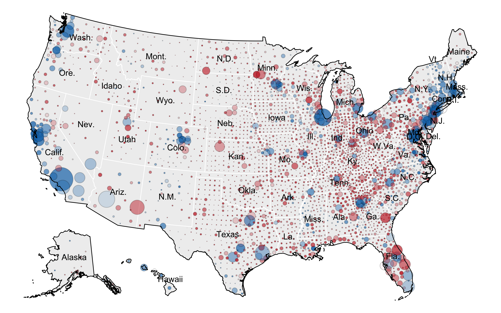

Accepted, Statistics and Public Policy

------------------------------------------------------------------------

## Figure 2 – Votes in each County

A composite plot with two panels illustrating the distribution of
Democratic and Republican votes in the 2020 US Presidential Election.
The top panel is a bar plot, and the bottom panel is a cumulative line
plot. <!-- -->

## Figure 3 - Histogram of the 2020 Presidential Election Results, by County

This R code chunk is designed to create a two-panel histogram comparing
unweighted and weighted distributions of the Democratic vote share in
the 2020 Presidential election by county. It’s a visualization to show
how vote distribution varies when considering the total number of votes
in each county. <!-- --> The code effectively
creates two histograms:

- Unweighted Histogram: Shows the distribution of counties based on
  their Democratic vote share, regardless of the number of votes in each
  county.
- Weighted Histogram: Replicates each county’s vote share a number of
  times equal to its total votes. This visualization emphasizes counties
  with more voters.

## Table 2 – Popular Vote in Counties Carried by Each Candidate

    ##                      Biden Counties Trump Counties
    ## Biden Votes                59019426       22245568
    ## Trump Votes                33564182       40644014
    ## Difference Pro-Trump      -25455244       18398446

## Table 3 - 2016 and 2020 Exit Polls, by Race

While Trump saw an increase in support from minority voters, both in
absolute figures and in percentage terms, Biden’s significant advances
among White voters, a larger demographic, effectively offset Trump’s
gains among minorities. Additionally, despite Trump’s relative increase
among minority voters, Biden surpassed Clinton’s absolute performance
among these groups. This was due in part to the expanded pool of
minority voters in 2020.

``` r
# Exit poll data for 2016
exit.2016
```

    ##                 White Black Hispanic Asian Other
    ## proportion_vote  0.70  0.12     0.11  0.04  0.03
    ## Democratic       0.37  0.89     0.66  0.65  0.56
    ## Republican       0.57  0.08     0.28  0.27  0.36

``` r
# Exit poll data for 2020
exit.2020
```

    ##                 White Black Hispanic Asian Other
    ## proportion_vote  0.67  0.13     0.13  0.04  0.04
    ## Democratic       0.41  0.87     0.65  0.61  0.55
    ## Republican       0.58  0.12     0.32  0.34  0.41

## Table 4 - Change in Non-Hispanic White Votes between 2016 and 2020

``` r
# Table 4 - Change in Non-Hispanic White Votes between 2016 and 2020
tab4
```

    ##                               2016      2020 Difference
    ## Trump                     54531026  61565755    7034729
    ## Clinton/Biden             35397332  43520620    8123287
    ## Other                      5740108   1061479   -4678629
    ## Non-Hispanic White Votes  95668466 106147853   10479387
    ## Minority Votes            41000771  52281778   11281007
    ## All Votes                136669237 158429631   21760394

# Create Maps

The provided R code is for creating two types of maps based on the 2020
US Presidential Election data by county: a choropleth map (Figure 4) and
a bubble plot (Figure 5).

## Figure 4 - Choropleth Plot, 2020 Presidential Election by county

<!-- -->

## Figure 5 – Bubble Plot, 2020 Presidential Election by county

<!-- -->

## Figure 6 – Kent County, Michigan 2020 election data plotted as Ayyadurai shows it.

<!-- -->

## Figure 7 – Kent County, Michigan Precinct comparison between Trump Straight-ticket and Trump Split-Ticket Support

<!-- -->
