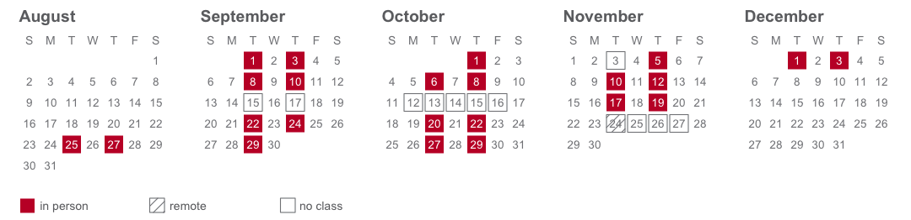

<!-- Instructor, TA, room, hours. Shared by the full and abridged syllabi — the one place these facts live. -->

> Professor **Jonathan Cervas**  
> Office: Posner Hall 374  
> Email: **<cervas@cmu.edu>**  
> Location: [Scaife Hall
> 234](https://www.cmu.edu/computing/services/teach-learn/tes/classrooms/locations/scaife.html)  
> Time: Tuesday & Thursday 2:00p-3:20p Eastern  
> Office Hours: Wed 10:30a-12:30p & 1:30p-3:30p, and by appointment
> (arrange via email)  
> [**CMU Academic Calendar**](https://www.cmu.edu/hub/calendar/)

> TA: **Zakareya Hamed**  
> Email: **<zhamed@andrew.cmu.edu>**  
> Office Hours: arrange via email

The most up-to-date version of this [**syllabus can be found
here**](https://jcervas.github.io/teaching/2026-2027/class-cmu-2026-84-309/readme.html)

------------------------------------------------------------------------

> **Course Relevance:** DC: Perspectives on Justice and Injustice  
> **Learning Resources:** All resources will be provided via Canvas  
> **Prerequisites:** NONE

------------------------------------------------------------------------

<!-- Course description and learning objectives. Rewrite yearly to match what the course actually does. -->

## Course Description

Are Americans really so divided? The question sounds rhetorical, but
political scientists have spent thirty years disagreeing about the
answer, and the first month of this course works through that argument:
whether the public has genuinely polarized or merely sorted itself into
tidier parties, what people mean by “affective polarization” and whether
it does the damage commonly attributed to it, how race and partisanship
reinforce one another, and whether any of this actually threatens
democracy. You will read scholars arguing with each other in print,
sometimes over the same data.

The rest of the semester belongs to you. Working in teams of four or
five, you will choose a topic, assign your classmates the readings, set
the questions, and run the discussion yourselves. Alongside that you
will write an op-ed for a general audience, review a book and present it
to the class, and build a policy brief with a small team.

Running through all of it is a question about justice: how political
division creates and entrenches inequality — who gets heard, who gets
represented, and who absorbs the costs of a politics organized around
mutual dislike. No previous coursework in political science is expected,
and no statistics beyond reading a chart.

## Learning Objectives

By the end of this course, students will be able to:

1.  **Explain** what political scientists have actually established
    about polarization in the United States, and identify where they
    still disagree.
2.  **Distinguish** ideological polarization, partisan sorting,
    affective polarization, and negative partisanship, and weigh the
    evidence offered for each.
3.  **Analyze** how political divisions intersect with and reinforce
    racial, economic, and social inequality.
4.  **Evaluate** competing arguments on contested questions — including
    the argument you disagree with, in its strongest form.
5.  **Facilitate** informed discussion: select readings, frame questions
    that have no easy answer, and moderate disagreement without
    flattening it.
6.  **Communicate** persuasively to a general audience, in writing and
    aloud.
7.  **Develop** evidence-based policy recommendations and account for
    their consequences for equity.
8.  **Reflect** on your own values, biases, and role as a civic
    participant in a divided society.

<!-- Assessment weights and due dates. Shared by both syllabi. Weights must total 100. -->

## Assessment

The course grade will be a weighted average of the following components:

| Assignment                                   | Percent of Final Grade |
|----------------------------------------------|------------------------|
| **Attendance**                               | **25%**                |
| **Discussion Board** (before each class)     | **15%**                |
| **Student Led Topics**                       | **9%**                 |
| **Surveys** (3: intake, midterm, evaluation) | **2%**                 |
| **Book Review** (Slides + Presentation)      | **12%**                |
| **Op-Ed Project** (Draft + Review + Final)   | **20%**                |
| **Group Policy Brief**                       | **17%**                |

## Due Dates

| Assignment               | Due Date                         |
|--------------------------|----------------------------------|
| Discussion board post    | 9:00 a.m., each class day        |
| Surveys (3)              | August 26, October 7, final week |
| Op-ed, first draft       | September 21                     |
| Op-ed peer review        | September 24                     |
| Op-ed final draft        | September 28                     |
| Book Review (slides)     | November 23                      |
| Group Project            | December 1/3                     |
| Group Project reflection | December 4                       |

<!-- What each graded component is. Contains the attendance and discussion-board figures, which source the shared curve in ../../_syllabus-template/attendance.R. -->

## Assignment Details

**Full instructions for every assignment are in Canvas**, under
Assignments. What follows is the shape of each one and what it is worth.

- **Attendance** (25%). Show up. The first three absences cost almost
  nothing; four to six is where a semester goes wrong.
- **Discussion Board** (15%). One short post before every class, due
  **9:00 a.m.** on the day we meet. Either raise something or answer
  someone. Your two lowest scores are dropped.
- **Student Led Topics** (9%). In a team of four or five you pick a
  topic, assign the readings, set the questions, and run one
  eighty-minute session — plus a short reflection within three days of
  your own.
- **Surveys** (2%). Three short surveys: August 26, October 7, and the
  final week. Graded for completion; screenshot the confirmation and
  upload it.
- **Book Review** (12%). A slide deck (5%) and a presentation to a small
  group on November 24 (7%).
- **Op-Ed Project** (20%). A rough draft (10%), two peer reviews (8%),
  and a final draft (2%). **The draft deadline is the one hard deadline
  in this course** — two classmates are assigned to read you, and
  whatever exists is what they get.
- **Group Policy Brief** (17%). A written brief (10%), a presentation in
  finals week (5%), and an individual reflection (2%).

<!-- Grading philosophy and the late-work policy. Usually stable year to year. -->

## Grading

Your grade depends heavily on active engagement. This course is
interactive: your preparation (completing the readings), contributions
to discussions, and participation in debates are essential to your
success.

*Assignments & Deadlines* You are expected to meet all assignment
deadlines. If you anticipate being unable to turn something in on time,
contact me before the due date to discuss alternatives. Late work will
incur a penalty[^1] provided it does not impede your classmates’
progress (for instance, in group projects). Failing to participate or
contribute meaningfully, especially in ways that affect others’ work,
will result in a lower grade.

<!-- ===========================================================================
     THE SCHEDULE — this is the only file to edit. There is no second copy.

     It feeds two audiences from one source:

       the syllabus   prints the session lines and the REQUIRED readings
       Canvas         per-session reading pages get everything, including the
                      optional readings and the annotations

     Line types
       **Week N — label**                  a week heading
       - **Tue, Sep 29** — Title           one class
         - [Label](url)                    a required reading — BOTH
         - *Optional*: [Label](url)        optional — CANVAS ONLY
           - a note about the reading      annotation — CANVAS ONLY

     The syllabus filter lives in ../readme.Rmd; the Canvas half is
     canvas.json's `sessions` map plus ../../_syllabus-template/canvas-sync.py.

     Dates are written out — no inline R. The build refuses to run if any
     creeps back in, because it once reached students as literal code.
     =========================================================================== -->

## Schedule

*Required readings only. Optional readings, and fuller notes on each,
are on that session’s page in Canvas.*

### Week 1 — the course, and the Fence

#### Tue, Aug 25 — Introduction to the Course

- **DUE Wed, Aug 26, 11:59 p.m.** — the **“Cervas” Election Study**
  (link in Canvas; screenshot the confirmation).

#### Thu, Aug 27 — The Fence

- [“CMU Fence Controversy Sparks Censorship Concerns.” Pittsburgh
  Post-Gazette,](https://www.post-gazette.com/news/education/2025/07/17/what-is-the-fence-at-carnegie-mellon/stories/202507160062)
- [Strasburg et al. 2025 — In Midnight Move, CMU Students Roll in New
  Fence to Protest Closure of Free Speech
  Icon](https://www.publicsource.org/cmu-students-create-new-fence-to-highlight-campus-free-speech/)
- [Chang et al. 2026 — YAL Rallies at Fence, Delivers Petition to
  President
  Jahanian](https://the-tartan.org/2026/04/06/yal-rallies-at-fence-delivers-petition-to-president-jahanian/)
- [Aiken 2026 — Carnegie Mellon Investigating Students over Fence
  Messages Tied to Israeli-Palestinian
  Conflict](https://www.post-gazette.com/news/education/2026/08/01/carnegie-mellon-fence-investigation/stories/202607310058)
- [Student Handbook, Advertising on Campus - Graffiti and Poster Policy
  of
  Student](https://www.cmu.edu/student-affairs/theword/community-policies/advertising-on-campus.html)
- [Student Government Graffiti and Poster
  Policy](https://www.cmu.edu/stugov/policies/old-pdfs/Student%20Government%20Graffiti%20and%20Poster%20Policy_Updates_1_26_17.pdf)

### Week 2 — Polarization unit opens

#### Tue, Sep 1 — Organize Topics for Student Led Discussions

- **In class: the Perception Gap.** More in Common, perceptiongap.us.

#### Thu, Sep 3 — Polarization I: Partisan and Ideological Polarization

- **Start here:** [Fiorina 2026 — *Unstable Majorities Continue: The
  Trump
  Era*](https://cmu.primo.exlibrisgroup.com/permalink/01CMU_INST/6lpsnm/alma991020547656104436)
  — **Chapter 8** (23 pages).
- [Fiorina et al. 2008 — Political Polarization in the American
  Public](https://doi.org/10.1146/annurev.polisci.11.053106.153836)
- [Abramowitz et al. 2008 — Is Polarization a
  Myth?](https://doi.org/10.1017/S0022381608080493)
- [Fiorina 2026 — *Unstable Majorities Continue*, **Chapter 2**: “Once
  More unto the Breach: Is America
  Polarized?”](https://www.hoover.org/research/once-more-unto-breach-america-polarized)

### Week 3 — Polarization unit

#### Tue, Sep 8 — Polarization II: Sorting and Social Identity

- [Mason 2015 — ‘I Disrespectfully
  Agree’](https://doi.org/10.1111/ajps.12089)
- [Ahler et al. 2018 — The Parties in Our
  Heads](https://doi.org/10.1086/697253)

#### Thu, Sep 10 — Polarization III: Affective Polarization

- [Iyengar et al. 2019 — The Origins and Consequences of Affective
  Polarization in the United
  States](https://doi.org/10.1146/annurev-polisci-051117-073034)
- [Finkel et al. 2020 — Political Sectarianism in
  America](https://doi.org/10.1126/science.abe1715)
- [Fiorina 2026 — *Unstable Majorities Continue*, **Chapter 3**: “What
  About *Affective*
  Polarization?”](https://www.hoover.org/research/what-about-affective-polarization)

### Week 4 — NO CLASS (Sep 15–17)

#### Tue, Sep 15 — **NO CLASS.** Eradicate Hate Conference.

#### Thu, Sep 17 — **NO CLASS.** Constitution Day Symposium.

### Week 5 — Polarization unit

#### Tue, Sep 22 — Polarization IV: Negative Partisanship and the White Working Class

- [Abramowitz et al. 2016 — The Rise of Negative Partisanship and the
  Nationalization of
  U.S](http://www.stevenwwebster.com/negative-partisanship.pdf)
- [Abramowitz 2025 — It’s Not the Economy,
  Stupid](https://centerforpolitics.org/crystalball/its-not-the-economy-stupid-the-ideological-foundations-of-white-working-class-republicanism/)
- [Fiorina 2026 — *Unstable Majorities Continue*, **Chapter 5**: “The
  White Working Class in 2016 (and
  Earlier)”](https://www.hoover.org/research/white-working-class)

#### Thu, Sep 24 — Polarization V: Race and Polarization

- [Tesler 2012 — The Spillover of Racialization into Health
  Care](https://doi.org/10.1111/j.1540-5907.2011.00577.x)
- [Mason et al. 2021 — Activating Animus: The Uniquely Social Roots of
  Trump Support](https://doi.org/10.1017/S0003055421000563)

### Week 6 — Polarization unit · geography

#### Tue, Sep 29 — Polarization VII: Geographic — The Map, and the Power in It

- **Do these before you read anything.**
- [Brown & Enos — Partisan Segregation (interactive
  maps)](https://www.ryandenos.com/partisan-segregation)
- [The New York Times 2025 — An Extremely Detailed Map of the 2024
  Election
  Results](https://www.nytimes.com/interactive/2025/us/elections/2024-election-map-precinct-results.html)
- [Badger et al. 2021 — A Close-Up Picture of Partisan Segregation,
  Among 180 Million
  Voters](https://www.nytimes.com/interactive/2021/03/17/upshot/partisan-segregation-maps.html)
- [Brown et al. 2026 — How Generational Turnover and Party Switching
  Reshape the US Political
  Map](https://cepr.org/voxeu/columns/how-generational-turnover-and-party-switching-reshape-us-political-map)
- [De Witte 2019 — How the Urban-Rural Divide Shapes
  Elections](https://news.stanford.edu/stories/2019/06/urban-rural-divide-shapes-elections)
- [Cervas 2026 — The Effects of Mid-Decade Redistricting on Electoral
  Outcomes](https://cervas.medium.com/the-effects-of-mid-decade-redistricting-on-electoral-outcomes-d870c772942b)

#### Thu, Oct 1 — Place, Identity, and Rural Consciousness

- **Two chapters, and that is the whole assignment.** Jacobs and Shea
  fielded the largest survey ever taken of rural Americans, and the book
  that came out of it is the best available answer to
- [Jacobs et al. 2023 — *The Rural Voter: The Politics of Place and the
  Disuniting of America.* Columbia University
  Press](https://cmu.primo.exlibrisgroup.com/permalink/01CMU_INST/6lpsnm/alma991020185778804436)

### Week 7 — Polarization unit closes

#### Tue, Oct 6 — Polarization VI: Does Any of This Threaten Democracy?

- [Druckman et al. 2023 — Does Affective Polarization Contribute to
  Democratic Backsliding in
  America?](https://doi.org/10.1177/00027162241228952)
- [McCoy et al. 2019 — Toward a Theory of Pernicious Polarization and
  How It Harms Democracies](https://doi.org/10.1177/0002716218818782)
- “Would You Vote Against Your Own Side to Save Democracy?”
- [Graham et al. 2020 — Democracy in America? Partisanship,
  Polarization, and the Robustness of Support for Democracy in the
  United States](https://doi.org/10.1017/S0003055420000052)

#### Thu, Oct 8 — Who Pays for the News?

- [Darr et al. 2018 — Newspaper Closures Polarize Voting
  Behavior](https://doi.org/10.1093/joc/jqy051)
- [Martin et al. 2019 — Local News and National
  Politics](https://doi.org/10.1017/S0003055418000965)
- [Pickard 2020 — Restructuring Democratic
  Infrastructures](https://doi.org/10.1080/21670811.2020.1733433)

### Week 8 — FALL BREAK, no class (Oct 13–15)

#### Tue, Oct 13 — **NO CLASS.** Fall Break.

#### Thu, Oct 15 — **NO CLASS.** Fall Break.

### Week 9 — Student-led sessions open

#### Tue, Oct 20 — Student-led session — team and topic TBA

#### Thu, Oct 22 — Student-led session — team and topic TBA

### Week 10 — Student-led · before the vote

#### Tue, Oct 27 — Before the Vote: Loser’s Consent

- [Layman et al. 2023 — Political Parties and Loser’s Consent in
  American Politics](https://doi.org/10.1177/00027162241229309)

#### Thu, Oct 29 — Student-led session — team and topic TBA

### Week 11 — Student-led · election week

#### Tue, Nov 3 — **NO CLASS.** Democracy Day; the midterm elections. No classes before 5 p.m. [Register to vote](https://www.cmu.edu/student-affairs/slice/civic-engagement/advocacy/voter/index.html).

#### Thu, Nov 5 — Student-led session — team and topic TBA

### Week 12 — Student-led

#### Tue, Nov 10 — Student-led session — team and topic TBA

#### Thu, Nov 12 — Student-led session — team and topic TBA

### Week 13 — Student-led

#### Tue, Nov 17 — Student-led session — team and topic TBA

#### Thu, Nov 19 — Student-led session — team and topic TBA

### Week 14 — Book review presentations

#### Tue, Nov 24 — VIRTUAL CLASS — Book Review Presentations

- **Everyone presents today.** You will not present to the room — you
  will be put into a small breakout group and present there, which is
  how thirty-four presentations fit into eighty minutes.
- Slides are due Mon, Nov 23 at 11:59 p.m., uploaded to Canvas.
- Speak to your slides rather than reading them, and open the floor with
  a question. A group
- Being in a small group does not make this informal. It is the same 7%
  it would be in front

#### Thu, Nov 26 — **NO CLASS.** Thanksgiving.

### Week 15 — Group policy briefs

#### Tue, Dec 1 — Group Policy Brief

#### Thu, Dec 3 — Group Policy Brief

<!-- End matter: privacy draft, community agreement, AI policy, representation, accommodations, well-being. Mostly stable; the privacy draft is replaced by the class each year. -->

## Student Privacy in Class Discussions

> **Draft only — we write the real one together on the first day.**
>
> A discussion course works only if people will say what they actually
> think, and people say what they think only when they know what happens
> to their words afterward. That is what this agreement settles: what is
> on the record, what stays in the room, what may be repeated outside it
> and in what form. It exists to make candour possible.

> **Shared Community Agreement (draft)**
>
> To foster a respectful and productive learning environment, the
> following policies apply:
>
> **No Recording of Class Discussions**
>
> - Audio or video recording of class discussion is **not permitted**.
> - Recording of lectures may be allowed with approval from **Disability
>   Resources**.
>
> **Technology Use**
>
> - Laptops must remain closed.
> - Phones must be put away unless otherwise specified.
>
> **Anonymity in Submissions**
>
> - All written work should be anonymized (**no names on papers or
>   submissions**).
> - Peer reviews will also remain anonymous.
>
> **Confidentiality of Classroom Contributions**
>
> - When discussing ideas from class outside of this setting, you may
>   reference the **content** but not the **identities** of the
>   individuals who contributed.
>
> **Respectful Dialogue**
>
> - Listen attentively and allow peers to finish their thoughts before
>   responding.
> - Do not talk over one another.
> - Treat others with the same respect you would expect for yourself.
>
> **Civility in Communication**
>
> - Speak at a moderate volume.
> - Critique **ideas**, not individuals.
> - Assume the most generous interpretation of your peers’ statements.
>
> **Use of Generative AI (GAI)**
>
> - You may not use a peer’s work in generative AI tools without their
>   **explicit permission**.
> - Consider each peer’s work as **copyrighted**.
>
> **Representation of Opinions**
>
> - A peer’s views expressed in class do not represent the official
>   position of their clubs, organizations, or extracurricular
>   affiliations.

## AI Use Policy for Student Work

The rule is short: **the argument has to be yours.** Use these tools to
help you work; do not use them to do the work.

**Reasonable use.** Brainstorming. Generating the best counter-argument
to your own position so you can answer it. Checking grammar and clarity.
Asking for an explanation of something in a reading you did not follow.
Asking where a draft of yours is unclear.

**Not reasonable.** Submitting generated prose or slides as your own.
Producing your discussion-board posts. Having a tool write your peer
review — that one takes something from a classmate who is owed a real
reader. Turning in an argument you could not defend if asked about it
here, in this room, out loud.

That last test is the one that matters, and it is specific to this
course. Nearly everything you write here you may be asked to say aloud:
your board post seeds a discussion, your slides come with a
presentation, your op-ed and your brief are positions you have taken in
front of people who can question them. If you cannot say why your
argument makes the move it makes, how the text got produced is beside
the point. You do not have the thing the assignment was for.

**Say what you used.** A line at the end of the op-ed or the brief, a
final slide on the book review deck, a clause in a post: *I used
\[tool\] to \[purpose\].* That is the whole requirement. Disclosure
costs you nothing and is never itself a problem. Undisclosed use is.

**Do not put a classmate’s work into these tools** without their
explicit permission. Their draft is theirs, and they gave it to you to
read, not to feed to something else.

Submitting generated work as your own is a violation of the university’s
academic integrity policy and will be handled as one. If you are unsure
whether something falls inside these lines, ask me before you submit
rather than after.

## Representation Statement

I am committed to including a broad range of perspectives in the
readings and materials for this course. If you believe a critical voice
is missing, please let me know so I can improve the syllabus now and in
future offerings.

**We must treat every individual with respect.** We come from many
different backgrounds, and this variety of viewpoints is fundamental to
building and maintaining an equitable and inclusive campus community.
“Representation” can refer to the ways we identify ourselves—race,
color, national origin, language, sex, disability, age, sexual
orientation, gender identity, religion, creed, ancestry, belief, veteran
status, or genetic information, among others. Each of these identities
shapes the perspectives our students, faculty, and staff bring to
campus. Promoting these varied viewpoints not only fuels excellence and
innovation but also advances the pursuit of justice. We acknowledge our
imperfections while fully committing to the work—inside and outside our
classrooms—of building and sustaining a campus community that embraces
these core values.

Each of us is responsible for creating a safer, more inclusive
environment.

Unfortunately, incidents of bias or discrimination do occur, whether
intentional or unintentional. They contribute to an unwelcoming
atmosphere for individuals and groups at the university. Therefore, the
university encourages anyone who experiences or observes unfair or
hostile treatment on the basis of identity to speak out for justice and
seek support—either in the moment or afterward. You can share your
experiences using the following resources:

- **Ethics Reporting Hotline**  
  Submit an anonymous report by calling 844-587-0793 or visiting
  **cmu.ethicspoint.com**.  
  All reports are documented and reviewed to determine whether further
  action is needed. Regardless of the incident type, the university will
  use your feedback to transform our campus climate into one that is
  more equitable and just.

## Accommodations for Students with Disabilities

If you have a documented disability and an accommodations letter from
the Office of Disability Resources, please discuss your needs with me as
early in the semester as possible. I will work with you to ensure that
accommodations are provided as appropriate. If you suspect you may have
a disability and are not yet registered with the Office of Disability
Resources, you can contact them at **<access@andrew.cmu.edu>**.

## Student Well-Being

The past few years have been challenging. We are all under significant
stress and uncertainty. I encourage you to find ways to move regularly,
eat well, and reach out to your support system—or to me at
**<cervas@cmu.edu>**—if you need help. We can all benefit from support
during stressful times, and this semester is no exception.

As a student, you may experience a range of challenges that interfere
with learning, such as strained relationships, increased anxiety,
substance use, feeling down, difficulty concentrating, or lack of
motivation. These mental health concerns or stressful events can
diminish your academic performance and reduce your ability to
participate in daily activities. CMU offers services that can help, and
treatment does work. Learn more about confidential mental health
services available on campus at:

- **Counseling and Psychological Services**:
  <http://www.cmu.edu/counseling/>  
  Phone (24/7): 412-268-2922

Please remember that support is always available—don’t hesitate to reach
out.

[^1]: One percentage point per hour late, never falling below 50%. An
    hour or two costs almost nothing; a day costs a letter grade, but
    late work is always worth more than no work. Work never submitted
    scores zero, so handing something in a week late is always worth
    more than handing in nothing. Canvas applies both automatically.
