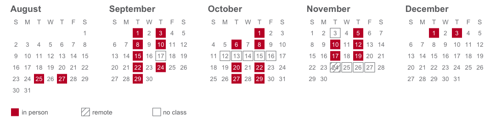

<!-- Instructor and logistics. Shared by the full and abridged syllabi. -->

> Professor Jonathan Cervas  
> Office: Posner Hall 374  
> Email: **<cervas@cmu.edu>**  
> Location: [Porter Hall
> A21A](https://www.cmu.edu/computing/services/teach-learn/tes/classrooms/locations/porter.html)  
> Time: Tuesday & Thursday 11:00a-12:20p Eastern  
> Office Hours: Wed 10:30a-12:30p & 1:30p-3:30p, and by appointment
> (arrange via email)  
> [**CMU Academic Calendar**](https://www.cmu.edu/hub/calendar/)

The most up-to-date version of this [**syllabus can be found
here**](https://jcervas.github.io/teaching/2026-2027/class-cmu-2026-84-355/readme.html):
<https://jcervas.github.io/teaching/2026-2027/class-cmu-2026-84-355/readme.html>

------------------------------------------------------------------------

> **Course Relevance:** DC: *Perspectives on Justice and Injustice*
> **Learning Resources:** All resources will be provided via Canvas  
> **Prerequisites:** 36-200 Reasoning with Data

------------------------------------------------------------------------

**25 meetings**, Tuesdays and Thursdays. One of them, **Tue, Nov 24**,
meets on Zoom rather than in the room. Tinted days are ones we do not
meet — fall break, Democracy Day, Thanksgiving, and the Constitution Day
Symposium.

<!-- Course description, goals, and learning objectives. -->

## Course Description

The point of this course is to understand the political world —
particularly through the data it produces. American elections generate
an enormous amount of it: vote returns reaching back to the nineteenth
century, the census that decides how many seats each state gets,
campaign finance filings, polls, roll-call votes, and the record of who
turned out and who did not. Every one of those numbers was produced by
somebody, for a purpose, and every one of them leaves something out.

We work with real data every week — 41 presidential elections since
1864, the apportionment that followed the 2020 census, FEC filings,
congressional roll calls, Census and American Community Survey
estimates, and the 2026 midterms as they happen.

**This is a general education course and there is no coding
prerequisite.** Every data exercise we do arrives as a prepared data
brief with the results already in front of you. What you are asked to do
is read it closely, follow how the numbers were made, and explain what
you are looking at. The skill being built is not programming; it is
judgment about evidence. You will practice it on a data-driven news
story written for real readers, and defend it in class every week.

## Course Goals

This course has one central aim: that you leave able to **look at a
number about American democracy and know what to ask of it**. Who
produced it, what it counts, what it leaves out, and whether it supports
the claim being made in its name.

Everything else — the readings, the labs, the project — serves that.

## Learning Objectives

By the end of the semester you will be able to:

1.  **Explain where American election data comes from** — who produces
    it, at what geographic level, and what each source does and does not
    capture. *(Parts I and III)*
2.  **Read a table, chart, or map of electoral data and say plainly what
    it shows, what it does not show, and what would have to be true for
    its conclusion to hold.** *(every part; this is the core skill)*
3.  **Test a claim about elections against the underlying data** —
    whether the claim comes from a news story, a campaign, or a
    scholarly argument. *(Parts II and III)*
4.  **Explain the institutions that convert votes into power**: the
    Electoral College, apportionment, districting, and the Voting Rights
    Act. *(Parts I and III)*
5.  **Recognize when a number misleads** — through selective framing,
    mismatched units of analysis, or a model that gets the right answer
    for the wrong reason. *(every part)*
6.  **Write about quantitative evidence for a non-technical audience** —
    in journalistic form at length, and briefly every week on the
    discussion board. *(the data journalism project; the board)*

<!-- Required text. Update the edition yearly. -->

## Required Text

John Sides, Daron Shaw, Matt Grossmann & Keena Lipsitz. *Campaigns and
Elections*. New York: W. W. Norton. ISBN 978-1-324-11504-5.

Readings from the text provide the **context** for each week. Expect to
read one or two chapters before Tuesday, when we discuss it, and to
spend Thursday working with data — the slides you brought, then the lab.
Chapters are short — budget about an hour.

There is nothing else to buy.

### Current events

**The textbook is the context; the news provides content.** A chapter is
settled by the time it prints, and this one went to press before the
campaign you are living through.

So most weeks carry **one or two short current-events items alongside
the chapter** — an article, an interactive, a newsletter post, sometimes
a podcast. They are listed in the schedule. **They are not optional**:
they are usually what Tuesday actually argues about, because they are
where the chapter’s claim either holds up or does not.

**Expect additions.** A syllabus written in August cannot know what
November will produce. If the schedule and Canvas disagree, Canvas is
right.

**Current events are also where your weekly data slide comes from.** You
are not expected to go hunting in unfamiliar places. The sources below
are valuable resources, but you can find other things as well.

|                           | Worth following all term                                                                                                                                                                                                                                                              |
|---------------------------|---------------------------------------------------------------------------------------------------------------------------------------------------------------------------------------------------------------------------------------------------------------------------------------|
| **General**               | *New York Times* (especially The Upshot), *Washington Post*, *Wall Street Journal* — all three are free to you through the [CMU Libraries](https://www.library.cmu.edu/)                                                                                                              |
| **Elections specialists** | [Bolts](https://boltsmag.org), [Votebeat](https://votebeat.org), [Stateline](https://stateline.org), [Democracy Docket](https://www.democracydocket.com), [Cook Political Report](https://www.cookpolitical.com), [Sabato’s Crystal Ball](https://centerforpolitics.org/crystalball/) |
| **Data and forecasting**  | [Strength In Numbers](https://www.gelliottmorris.com) (G. Elliott Morris), [Silver Bulletin](https://www.natesilver.net), [Split Ticket](https://split-ticket.org), [The Downballot](https://www.the-downballot.com)                                                                  |
| **Podcasts**              | *The Ezra Klein Show* (NYT) · *NPR Politics Podcast* · *The Downballot* (weekly, Thursdays) · *Amicus* (Slate) · *Public Opinion Podcast* (AAPOR)                                                                                                                                     |

## What you need

**This is not a programming course, and there is no coding
prerequisite.**

There is no software to install and nothing to set up. Every data
exercise or example arrives as a prepared data brief — the source, the
decisions behind it, and the figures already made — and your job is to
read it, follow how the numbers were built, and above all *explain what
you are looking at*. If you have never worked with data before, you are
exactly who these are written for.

Bring a laptop to Thursday sessions if you have one; the briefs are web
pages and they read well on a phone or on paper too. If you would rather
work from a printout, say so and I will bring one.

<!-- How the week runs and the structure of the course — the Tuesday/Thursday rhythm. -->

## How This Course Works

**Two things run side by side.** One is the textbook: how campaigns and
elections work, read straight through from Chapter 1 to Chapter 13. The
other is the data — where the numbers about American politics come from,
who produced them and why, and what they can and cannot tell you.
Generally speaking, **Tuesday is the book. Thursday is the data.**

The two are not synchronized, and are not meant to be. The textbook
keeps its own order, and the three tests cover it and nothing else. The
data sessions run their own sequence, below.

| When                      | What                                                                    |
|---------------------------|-------------------------------------------------------------------------|
| **Before Tuesday**        | Read the week’s chapter — about an hour.                                |
| **Tuesday, in class**     | The chapter, and the question it raises.                                |
| **Before Thursday**       | Post a data slide bearing on the question we ended Tuesday with.        |
| **Thursday, in class**    | Two of your slides, then the lab.                                       |
| **By Friday, 11:59 p.m.** | One post to the discussion board about any data we looked at that week. |

------------------------------------------------------------------------

### The data sessions

**Twelve sessions in three parts, and the parts are a claim about who
collected the data and why.** The state **enumerates**, and you are
required to answer (I). Somebody **asks**, and you answer because you
feel like it (II). Then an election happens, and Part III is everything
it leaves behind — the result **certified**, the machinery
**administered**, a donation **disclosed** because a statute compels it,
a voter file nobody volunteered for, and, where nobody collected
anything, a number a researcher **built**.

| Pt      |                                        | Sessions |
|---------|----------------------------------------|---------:|
| **I**   | The Census Bureau                      |  **1–3** |
| **II**  | Surveys                                |  **4–6** |
| **III** | Elections, and the records around them | **7–12** |

<!-- Assessment weights and due dates. Shared by both syllabi; the per-component
     descriptions are gated to the full syllabus via _components.Rmd. The child
     path is bare, not syllabus/-prefixed: knitr resolves it from this file's own
     folder, unlike the child paths in readme.Rmd. -->

## Assessment

The course grade will be a weighted average of the following components:

| Category                         | Percent of Final Grade |
|----------------------------------|------------------------|
| **Participation & Attendance**   | 23%                    |
| **Discussion Board**             | 10%                    |
| **Surveys** (3, completion only) | 2%                     |
| **Data Slides**                  | 10%                    |
| **Three Tests** (10% each)       | 30%                    |
| **Data Journalism Project**      | 25%                    |

<!-- The one-line description of each component. FULL SYLLABUS ONLY: the Canvas
     syllabus stays brief, and each assignment carries its own instructions. -->

What each one is:

- **Participation & Attendance** — Being here, prepared, and in the
  conversation — on both days.
- **Discussion Board** — By Friday night each week, one post about any
  of the data we talked about: the lab, a classmate’s data slide, a
  figure in the reading. Something that surprised you, something we
  missed, something you do not understand, or an answer to somebody
  else’s question. **A few sentences to a paragraph** — enough to show
  you engaged with what we did. One post is full credit.
- **Surveys** — Three short ones: the **Cervas Election Study** in Week
  1, a **midterm feedback** survey once you have seen how the course
  actually runs, and the **course evaluation** at the end. **All three
  are anonymous** and graded for completion only — there are no right
  answers, and nothing you say affects any other part of your grade.
- **Data Slides** — Find data bearing on the question Tuesday ended with
  and post it before Thursday as an **infographic with a short
  write-up**: the figure itself, the source named and linked, and a few
  sentences on what the data say and mean. Each week two slides are
  drawn at random and worked through in class, and nobody presents the
  data they found themselves — expect your own data to come up once or
  twice all term. The slide is marked complete or incomplete each week.
  At the end of term you hand in a **newsletter**: every piece of data
  you found, each with a short write-up. **Build it as you go** — it is
  a paragraph a week, and an evening’s work if you leave it all to
  December.
- **Three Tests** — In class, on paper, and **on the textbook only**.
  Test 1 on **Thu, Oct 8** (Sides et al., Chapters 1–5), Test 2 on
  **Tue, Nov 10** (Chapters 6–9), Test 3 on **Thu, Dec 3** (Chapters
  10–13). We read the book straight through in its own order, so each
  test is a block of consecutive chapters: each covers the chapters read
  since the last one, **none is cumulative**, and every chapter appears
  on exactly one test. There is no final exam.
- **Data Journalism Project** — A data-driven news story about a trend
  or issue in electoral processes. Runs in three parts — draft, peer
  review, final — and **most of the marks are on the first two**. It is
  the only substantial piece of writing this term.

## Due Dates

| Assignment                                      | Due                                                                                                             |
|-------------------------------------------------|-----------------------------------------------------------------------------------------------------------------|
| Data slide                                      | before **each Thursday**                                                                                        |
| Surveys (3)                                     | **Wed, Aug 26** (Cervas Election Study), **Fri, Oct 23** (midterm feedback), **final week** (course evaluation) |
| Discussion board post                           | **Friday, 11:59 p.m.**, each week                                                                               |
| Data Session 4 board post (no Thursday session) | **Tue, Sep 22** — no session to follow that week, so you get the weekend                                        |
| Week 14 board post (Thanksgiving)               | **Mon, Nov 30** — Tuesday is on Zoom, and there is no Thursday                                                  |
| **Test 1** — Ch. 1–5                            | **Thu, Oct 8**, in class                                                                                        |
| Data journalism: pitch                          | **Tue, Oct 20**, in class                                                                                       |
| **Test 2** — Ch. 6–9                            | **Tue, Nov 10**, in class                                                                                       |
| Data journalism: **draft**                      | **Thu, Nov 19** — the term’s last data session                                                                  |
| Data journalism: **peer reviews** (two)         | **Tue, Dec 1**                                                                                                  |
| **Test 3** — Ch. 10–13                          | **Thu, Dec 3**, in class                                                                                        |
| Data newsletter                                 | **Tue, Dec 8**                                                                                                  |
| Data journalism: **final**                      | **Fri, Dec 11** — after the last session                                                                        |

There is no final exam.

<!-- One line per graded component. The full instructions live in ../assignments/*.md,
     which sync-to-canvas.sh pushes to the Canvas pages; this section only says what
     each component is and what it is worth. -->

## Assignment Details

**Full instructions for every assignment are in Canvas**, under
Assignments. What follows is the shape of each one and what it is worth.

- **Participation & Attendance** (23%). Being here, prepared, and in the
  conversation — on both days. The first three absences cost almost
  nothing; four to six is where a semester goes wrong.
- **Discussion Board** (10%). One post a week about any of the data we
  looked at, due **Friday, 11:59 p.m.** Marked complete/incomplete, and
  one post is full credit.
- **Surveys** (2%). Three short ones: the **Cervas Election Study** on
  **Wed, Aug 26**, midterm feedback on **Fri, Oct 23**, and the course
  evaluation in the final week. All three are anonymous, so screenshot
  the confirmation and upload it.
- **Data Slides** (10%). Each week an **infographic with a short
  write-up**, bearing on the question Tuesday ended with, posted before
  Thursday. Two are drawn at random and worked through in class. The
  weekly slides are 90% of this component; the newsletter you assemble
  from them is the other 10%.
- **Three Tests** (30%). In class, on paper, and **on the textbook
  only** — 10% each, none cumulative: **Thu, Oct 8** (Ch. 1–5), **Tue,
  Nov 10** (Ch. 6–9), **Thu, Dec 3** (Ch. 10–13). There is no final
  exam.
- **Data Journalism Project** (25%). A data-driven news story, 2–4 pages
  single spaced, with at least two figures. A pitch (5%), a draft (50%),
  the two peer reviews you write (35%), and the final (10%) — **most of
  the marks are on the draft and the reviews**, and you cannot rescue a
  missing draft with a good final.

<!-- Grading philosophy and late policy. -->

## Grading

Your grade rests on engagement as much as on output. The course is built
around two things happening every week — you arriving having read, and
you arriving having found data — and neither can be made up afterwards.

**Deadlines.** You are expected to meet them. If you can see in advance
that you will not, contact me **before** the due date and we will sort
something out.

Late work loses **one percentage point per hour, and never falls below
50%**.[^1] Canvas applies this automatically. Submit what you have
rather than polishing something that is already late.

Work that is never submitted scores **zero**, which is the whole reason
the late floor sits at 50%: handing something in a week late is always
worth more than handing in nothing.

Two things sit outside that rule because being late breaks somebody
else’s work, not just your own:

- **Peer reviews.** Your classmate cannot revise against a review that
  has not arrived. Late reviews are marked down sharply.
- **Project drafts.** A missing draft means two people have nothing to
  review, and — as above — you cannot rescue a missing draft with a good
  final.

<!-- Session-by-session schedule. Dates are written out, so a new year means editing them here. -->

## Schedule

**Week 1 — Part I opens**

- **Tue, Aug 25** — Course introduction: the three parts. Read the
  book’s own introduction, What This Book Is For.
  - The book’s introduction — *What This Book Is For*
  - **DUE Wed, Aug 26, 11:59 p.m.** — the **Cervas Election Study**.
- **Thu, Aug 27** — Data Session 1 — The decennial census, and the seats
  it decides
  - [Census Bureau, *America Counts: 250
    Years*](https://www.census.gov/library/stories/2026/06/america-counts-250-years.html)
  - [Census Academy — the Census data
    API](https://www.census.gov/data/academy/courses/intro-to-the-census-bureau-data-api.html)
    — module 1 only
  - [NCSL, *Redistricting Law 2020*, ch. 1 — the
    census](https://documents.ncsl.org/wwwncsl/Redistricting-Census/Redistricting-Law-2020_NCSL%20FINAL.pdf)

**Week 2 — Part I**

- **Tue, Sep 1** — The rules, and the four standards
  - Sides et al., Ch. 1
  - [Scott, *Seeing Like a State* (1998), intro — where “legibility”
    comes from](https://www.jstor.org/stable/j.ctt1nq3vk)
- **Thu, Sep 3** — Data Session 2 — Geography, and the scales it comes
  at
  - [Census Bureau video — *Understanding Statistical
    Geographies*](https://www.census.gov/library/video/2021/understanding-statistical-geographies.html)

**Week 3 — Part I**

- **Tue, Sep 8** — Who can vote, how, and where
  - Sides et al., Ch. 2
  - [Cohn, *NYT* — the Electoral College
    edge](https://www.nytimes.com/2024/09/25/upshot/trump-electoral-college-harris.html)
  - [Brennan Center — census data and a changing
    nation](https://www.brennancenter.org/our-work/research-reports/census-data-highlights-changing-nation)
  - [*NPR* — Black representation after the
    ruling](https://www.npr.org/2026/04/30/nx-s1-5805050/supreme-court-voting-rights-congressional-black-caucus)
  - [Podcast: *Amicus*
    (Slate)](https://slate.com/podcasts/amicus/2026/07/supreme-court-term-recap-birthright-citizenship-voting-rights)
- **Thu, Sep 10** — Data Session 3 — The American Community Survey
  - [ACS Handbook, ch. 1 — the
    basics](https://www.census.gov/content/dam/Census/library/publications/2020/acs/acs_general_handbook_2020_ch01.pdf)
  - [Census Academy — *Discovering the American Community
    Survey*](https://www.census.gov/data/academy/courses/discovering-the-american-community-survey.html)
    — all six modules

**Week 4 — Part II opens**

- **Tue, Sep 15** — The transformation of American campaigns
  - Sides et al., Ch. 3
- **Thu, Sep 17** — **NO CLASS.** Constitution Day Symposium. Data
  Session 4 is self-directed: what a survey can establish.
  - [Pew — how public polling has
    changed](https://www.pewresearch.org/methods/2023/04/19/how-public-polling-has-changed-in-the-21st-century/)
  - [Pew — polling basics, lessons
    1–3](https://www.pewresearch.org/course/public-opinion-polling-basics/)

**Week 5 — Part II**

- **Tue, Sep 22** — Money, and the rule that shapes everything after it
  - Sides et al., Ch. 4
- **Thu, Sep 24** — Data Session 5 — Election polls: the horse race, and
  what a margin hides
  - [Bailey, *Polling at a Crossroads* (2023), ch. 1,
    3–22](https://www.cambridge.org/9781108482790)
  - [*NYT* — are political polls
    accurate?](https://www.nytimes.com/2026/08/14/briefing/are-political-polls-accurate.html)
  - [Podcast: AAPOR on pre-election
    polling](https://aapor.org/media/public-opinion-pod/)

**Week 6 — Part II closes**

- **Tue, Sep 29** — Strategy: who a campaign decides to talk to
  - [Sabino, *Bolts* — Missouri’s ballot-initiative
    vote](https://boltsmag.org/missouri-rejects-restrictions-on-direct-democracy/)
  - Sides et al., Ch. 5
- **Thu, Oct 1** — Data Session 6 — Public opinion, and the studies
  built to measure it: the Cervas Election Study beside CES and ANES. No
  slide this week.
  - [Verba, “The Citizen as Respondent” (1996),
    1–7](https://www.jstor.org/stable/2082793) — why measure opinion by
    survey at all
  - [Pew — writing survey
    questions](https://www.pewresearch.org/writing-survey-questions/) —
    wording, order effects, response options
  - *Reference:* [Cooperative Election
    Study](https://cces.gov.harvard.edu/) — how it samples, and how many
    it reaches
  - *Reference:* [American National Election
    Studies](https://electionstudies.org/) — the same two questions,
    answered differently
  - *Reference:* [*Harvard Youth Poll*, 52nd
    edition](https://iop.harvard.edu/youth-poll/52nd-edition-spring-2026)
    — toplines, and the methodology behind them

**Week 7 — Test 1**

- **Tue, Oct 6** — Who the electorate is. No new chapter — review Ch.
  1–5; Test 1 is Thursday.
  - No new chapter — review Ch. 1–5 for Test 1
  - [*NYT* — the rise of the multiracial
    right](https://www.nytimes.com/interactive/2025/07/24/opinion/minority-voters-trump-right.html)
- **Thu, Oct 8** — **TEST 1.** In class, on paper — Ch. 1–5
  - Nothing new — bring questions

**Week 8 — FALL BREAK, no class (Oct 12–16)** Test 1 is behind you.
Nothing is due.

------------------------------------------------------------------------

**Week 9 — Part III opens**

- **Tue, Oct 20** — Data Session 7 — Part III opens: what a return is,
  where you get one, and what forty of them show
  - [Burness, *Bolts* — election data and voting
    rights](https://boltsmag.org/election-data-is-vital-to-voting-rights-but-hard-to-track-down/)
  - [FairVote — *Monopoly Politics
    2026*](https://fairvote.org/report/monopoly-politics-2026-update/)
  - **DUE: Data journalism story — pitch your topic** (one paragraph, in
    class).
- **Thu, Oct 22** — Data Session 8 — The bottom rungs: precincts and
  ballots
  - [MIT Election Lab — why does anyone need precinct-level
    results?](https://electionlab.mit.edu/articles/why-does-anyone-need-precinct-level-election-results)
    — what county totals lose, and why the boundaries move
  - **DUE Fri, Oct 23, 11:59 p.m.** — the **mid-term course feedback
    survey**.

**Week 10 — Part III**

- **Tue, Oct 27** — Parties and interest groups
  - Sides et al., Ch. 6 and Ch. 7
- **Thu, Oct 29** — Data Session 9 — Money in politics: the record, and
  the hole in it
  - [OpenSecrets — dark money
    basics](https://www.opensecrets.org/dark-money/basics) — who must
    name a donor, and who need not
  - [*NYT* — Harris’s donors, the
    graphics](https://www.nytimes.com/interactive/2024/08/22/us/elections/kamala-harris-donors.html)
    — a disclosure file, drawn
  - [*NYT* — Trump’s campaign-finance
    disclosures](https://www.nytimes.com/2024/08/26/opinion/republican-donors-money-trump.html)
    — the same instrument as a problem
  - [Podcast: *The Downballot* on this cycle’s
    money](https://www.the-downballot.com/podcast)

**Week 11 — Part III · election night**

- **Tue, Nov 3** — **NO CLASS.** Democracy Day. Read both chapters this
  week, for Thursday.
  - For Thursday: Sides et al., Ch. 8 and Ch. 9
- **Thu, Nov 5** — **Fixed date.** Data Session 10 — Live returns. Built
  on results that do not exist until Nov 3.
  - [NPR — *Race calls
    101*](https://www.npr.org/2024/11/05/g-s1-32603/how-are-races-actually-called)

**Week 12 — Part III · the machinery**

- **Tue, Nov 10** — **TEST 2.** In class, on paper — Ch. 6–9
  - Ch. 8 and 9 are on the test
- **Thu, Nov 12** — Data Session 11
  - *Session and reading to be set.*

**Week 13 — Part III**

- **Tue, Nov 17** — Congressional, state and local campaigns
  - Sides et al., Ch. 10 and Ch. 11
  - [Morris — the hidden
    axis](https://www.gelliottmorris.com/p/not-just-left-vs-right-most-voters)
- **Thu, Nov 19** — Data Session 12
  - *Session and reading to be set.*
  - **DUE: data journalism draft**.

**Week 14 — the last two chapters**

- **Tue, Nov 24** — **Remote.** The last two chapters — who turns out,
  and how they choose. On Zoom. No data session, no slide.
  - Sides et al., Ch. 12 and Ch. 13 — both on Test 3
  - *Source your own:* a news piece quoting a margin of error, or a
    demographic estimate
- **Thu, Nov 26** — **NO CLASS.** Thanksgiving. Nothing is due.

**Week 15 — Part III, and the end**

- **Tue, Dec 1** — The end of the argument — the law, the maps, and
  whether the thing itself can be measured.
  - [Moynihan — *Power, Democracy and
    Clarity*](https://open.substack.com/pub/donmoynihan/p/power-democracy-and-clarity)
    — the Court’s voting-rights turn after *Callais*
  - [Monmonier, *Drawing the Line*,
    ch. 5](https://archive.org/details/drawinglinetales0000monm) —
    borrow from the Internet Archive
  - [*NYT* — gerrymandered districts aren’t always
    ugly](https://www.nytimes.com/interactive/2022/01/11/opinion/redistricting-gerrymandering-reform.html)
  - Two ballot measures: [California Prop
    50](https://lao.ca.gov/BallotAnalysis/Proposition?number=50&year=2025)
    (passed), and
    [Virginia](https://cardinalnews.org/2026/05/08/supreme-court-of-virginia-voids-redistricting-election-as-unconstitutional/)
    (passed, then voided)
  - [V-Dem](https://v-dem.net/) — scoring democracy itself, for every
    country, every year
  - **DUE: peer reviews of the data journalism draft** — two each.
- **Thu, Dec 3** — **TEST 3.** In class, on paper — Ch. 10–13, then the
  course wrap
  - Nothing to read — bring questions

------------------------------------------------------------------------

**Finals period — there is no exam.**

- **DUE Tue, Dec 8** — **the data newsletter**.
- **DUE Fri, Dec 11** — **data journalism story, final version**.

------------------------------------------------------------------------

<!-- End matter: AI policy, representation, accommodations, well-being. -->

## AI Use Policy for Student Work

As artificial intelligence (AI) tools become increasingly accessible, it
is important to clarify expectations for their use in this course. You
are welcome to use AI technologies (such as ChatGPT, Grammarly, or
similar tools) to support your independent work—such as brainstorming
ideas, checking grammar, or improving the clarity of your writing.
However, you **may not use AI to generate substantive content that you
submit as your own original work**. All assignments, essays, and
projects must reflect your own analysis, critical thinking, and voice.

**Permitted Uses of AI:**

- Outlining or organizing your thoughts
- Checking grammar, spelling, or clarity
- Generating ideas or prompts to help you get started
- Reviewing your own drafts for readability

**Prohibited Uses of AI:**

- Submitting AI-generated essays, paragraphs, or answers as your own
  work
- Using AI to complete assignments, discussion posts, or projects in
  place of your own effort
- Copying and pasting AI-generated content without substantial revision
  and personal input

If you use AI tools in your process, you must **disclose** how you used
them in a brief note at the end of your assignment (e.g., “I used
ChatGPT to help brainstorm ideas for my outline.”).

**Violations:** Submitting AI-generated content as your own is
considered academic dishonesty and will be treated as a violation of the
university’s academic integrity policy.

If you have questions about what is or is not allowed, please ask before
submitting your work.

## Representation Statement

I am committed to including a broad range of perspectives in the
readings and materials for this course. If you believe a critical voice
is missing, please let me know so I can improve the syllabus now and in
future offerings.

**We must treat every individual with respect.** We come from many
different backgrounds, and this variety of viewpoints is fundamental to
building and maintaining an equitable and inclusive campus community.
“Representation” can refer to the ways we identify ourselves—race,
color, national origin, language, sex, disability, age, sexual
orientation, gender identity, religion, creed, ancestry, belief, veteran
status, or genetic information, among others. Each of these identities
shapes the perspectives our students, faculty, and staff bring to
campus. Promoting these varied viewpoints not only fuels excellence and
innovation but also advances the pursuit of justice. We acknowledge our
imperfections while fully committing to the work—inside and outside our
classrooms—of building and sustaining a campus community that embraces
these core values.

Each of us is responsible for creating a safer, more inclusive
environment.

Unfortunately, incidents of bias or discrimination do occur, whether
intentional or unintentional. They contribute to an unwelcoming
atmosphere for individuals and groups at the university. Therefore, the
university encourages anyone who experiences or observes unfair or
hostile treatment on the basis of identity to speak out for justice and
seek support—either in the moment or afterward. You can share your
experiences using the following resources:

- **Ethics Reporting Hotline** Submit an anonymous report by calling
  844-587-0793 or visiting **cmu.ethicspoint.com**. All reports are
  documented and reviewed to determine whether further action is needed.
  Regardless of the incident type, the university will use your feedback
  to transform our campus climate into one that is more equitable and
  just.

## Accommodations for Students with Disabilities

If you have a documented disability and an accommodations letter from
the Office of Disability Resources, please discuss your needs with me as
early in the semester as possible. I will work with you to ensure that
accommodations are provided as appropriate. If you suspect you may have
a disability and are not yet registered with the Office of Disability
Resources, you can contact them at **<access@andrew.cmu.edu>**.

## Student Well-Being

The past few years have been challenging. We are all under significant
stress and uncertainty. I encourage you to find ways to move regularly,
eat well, and reach out to your support system—or to me at
**<cervas@cmu.edu>**—if you need help. We can all benefit from support
during stressful times, and this semester is no exception.

As a student, you may experience a range of challenges that interfere
with learning, such as strained relationships, increased anxiety,
substance use, feeling down, difficulty concentrating, or lack of
motivation. These mental health concerns or stressful events can
diminish your academic performance and reduce your ability to
participate in daily activities. CMU offers services that can help, and
treatment does work. Learn more about confidential mental health
services available on campus at:

- **Counseling and Psychological Services**:
  <http://www.cmu.edu/counseling/> Phone (24/7): 412-268-2922

Please remember that support is always available—don’t hesitate to reach
out.

------------------------------------------------------------------------

[^1]: An hour or two costs almost nothing; a day costs a letter grade.
    Charging by the hour rather than the day removes the cliff at
    midnight — being twenty minutes late should not cost the same as
    being twenty hours late. The floor is there so that late work is
    always worth more than no work.
